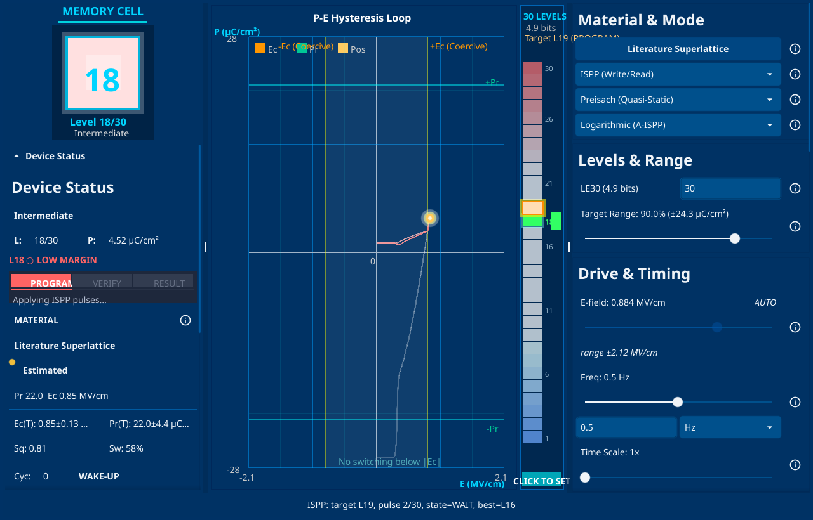

# FeCIM Lattice Tools

## Audience

FeCIM Lattice Tools is for people who need a practical, inspectable simulator for ferroelectric compute-in-memory (FeCIM) ideas:

- **Students and instructors** learning hysteresis, crossbar arrays, non-idealities, and CIM system tradeoffs.
- **Researchers** exploring FeCIM model behavior, validation workflows, and literature-backed assumptions.
- **Device, circuit, and architecture designers** comparing how material choices, array effects, and peripheral assumptions affect a design.
- **Open-source contributors** who want to improve a simulation-first tool with tests, documentation, and reproducible examples.

It is **not** a silicon measurement report, a product benchmark, a foundry PDK, or proof that a specific device achieves a claimed accuracy, energy, endurance, or state-count result. Treat this repository as an education, research, and design workspace unless a claim is explicitly tied to a cited source and validation test.

> A simulation-first desktop lab for learning, testing, and designing around ferroelectric compute-in-memory systems.

Built on published physics -- Materlik 2015, Park 2015, Alessandri 2018, Guo 2018 -- with core parameters cited or explicitly marked educational.

---

[](https://github.com/TrebuchetDynamics/fecim-lattice-tools/actions/workflows/ci.yml)
[](https://go.dev)
[](https://fyne.io)
[](./LICENSE)



## At a Glance

| Question | Answer |
|----------|--------|
| What is it? | A Go/Fyne desktop app plus validation workspace for FeCIM simulation. |
| Why use it? | To inspect how ferroelectric material assumptions, hysteresis models, crossbar effects, peripheral circuits, and EDA exports interact. |
| What can I run? | Seven GUI modules, headless validation scripts, module tests, and EDA/export examples. |
| What is the boundary? | Simulation and education only unless a claim is cited and covered by validation. |

## Table of Contents

- [At a Glance](#at-a-glance)
- [What You Can Do](#what-you-can-do)
- [Scope and Claim Boundary](#scope-and-claim-boundary)
- [Modules](#modules)
- [Getting Started](#getting-started)
- [Main Commands](#main-commands)
- [Configuration](#configuration)
- [Technical Architecture](#technical-architecture)
- [Development Standard](#development-standard)
- [Validation](#validation)
- [Trust Boundaries](#trust-boundaries)
- [Citation System](#citation-system)
- [Repository Layout](#repository-layout)
- [Documentation](#documentation)
- [Contributing and Support](#contributing-and-support)
- [License](#license)

## What You Can Do

FeCIM Lattice Tools keeps device, array, circuit, algorithm, and export assumptions in one inspectable tool. Use it to:

- Visualize P-E loops, coercive-field behavior, remanent polarization, and minor loops.
- Compare Preisach and Landau-Khalatnikov hysteresis behavior under different material presets.
- Study how conductance quantization, IR drop, sneak paths, and drift affect crossbar MVM.
- Run example inference experiments to see how CIM constraints change algorithm behavior.
- Explore peripheral read/program paths, DAC/ADC/TIA abstractions, and ISPP write control.
- Generate EDA-oriented artifacts for SPICE, Verilog, Liberty, DEF, and LEF-style flows.
- Reproduce internal validation checks and extend them with literature-backed tests.

## Scope and Claim Boundary

This repository follows an accuracy-first documentation policy:

- External scientific claims must be cited and listed in the [honesty audit](./docs/4-research/honesty-audit.md).
- Simulation defaults must be described as defaults, placeholders, assumptions, or range-checked parameters.
- Unverified conference, marketing, or talk claims must not be presented as technical facts.
- Testable behavior should be covered by automated tests before implementation changes are accepted.
- Source-backed facts should be recorded in the Markdown-native [citation system](./citations/README.md).

For current verified claims, known gaps, and removed or restricted claims, read [Scientific Honesty Audit](./docs/4-research/honesty-audit.md).

## Modules

| Module | Directory | Purpose |
|--------|-----------|---------|
| 1 | [`module1-hysteresis/`](./module1-hysteresis) | P-E curves, Preisach modeling, LK dynamics, material presets, and ISPP write behavior. |
| 2 | [`module2-crossbar/`](./module2-crossbar) | Crossbar MVM, conductance levels, IR drop, sneak paths, drift, and array effects. |
| 3 | [`module3-mnist/`](./module3-mnist) | Example inference pipeline for studying algorithm behavior under CIM constraints. |
| 4 | [`module4-circuits/`](./module4-circuits) | Peripheral circuit abstractions for DAC, ADC, TIA, read paths, and program paths. |
| 5 | [`module5-comparison/`](./module5-comparison) | Comparison views for assumptions, metrics, and operating conditions. |
| 6 | [`module6-eda/`](./module6-eda) | EDA export and integration utilities for design-oriented workflows. |
| 7 | [`module7-docs/`](./module7-docs) | Integrated documentation, references, and educational material. |

Shared infrastructure lives in [`shared/`](./shared), and validation suites live in [`validation/`](./validation).

## Getting Started

### Prerequisites

- Go 1.25 or newer.
- A desktop environment for the GUI.
- On Ubuntu or other minimal Linux environments, the OpenGL/X11 headers used by Fyne:

```bash
sudo apt-get update
sudo apt-get install -y libgl1-mesa-dev xorg-dev
```

### Install and Run

The current default desktop app remains the Fyne shell:

```bash
git clone https://github.com/TrebuchetDynamics/fecim-lattice-tools.git
cd fecim-lattice-tools
go run ./cmd/fecim-lattice-tools
```

The future zero-CGO `gogpu/ui` shell is available as a placeholder path:

```bash
CGO_ENABLED=0 go run ./cmd/fecim-lattice-tools-next
```

The `next` shell is intended to become the default after it reaches parity. Current module parity remains in the Fyne app.

### Build

```bash
go build -o fecim-lattice-tools ./cmd/fecim-lattice-tools
./fecim-lattice-tools
```

### Verify

```bash
go test ./...
make test-next-ui
bash scripts/reproduce_validation.sh
```

## Main Commands

Open a specific GUI module:

```bash
go run ./cmd/fecim-lattice-tools --module hysteresis
go run ./cmd/fecim-lattice-tools --module crossbar
go run ./cmd/fecim-lattice-tools --module eda
```

Inspect available materials and launcher flags:

```bash
go run ./cmd/fecim-lattice-tools --list-materials
go run ./cmd/fecim-lattice-tools --help
```

Generate fresh README-style screenshots:

```bash
go run ./cmd/fecim-screenshotter -out docs/assets -only hysteresis -tag readme -w 1280 -h 820
```

See [CLI Reference](./docs/1-getting-started/cli-reference.md) for the full launcher and module command reference.

## Configuration

No API keys or cloud credentials are required for the default app, tests, or validation workflows.

Simulation settings live in YAML files under [`config/`](./config):

| File | Purpose |
|------|---------|
| [`config/materials.yaml`](./config/materials.yaml) | Material presets and ferroelectric parameters. |
| [`config/constants.yaml`](./config/constants.yaml) | Shared physical constants and default level assumptions. |
| [`config/simulation.yaml`](./config/simulation.yaml) | Simulation time-step and solver defaults. |
| [`config/crossbar.yaml`](./config/crossbar.yaml) | Crossbar geometry and array assumptions. |
| [`config/mnist.yaml`](./config/mnist.yaml) | Example inference experiment settings. |
| [`config/energy.yaml`](./config/energy.yaml) | Educational energy model inputs. |

For the full schema and loading behavior, read [Configuration Reference](./docs/3-develop/config-reference.md). Config values that are not externally validated must stay labeled as defaults or assumptions.

## Technical Architecture

Tech stack:

- **Language:** Go 1.25+
- **Desktop UI:** Fyne 2.7 remains the current default; `gogpu/ui` is the future zero-CGO shell path.
- **Validation:** Go tests, golden data, literature range checks, and reproducibility scripts
- **Exports:** SPICE, Verilog, Liberty, DEF, and LEF-oriented outputs

High-level flow:

```text
cmd/fecim-lattice-tools       current Fyne shell
cmd/fecim-lattice-tools-next  future zero-CGO gogpu/ui shell
        |
        v
shared/ theme, widgets, physics, logging, utilities
        |
        +--> module1-hysteresis  --> ferroelectric model behavior
        +--> module2-crossbar    --> array MVM and non-idealities
        +--> module3-mnist       --> example inference experiment
        +--> module4-circuits    --> read/program path abstractions
        +--> module5-comparison  --> assumption and metric comparison
        +--> module6-eda         --> design/export artifacts
        +--> module7-docs        --> integrated documentation
        |
        v
validation/ regression, literature, and integration checks
```

## Development Standard

This project uses test-driven development for code changes:

- Write or update a failing test before changing behavior.
- Keep tests tied to observable physics, CLI, GUI, export, or validation behavior.
- Label simulation assumptions clearly in code and docs.
- Run formatting and tests before pushing.

Common checks:

```bash
gofmt -w .
go test ./...
make test-next-ui
go test -race -short ./shared/... ./validation/...
```

See [Contributing](./CONTRIBUTING.md) and [Testing Guide](./docs/3-develop/testing/TESTING.md) for the full workflow.

## Validation

The validation layer checks internal model behavior and selected literature-backed ranges. Current validation includes:

- Physics regression tests and golden data.
- Literature range checks for selected HZO and ferroelectric parameters.
- Kirchhoff-law checks for crossbar current behavior.
- Integration tests for module-level behavior.
- CI enforcement on `main`.

Validation does not turn educational defaults into measured device claims. If a parameter is not validated against a specific paper or dataset, it must remain labeled as an assumption or default.

## Trust Boundaries

Use [docs/TRUST.md](./docs/TRUST.md) to decide which outputs are highly validated, literature-backed, educational, planned, or not validated. Use [docs/HOW_TO_BREAK_THIS.md](./docs/HOW_TO_BREAK_THIS.md) and [docs/PREDICTIONS.md](./docs/PREDICTIONS.md) to review adversarial stress cases and pre-registered validation targets.

## Citation System

Citations live in plain Markdown under [citations/](./citations). Each source gets a reviewable paper record, verified facts are promoted into [citations/facts.md](./citations/facts.md), and unresolved conflicts are tracked in [citations/disputed.md](./citations/disputed.md).

Use the citation system before adding external scientific claims to code, documentation, validation reports, or the paper draft.

## Repository Layout

```text
fecim-lattice-tools/
├── cmd/                    # GUI and utility entrypoints
├── citations/              # Markdown-native source records and facts database
├── module1-hysteresis/     # Ferroelectric hysteresis and switching models
├── module2-crossbar/       # Crossbar simulation and non-idealities
├── module3-mnist/          # Example inference pipeline
├── module4-circuits/       # Peripheral circuit abstractions
├── module5-comparison/     # Technology and assumption comparison
├── module6-eda/            # EDA export utilities
├── module7-docs/           # Integrated documentation viewer
├── shared/                 # Common physics, UI, logging, and utility code
├── docs/                   # User, developer, and research documentation
├── data/                   # Simulation inputs and lookup data
└── validation/             # Regression, literature, and integration checks
```

## Documentation

- [Installation](./docs/1-getting-started/installation.md)
- [Technical Architecture](./docs/3-develop/architecture/ARCHITECTURE.md)
- [Configuration Reference](./docs/3-develop/config-reference.md)
- [Testing Guide](./docs/3-develop/testing/TESTING.md)
- [Trust Boundaries](./docs/TRUST.md)
- [Citation System](./citations/README.md)
- [Scientific Honesty Audit](./docs/4-research/honesty-audit.md)
- [Contributing](./CONTRIBUTING.md)
- [Changelog](./CHANGELOG.md)

Module READMEs:

- [Module 1 - Hysteresis](./module1-hysteresis/README.md)
- [Module 2 - Crossbar](./module2-crossbar/README.md)
- [Module 3 - MNIST](./module3-mnist/README.md)
- [Module 4 - Circuits](./module4-circuits/README.md)
- [Module 5 - Comparison](./module5-comparison/README.md)
- [Module 6 - EDA](./module6-eda/README.md)
- [Module 7 - Docs](./module7-docs/README.md)

## Contributing and Support

Use GitHub issues for bugs, research gaps, documentation problems, and feature proposals:

- Repository: [TrebuchetDynamics/fecim-lattice-tools](https://github.com/TrebuchetDynamics/fecim-lattice-tools)
- Contribution guide: [CONTRIBUTING.md](./CONTRIBUTING.md)
- Pull request checklist: [`.github/pull_request_template.md`](./.github/pull_request_template.md)

Useful roadmap directions are tracked through issues and PRs. High-value contributions include stronger validation coverage, clearer educational examples, improved screenshots and demos, better EDA export examples, and documentation that labels assumptions precisely.

## License

This project is licensed under the MIT License. See [LICENSE](./LICENSE).
