# Module 4: Circuits - Comprehensive GUI Architecture Diagrams

Comprehensive Mermaid diagram documentation for the Peripheral Circuits GUI, including current layout, proposed refactor, component hierarchy, state machines, and data flow.

**Last Updated:** 2026-02-02  
**Conventions:** Component names match `module4-circuits/pkg/gui` identifiers; diagrams reflect UI structure, not exact pixel geometry.

---

## 1. Current Layout Diagram (Before Refactor)

This diagram shows the actual current layout structure of the Unified View in `tab_unified.go` (lines 41-120).

```mermaid
graph TB
    subgraph Border["Border Container (Root)"]
        subgraph Top["Top: VBox (topSection)"]
            CL["chainLabel: SIGNAL CHAIN<br/>DAC → Array → TIA → ADC"]
            MS["mainSection: createMainSimSection()"]
            OMH["operationsModeHelp: Instructions"]
            SEP1["Separator"]
        end
        subgraph Bottom["Bottom: VBox (bottomSection)"]
            CS["configSection: HBox<br/>Material | Array | ADC | Architecture | Tools"]
            MAB["modeActionBar: HBox<br/>MODE BTN | ACTION BTNS"]
            MPS["modePanelStack: Stack<br/>Write Slider OR Compute Inputs"]
            AVS["archVoltageStack: Stack<br/>Voltage info (architecture-specific)"]
        end
    end

    Top --> Bottom

    style CL fill:#5a3a2a,stroke:#a64
    style MS fill:#2a4a3a,stroke:#4a8
    style CS fill:#3a4a5a,stroke:#68a
    style MAB fill:#4a3a5a,stroke:#84a
```

**Key Points:**
- **Top Section**: Contains circuit visualization and help text
- **Bottom Section**: Compact control area with all configuration and action controls
- **Split Design**: Separates display (top) from controls (bottom) for clarity
- **Container Types**: VBox for vertical stacking, HBox for horizontal rows, Stack for mode-dependent visibility

---

## 2. Proposed Layout Diagram (After Refactor)

Improved layout focusing on the array canvas as the primary focal point with better use of space.

```mermaid
graph TB
    subgraph Border["Border Container (Root)"]
        subgraph Toolbar["Top: VBox (toolbarSection) ~100px"]
            CR["configRow: Material | Array | ADC | Mode Buttons | Arch Toggle"]
            MPS["modePanelStack: Write Slider OR Compute Inputs"]
            AR["actionRow: Write | MVM | Undo | Random | Reset"]
        end
        subgraph Center["Center: VBox (arraySection) EXPANDS"]
            SC["Signal Chain Header: DAC → Array → TIA → ADC"]
            UTC["UnifiedTappableCanvas (flexible, grows to fill space)"]
            IR["infoRow: cellInfo | arrayInfo | status"]
        end
        subgraph Status["Bottom: HBox (statusBar) ~20px"]
            Help["operationsModeHelp"]
        end
    end

    Toolbar -.->|"fixed height"| Center
    Center -.->|"fills remaining"| Status

    style Toolbar fill:#3a4a5a,stroke:#68a
    style Center fill:#2a4a3a,stroke:#4a8
    style UTC fill:#1a3a4a,stroke:#4af
    style Status fill:#4a3a5a,stroke:#84a
```

**Improvements:**
- **Toolbar**: Compact, fixed-height configuration area at top
- **Expandable Array**: Canvas grows to fill available space (better for large arrays)
- **Status Bar**: Minimal footer showing operation status
- **Better Focus**: Visual emphasis on the array visualization

---

## 3. Component Hierarchy Diagram

Detailed breakdown of all GUI components organized by functional area.

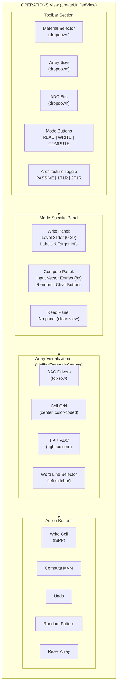

---

## 4. State Machine Diagram

Operation mode transitions and state-specific behavior.

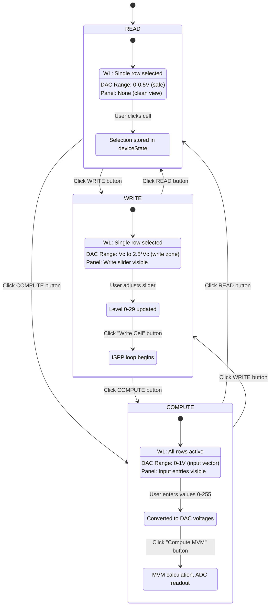

---

## 5. Data Flow Diagram

Complete data flow from user input through state management to visualization.

```mermaid
flowchart LR
    subgraph UserInput["User Input Layer"]
        MC["Mode Change<br/>(READ/WRITE/COMPUTE)"]
        CC["Cell Click<br/>(select row/col)"]
        SL["Slider Adjustment<br/>(target level)"]
        VE["Vector Entry<br/>(0-255 input)"]
        AB["Action Button<br/>(Write/Compute)"]
    end

    subgraph StateLayer["State Management<br/>(DeviceState)"]
        OM["opMode<br/>Current operation mode"]
        AR["activeRows[]<br/>Word line selection"]
        DV["dacVoltages[]<br/>Per-column voltages"]
        SC["selectedCell<br/>Row & column selection"]
        AW["arrayWeights[][]<br/>Cell conductance levels"]
    end

    subgraph ComputeLayer["Computation Layer"]
        IV["Input Vector<br/>Digital to voltage"]
        MVM["MVM Calculate<br/>I_out = sum(G * V_in)"]
        TIA["TIA Amplify<br/>V = I * Gain"]
        ADC["ADC Quantize<br/>Level = V / LSB"]
    end

    subgraph OutputLayer["Output & Visualization"]
        RC["rowCurrents[]<br/>Per-row currents"]
        RV["rowVoltages[]<br/>Per-row TIA output"]
        RL["rowLevels[]<br/>Per-row ADC codes"]
        CV["Canvas Refresh<br/>Color cells, draw peripherals"]
        Labels["Info Labels<br/>Status, selection, values"]
    end

    MC --> OM
    CC --> SC
    SL --> DV
    VE --> DV
    AB --> MVM

    OM --> AR
    SC --> AR
    AW --> MVM
    DV --> MVM
    AR --> MVM

    IV --> MVM
    MVM --> RC
    RC --> TIA
    TIA --> RV
    RV --> ADC
    ADC --> RL

    RC --> CV
    RL --> CV
    AR --> CV
    AW --> CV

    RL --> Labels
    SC --> Labels
    DV --> Labels

    style OM fill:#4a2a5a,stroke:#a4f
    style MVM fill:#2a4a3a,stroke:#4a8
    style CV fill:#1a3a4a,stroke:#4af
```

---

## 6. Component Nesting Structure

Fyne container nesting hierarchy showing parent-child relationships.

```mermaid
graph TD
    Root["Border Container<br/>(root)"]

    Root -->|"Top"| TopSection["VBox: topSection"]
    Root -->|"Bottom"| BottomSection["VBox: bottomSection"]

    TopSection -->|"child 1"| ChainLabel["Label: Signal Chain"]
    TopSection -->|"child 2"| MainSection["MainSimSection<br/>(circuit viz)"]
    TopSection -->|"child 3"| HelpLabel["Label: Instructions"]
    TopSection -->|"child 4"| Sep1["Separator"]

    BottomSection -->|"child 1"| ConfigSection["HBox: configSection"]
    BottomSection -->|"child 2"| ModeBar["HBox: modeActionBar"]
    BottomSection -->|"child 3"| ModeStack["Stack: modePanelStack"]
    BottomSection -->|"child 4"| ArchStack["Stack: archVoltageStack"]

    ConfigSection -->|"items"| MatSel["Material Selector"]
    ConfigSection -->|"items"| ArrSel["Array Size Select"]
    ConfigSection -->|"items"| ADCSel["ADC Bits Select"]
    ConfigSection -->|"items"| ToolBtns["Tool Buttons"]
    ConfigSection -->|"items"| ArchToggle["Architecture Buttons"]

    ModeBar -->|"items"| ModeBtns["Mode Buttons<br/>READ|WRITE|COMPUTE"]
    ModeBar -->|"items"| ActionBtns["Action Buttons<br/>Write|Compute|Undo|Random|Reset"]

    ModeStack -->|"layer 1"| WriteModePanel["Write Mode Panel<br/>(slider)"]
    ModeStack -->|"layer 2"| ComputePanel["Compute Mode Panel<br/>(entries)"]
    ModeStack -->|"layer 3"| ReadPanel["Read Mode Panel<br/>(empty)"]

    ArchStack -->|"layer 1"| PassiveVolt["Passive (0T1R)<br/>Voltage Info"]
    ArchStack -->|"layer 2"| ActiveVolt["1T1R/2T1R<br/>Voltage Info"]

    MainSection -->|"contains"| Canvas["UnifiedTappableCanvas<br/>(raster drawing)"]

    style Root fill:#3a3a3a,stroke:#888
    style TopSection fill:#5a3a2a,stroke:#a64
    style BottomSection fill:#2a3a5a,stroke:#46a
    style ModeStack fill:#4a3a5a,stroke:#84a
    style Canvas fill:#1a3a4a,stroke:#4af
```

---

## 7. Array Drawing Architecture

Detailed breakdown of the array visualization system.

```mermaid
graph TD
    subgraph DrawSystem["Array Drawing System<br/>(tab_unified_drawing.go)"]
        direction TB

        subgraph Canvas["UnifiedTappableCanvas"]
            Raster["canvas.Raster<br/>(draws to image)"]
            ClickHandler["Tapped() handler<br/>(converts click to row/col)"]
        end

        subgraph DrawFunc["drawUnifiedArray()"]
            Layout["Layout Calculation<br/>(margins, cell size, spacing)"]
            DrawDAC["Draw DAC peripherals<br/>(top, voltage labels)"]
            DrawWL["Draw word lines<br/>(left, active indicator)"]
            DrawGrid["Draw cell grid<br/>(color by conductance)"]
            DrawTIA["Draw TIA+ADC<br/>(right, current/level labels)"]
            DrawOverlay["Draw overlays<br/>(legend, energy, status badges)"]
        end

        subgraph ColorMap["Color Mapping"]
            GetColor["getColorForLevel(level)<br/>0-14: BLUE gradient<br/>15: WHITE<br/>16-29: RED gradient"]
        end

        subgraph ClickDetect["Click Detection"]
            CalcMargins["Calculate margins<br/>(depends on architecture)"]
            CalcCellSize["Calculate cell size<br/>(based on available space)"]
            FindCell["Find cell at click<br/>(row, col)"]
        end
    end

    Raster -.->|"render"| DrawFunc
    Raster -.->|"receives"| ClickHandler
    DrawFunc -->|"uses"| ColorMap
    ClickHandler -->|"uses"| ClickDetect
    DrawFunc -->|"uses"| Layout

    style Raster fill:#2a4a4a,stroke:#4a8
    style DrawFunc fill:#3a4a5a,stroke:#68a
    style GetColor fill:#2a4a3a,stroke:#4a8
```

---

## 8. Write Operation (ISPP) Sequence

Detailed sequence diagram of the Incremental Step Pulse Programming flow.

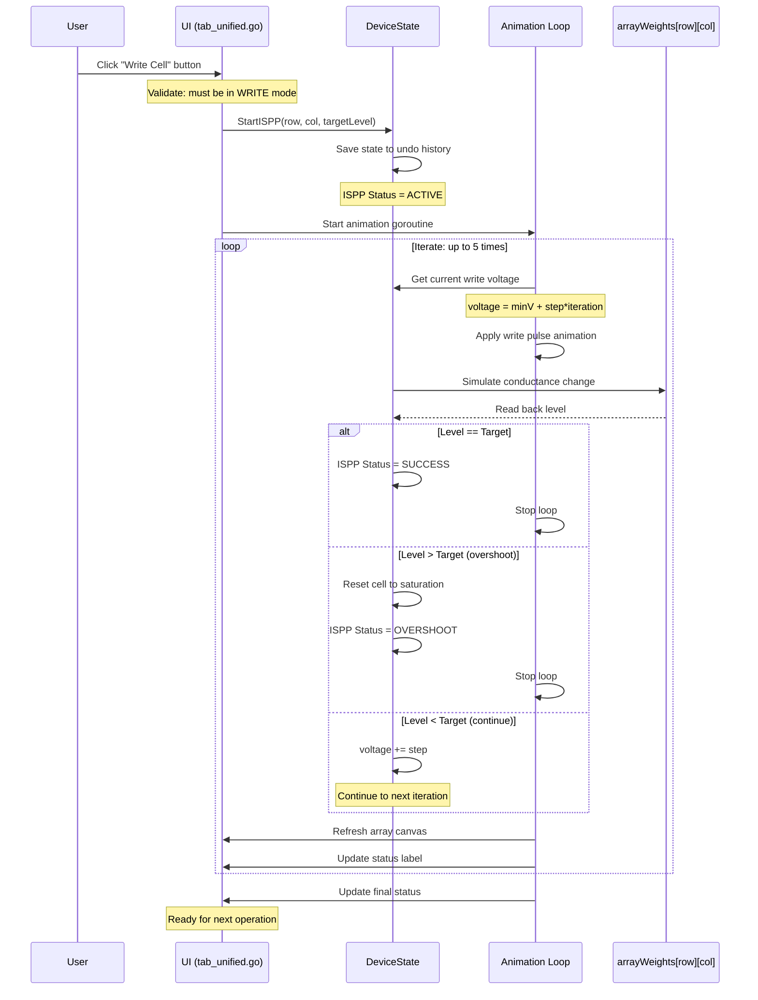

---

## 9. Architecture Mode Effects

How architecture selection affects UI layout and behavior.

```mermaid
flowchart TD
    subgraph ArchSelect["Architecture Selection"]
        PassiveBtn["PASSIVE<br/>(0T1R)<br/>Half-select"]
        T1R1Btn["1T1R<br/>Row transistor"]
        T2R1Btn["2T1R<br/>Row+Col transistors"]
    end

    subgraph Effects["Visual & Behavioral Effects"]

        subgraph WLMode["Word Line Selection"]
            WLAllOn["All WL always ON"]
            WLGated["WL gated per row"]
            WLFull["WL+BL fully gated"]
        end

        subgraph Margins["Canvas Margins"]
            M1["leftMargin = 30px<br/>topMargin = 65px<br/>rightMargin = 130px<br/>bottomMargin = 30px"]
            M2["leftMargin = 55px<br/>(more space for transistors)"]
            M3["leftMargin = 55px<br/>bottomMargin = 55px<br/>(room for BL selectors)"]
        end

        subgraph Overlays["Visual Overlays"]
            O1["V/2 half-select overlay<br/>active, shown on cells"]
            O2["No sneak path overlay<br/>isolated cells"]
            O3["Full selection scheme<br/>complete isolation"]
        end

        subgraph VoltagePanel["Right-Side Panel"]
            VP1["Passive Voltage Info:<br/>WL, BL, V/2 indication"]
            VP2["1T1R Voltage Info:<br/>Row select voltage"]
            VP3["2T1R Voltage Info:<br/>Row + Column selects"]
        end
    end

    PassiveBtn --> WLAllOn
    PassiveBtn --> M1
    PassiveBtn --> O1
    PassiveBtn --> VP1

    T1R1Btn --> WLGated
    T1R1Btn --> M2
    T1R1Btn --> O2
    T1R1Btn --> VP2

    T2R1Btn --> WLFull
    T2R1Btn --> M3
    T2R1Btn --> O3
    T2R1Btn --> VP3

    style PassiveBtn fill:#5a3a2a,stroke:#a64
    style T1R1Btn fill:#2a5a3a,stroke:#4a6
    style T2R1Btn fill:#2a3a5a,stroke:#46a
```

---

## 10. Panel Visibility & Mode Logic

How mode selection drives panel visibility.

```mermaid
flowchart TD
    subgraph ModeEvent["Mode Button Clicked"]
        SetMode["setOperationMode(mode)<br/>from tab_unified.go"]
    end

    subgraph StateUpdate["State Update"]
        UpdateState["DeviceState.SetOperationMode()"]
        SetDAC["Auto-set DAC range:<br/>READ: 0-0.5V<br/>WRITE: Vc-2.5Vc<br/>COMPUTE: 0-1V"]
        SetWL["Auto-set word line:<br/>READ: Single<br/>WRITE: Single<br/>COMPUTE: All active"]
    end

    subgraph UIUpdate["UI Update"]
        HideAllPanels["Hide all mode panels"]
        CheckMode{"opMode?"}
        ShowWritePanel["Show writeModePanel<br/>Level slider<br/>Target label"]
        ShowComputePanel["Show computeModePanel<br/>8 entry fields<br/>Random/Clear buttons"]
        ShowReadPanel["Show readPanel<br/>(empty, clean view)"]
    end

    subgraph Actions["Action Buttons"]
        ActionState["Enable/disable buttons<br/>based on mode"]
        WriteEnabled["Write mode:<br/>Program button enabled"]
        ComputeEnabled["Compute mode:<br/>Compute button enabled"]
        ReadEnabled["Read mode:<br/>All buttons available"]
    end

    SetMode --> UpdateState
    UpdateState --> SetDAC
    UpdateState --> SetWL
    SetDAC --> HideAllPanels
    SetWL --> HideAllPanels

    HideAllPanels --> CheckMode
    CheckMode -->|WRITE| ShowWritePanel
    CheckMode -->|COMPUTE| ShowComputePanel
    CheckMode -->|READ| ShowReadPanel

    ShowWritePanel --> ActionState
    ShowComputePanel --> ActionState
    ShowReadPanel --> ActionState

    ActionState --> WriteEnabled
    ActionState --> ComputeEnabled
    ActionState --> ReadEnabled

    style SetMode fill:#4a2a5a,stroke:#a4f
    style UpdateState fill:#3a4a5a,stroke:#68a
    style ActionState fill:#2a4a3a,stroke:#4a8
```

---

## 11. File Organization & Responsibilities

Current file structure and code organization for the Unified View.

```mermaid
graph TD
    subgraph Package["pkg/gui/"]
        direction TB

        subgraph Core["Core Infrastructure"]
            AppGo["app.go (464 lines)<br/>CircuitsApp struct<br/>initialization, lifecycle"]
            DeviceStateGo["device_state.go<br/>DeviceState struct<br/>simulation state, setters/getters"]
            EmbeddedGo["embedded.go<br/>Embedded app interface<br/>BuildContent(), Start(), Stop()"]
        end

        subgraph UnifiedView["Unified View Implementation"]
            TabMainGo["tab_unified.go (1365 lines)<br/>createUnifiedView()<br/>layout, panels, event handlers<br/>mode logic, canvas refresh"]

            TabCanvasGo["tab_unified_canvas.go (180 lines)<br/>UnifiedTappableCanvas widget<br/>click detection<br/>coordinate transformation"]

            TabDrawingGo["tab_unified_drawing.go (872 lines)<br/>drawUnifiedArray()<br/>all rendering logic<br/>cell colors, peripherals<br/>overlays, badges"]

            TabActionsGo["tab_unified_actions.go (438 lines)<br/>onUnifiedProgram()<br/>writeReadVerifyLoop()<br/>other action handlers<br/>animation logic"]

            TabVoltageGo["tab_unified_voltage.go (537 lines)<br/>runISPPWithAnimation()<br/>voltage rules<br/>physics simulation<br/>write sequence"]
        end

        subgraph Legacy["Legacy Tabs (Keep for now)"]
            ComparisonGo["tab_comparison.go<br/>Architecture comparison view<br/>benchmarking data"]
            ReferenceGo["tab_reference.go<br/>Reference & documentation<br/>timing diagrams, specs"]
        end

        subgraph Helpers["Helper Files"]
            DrawingGo["drawing.go<br/>Shared drawing utilities"]
            HelpersGo["helpers.go<br/>Utility functions"]
            FontGo["font.go<br/>Font definitions & loading"]
        end
    end

    AppGo --> DeviceStateGo
    AppGo --> TabMainGo
    TabMainGo --> TabCanvasGo
    TabMainGo --> TabDrawingGo
    TabMainGo --> TabActionsGo
    TabMainGo --> TabVoltageGo
    TabDrawingGo --> DrawingGo
    TabMainGo --> HelpersGo

    style AppGo fill:#3a4a5a,stroke:#68a
    style TabMainGo fill:#2a5a4a,stroke:#4a8
    style TabDrawingGo fill:#4a3a5a,stroke:#84a
    style TabVoltageGo fill:#5a3a2a,stroke:#a84
```

---

## 12. Configuration & State Synchronization

How configuration changes propagate through the system.

```mermaid
flowchart LR
    subgraph Config["Configuration Inputs"]
        Material["Material Selector<br/>(HZO, IGZO, etc.)"]
        ArraySize["Array Size Selector<br/>(4, 8, 16, 32, etc.)"]
        ADCBits["ADC Bits Selector<br/>(3, 4, 5, 6 bits)"]
        Architecture["Architecture Toggle<br/>PASSIVE | 1T1R | 2T1R"]
    end

    subgraph CircuitsApp["CircuitsApp Fields"]
        MatField["ca.material<br/>(HZOMaterial)"]
        SizeField["ca.arrayRows/Cols"]
        ADCField["ca.adcBits"]
        ArchField["ca.architecture"]
    end

    subgraph DeviceState["DeviceState Fields"]
        HZOMat["material<br/>(defines Vc, Pr, Ec)"]
        ReadRange["readVoltageRange<br/>(0 to Ec/3)"]
        WriteRange["writeVoltageRange<br/>(Ec to 2.5*Ec)"]
        Levels["quantLevels<br/>(30 for FeCIM)"]
    end

    subgraph Calculation["Derived Calculations"]
        StepSize["voltage step<br/>= (Max-Min)/(Levels-1)"]
        Margins["canvas margins<br/>(depends on arch)"]
        CellSize["cell size<br/>(depends on array size)"]
    end

    subgraph Render["Rendering & Physics"]
        Canvas["Canvas refresh<br/>(redraws array)"]
        Simulation["Physics simulation<br/>(weight calculation)"]
    end

    Material --> MatField
    ArraySize --> SizeField
    ADCBits --> ADCField
    Architecture --> ArchField

    MatField --> HZOMat
    SizeField --> Levels
    ADCField --> Levels
    ArchField --> Margins

    HZOMat --> ReadRange
    HZOMat --> WriteRange
    HZOMat --> StepSize

    SizeField --> CellSize
    ArchField --> CellSize
    ReadRange --> Calculation
    WriteRange --> Calculation
    StepSize --> Calculation

    Calculation --> Render
    Levels --> Simulation

    style MatField fill:#4a2a5a,stroke:#a4f
    style HZOMat fill:#3a4a5a,stroke:#68a
    style StepSize fill:#2a4a3a,stroke:#4a8
    style Canvas fill:#1a3a4a,stroke:#4af
```

---

## 13. Cell Color Mapping & Conductance States

How cell states map to visual colors in the array.

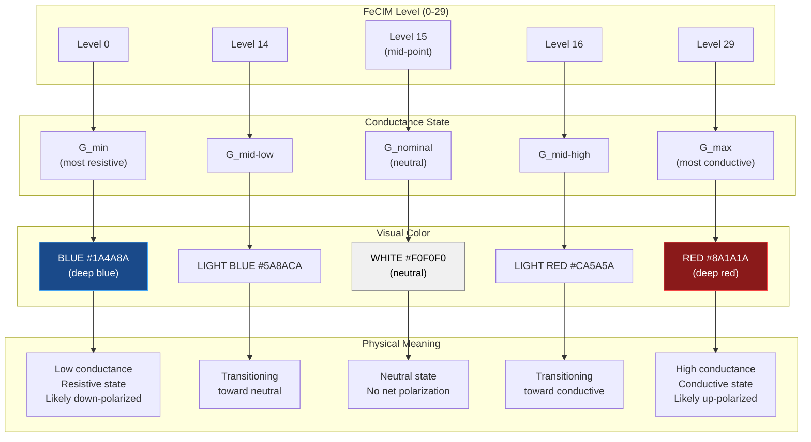

---

## 14. DAC Voltage Zones & Operating Regions

Voltage range organization for different operation modes.

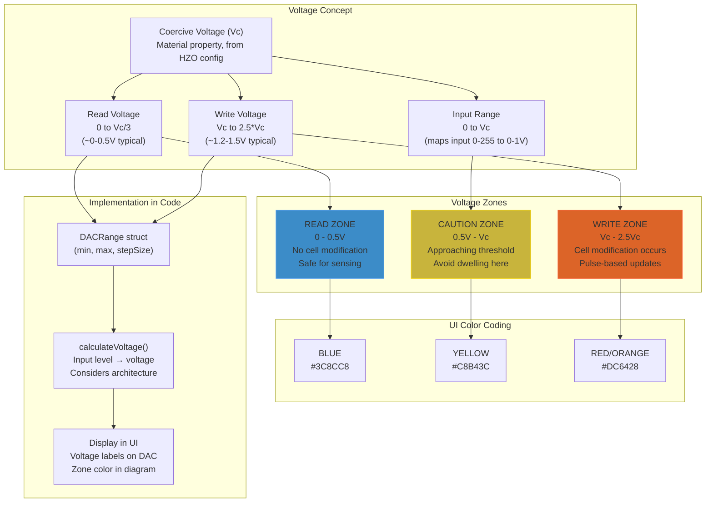

---

## 15. Click Detection Coordinate System

How mouse clicks are converted to array row/column coordinates.

```mermaid
graph TD
    subgraph Input["Mouse Input"]
        ClickEvent["PointEvent<br/>(X, Y in pixels)"]
    end

    subgraph Canvas["Canvas Dimensions"]
        CanvasW["Canvas Width"]
        CanvasH["Canvas Height"]
    end

    subgraph Margins["Margin Calculation<br/>(depends on architecture)"]
        TopMargin["topMargin = 65px<br/>(DAC labels)"]
        LeftMargin["leftMargin = 30-55px<br/>(WL selector)"]
        RightMargin["rightMargin = 130px<br/>(TIA + ADC labels)"]
        BottomMargin["bottomMargin = 30-55px<br/>(BL selectors)"]
    end

    subgraph Available["Available Space"]
        AvailW["availableWidth<br/>= CanvasW - leftMargin - rightMargin"]
        AvailH["availableHeight<br/>= CanvasH - topMargin - bottomMargin"]
    end

    subgraph GridCalc["Grid Calculation"]
        ArrayDim["arrayRows × arrayCols"]
        CellWidth["cellWidth = availableWidth / cols"]
        CellHeight["cellHeight = availableHeight / rows"]
        CellSize["cellSize = min(cellW, cellH)<br/>with min/max constraints"]
    end

    subgraph Conversion["Coordinate Conversion"]
        NormX["normalizedX = clickX - leftMargin"]
        NormY["normalizedY = clickY - topMargin"]
        ColIndex["col = normalizedX / cellSize"]
        RowIndex["row = normalizedY / cellSize"]
    end

    subgraph Validation["Validation"]
        BoundsCheck["Check:<br/>0 <= row < arrayRows<br/>0 <= col < arrayCols"]
        ErrorHandle["If out of bounds:<br/>Ignore click"]
        Success["If valid:<br/>Emit onTap(row, col)"]
    end

    ClickEvent --> Canvas
    Canvas --> Margins
    Margins --> Available
    Available --> GridCalc
    GridCalc --> CellSize
    CellSize --> Conversion
    ClickEvent --> Conversion
    Conversion --> Validation
    BoundsCheck --> ErrorHandle
    BoundsCheck --> Success

    style ClickEvent fill:#4a2a5a,stroke:#a4f
    style GridCalc fill:#3a4a5a,stroke:#68a
    style Success fill:#2a4a3a,stroke:#4a8
```

---

## 16. Animation System & Refresh Cycle

How animations are synchronized with UI updates.

```mermaid
flowchart TD
    subgraph Trigger["Animation Trigger"]
        ActionClick["User clicks action<br/>(Write, Compute, etc.)"]
    end

    subgraph GoroutineStart["Goroutine Launch"]
        GoStart["go runISPPWithAnimation()"]
        StopCheck{"Check stopChan"}
    end

    subgraph AnimLoop["Animation Loop"]
        SetStep["Set animationStep<br/>(0=idle, 1=DAC, 2=Array, 3=ADC)"]
        SimPhase["Simulate phase<br/>(update voltages/levels)"]
        RefreshUI["fyne.Do(func() {<br/>ca.sharedArrayCanvas.Refresh()"]
        UpdateLabel["ca.operationsStatusLabel.SetText()"]
        Sleep["time.Sleep(intervalMs)"]
    end

    subgraph CanvasRefresh["Canvas Refresh"]
        RasterRefresh["Raster.Refresh()<br/>triggers drawUnifiedArray()"]
        Redraw["drawUnifiedArray()<br/>accesses ca.mu (RLock)"]
        RenderToImage["Render to image.Image<br/>with current state"]
    end

    subgraph StateAccess["State Access Patterns"]
        RLock["ca.mu.RLock()"]
        RUnlock["ca.mu.RUnlock()"]
        SafeRead["Read fields:<br/>arrayWeights[][]<br/>animationStep<br/>etc."]
    end

    subgraph ExitCondition["Exit Conditions"]
        LoopEnd["Target reached<br/>or max iterations"]
        StopSignal["stopChan closed"]
        FinalRefresh["Final canvas refresh"]
    end

    ActionClick --> GoStart
    GoStart --> StopCheck
    StopCheck -->|"Not stopped"| AnimLoop
    StopCheck -->|"Stopped"| ExitCondition

    AnimLoop --> SetStep
    SetStep --> SimPhase
    SimPhase --> RefreshUI
    RefreshUI --> UpdateLabel
    UpdateLabel --> Sleep
    Sleep -->|"Loop back"| SetStep

    RefreshUI --> CanvasRefresh
    CanvasRefresh --> RasterRefresh
    RasterRefresh --> Redraw

    Redraw --> RLock
    RLock --> SafeRead
    SafeRead --> RUnlock
    RUnlock --> RenderToImage

    LoopEnd --> ExitCondition
    StopSignal --> ExitCondition
    ExitCondition --> FinalRefresh

    style GoStart fill:#4a2a5a,stroke:#a4f
    style AnimLoop fill:#3a4a5a,stroke:#68a
    style RLock fill:#2a4a3a,stroke:#4a8
    style FinalRefresh fill:#1a3a4a,stroke:#4af
```

---

## Usage & Integration

### Rendering These Diagrams

All diagrams use Mermaid syntax and can be rendered with:

- **GitHub/GitLab**: Markdown preview (automatic)
- **VS Code**: Install "Markdown Preview Mermaid Support" extension
- **Mermaid Live Editor**: Paste at [mermaid.live](https://mermaid.live)
- **Documentation Generators**: MkDocs, Docusaurus, Hugo (with mermaid plugin)

### For Developers

When modifying the GUI:

1. **Layout Change**: Update diagrams 1, 2, 3
2. **New State/Mode**: Update diagram 4 (state machine)
3. **Data Flow Change**: Update diagram 5
4. **File Organization**: Update diagram 11
5. **New Feature**: Add corresponding diagram explaining the flow

### Cross-References

| Diagram | File | Lines |
|---------|------|-------|
| 1. Current Layout | `tab_unified.go` | 41-120 |
| 2. Proposed Layout | Design document | N/A |
| 3. Component Hierarchy | `tab_unified.go` | 41-300 |
| 5. Data Flow | `tab_unified.go`, `tab_unified_drawing.go` | N/A |
| 8. ISPP Sequence | `tab_unified_actions.go`, `tab_unified_voltage.go` | 21-200 |
| 11. File Organization | `pkg/gui/` directory | N/A |
| 15. Click Detection | `tab_unified_canvas.go` | 50-140 |

---

## Architecture Decisions

### Why Stack Container for Panels?

The `modePanelStack` uses Fyne's Stack container because:
- Only one panel visible at a time
- Clean mode switching without layout recalculation
- Memory efficient (all panels pre-allocated)
- Smooth visual transitions

### Why Border Layout?

The root uses Border layout because:
- Natural separation of concerns (top/bottom)
- Top section fixed-height, bottom expands
- Clean visual hierarchy
- Responsive to window resizing

### Why RwMutex for State?

Thread safety with `sync.RWMutex` required because:
- Goroutines update state during animation
- Canvas render reads state
- Multiple simultaneous reads (RLock)
- Exclusive writes during simulation

---

## Notes on Diagram Accuracy

- **Diagrams 1-5**: Verified against current code (as of 2026-01-30)
- **Diagrams 11+**: Based on file structure and design patterns
- **Color codes**: Reflect actual Fyne color values where applicable
- **Line references**: Valid for `tab_unified.go` main view implementation

---

*Last Updated: 2026-02-02*
*Last Verification: 2026-01-30*
*Module 4: Peripheral Circuits GUI Architecture*
