# Module 4: Circuits - UI Flow Diagrams

> Mermaid diagrams for Peripheral Circuits Visualizer UI architecture

**Last Updated:** 2026-02-02  
**Conventions:** Diagram labels map to `module4-circuits/pkg/gui` widgets and views.

---

## 1. Main View Hierarchy

```mermaid
graph TD
    subgraph MainWindow["Main Window (app.go)"]
        Header["Header: View Selector"]
        ViewStack["View Stack Container"]
        Footer["Footer: Attribution"]
    end

    Header --> ViewSelect["Select: OPERATIONS | COMPARISON | REFERENCE"]

    subgraph ViewStack
        OPS["OPERATIONS View<br/>(tab_unified.go)"]
        COMP["COMPARISON View<br/>(tab_comparison.go)"]
        REF["REFERENCE View<br/>(tab_reference.go)"]
    end

    ViewSelect -->|"OPERATIONS"| OPS
    ViewSelect -->|"COMPARISON"| COMP
    ViewSelect -->|"REFERENCE"| REF

    style OPS fill:#2d5a27,stroke:#4a9
    style COMP fill:#4a4a6a,stroke:#88a
    style REF fill:#5a4a2a,stroke:#a86
```

---

## 2. OPERATIONS View Layout

```mermaid
graph TD
    subgraph OpsView["OPERATIONS View"]
        direction TB

        subgraph TopSection["Top Section"]
            SignalChain["Signal Chain Header<br/>DAC → Array → TIA → ADC"]
            MaterialArch["Material Selector | Architecture Toggle"]
            ModeBar["Mode Bar: READ | WRITE | COMPUTE"]
            ModePanels["Mode Panels (Stack)"]
            DACSection["DAC Input Section"]
        end

        subgraph CenterSection["Center Section (HSplit)"]
            WLSelector["Word Line<br/>Selector<br/>(10%)"]
            ArrayViz["Array Visualization<br/>UnifiedTappableCanvas<br/>(90%)"]
        end

        subgraph BottomSection["Bottom Section"]
            ActionBtns["Action Buttons:<br/>Write Cell | Sense Row | Compute MVM | Animate | Random | Reset"]
        end
    end

    SignalChain --> MaterialArch
    MaterialArch --> ModeBar
    ModeBar --> ModePanels
    ModePanels --> DACSection
    DACSection --> CenterSection
    CenterSection --> BottomSection

    style ArrayViz fill:#1a3a4a,stroke:#4af
    style ModeBar fill:#3a2a4a,stroke:#a4f
```

---

## 3. Operation Mode State Machine

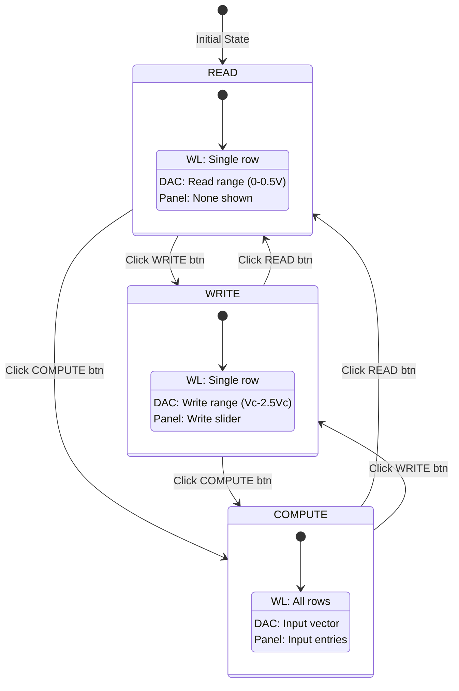

---

## 4. Array Visualization Components

```mermaid
graph LR
    subgraph ArrayCanvas["UnifiedTappableCanvas (850x600px)"]
        direction TB

        subgraph TopPeripherals["Top Peripherals"]
            DAC0["DAC C0"]
            DAC1["DAC C1"]
            DACn["DAC C7"]
        end

        subgraph CellGrid["Cell Grid (8x8)"]
            BL["Bit Lines<br/>(vertical)"]
            WL["Word Lines<br/>(horizontal)"]
            Cells["FeCIM Cells<br/>(color-coded)"]
        end

        subgraph RightPeripherals["Right Peripherals"]
            TIA0["TIA R0"]
            TIA1["TIA R1"]
            TIAn["TIA R7"]
            ADC0["ADC R0"]
            ADC1["ADC R1"]
            ADCn["ADC R7"]
        end

        subgraph Overlays["Overlays"]
            Legend["Legend<br/>G: Lo→Hi<br/>V: R/!/W"]
            EnergyBar["Energy Bar<br/>DAC|TIA|ADC"]
            VGauge["Voltage Gauge"]
            OpBadge["Operation Badge"]
            ArchBadge["Architecture Badge"]
        end
    end

    DAC0 --> BL
    DAC1 --> BL
    DACn --> BL
    BL --> Cells
    WL --> Cells
    Cells --> TIA0
    Cells --> TIA1
    Cells --> TIAn
    TIA0 --> ADC0
    TIA1 --> ADC1
    TIAn --> ADCn

    style Cells fill:#2a4a3a,stroke:#4a8
    style DAC0 fill:#4a2a5a,stroke:#84a
    style TIA0 fill:#5a4a2a,stroke:#a84
    style ADC0 fill:#2a4a4a,stroke:#4a8
```

---

## 5. Data Flow Diagram

```mermaid
flowchart TD
    subgraph UserInput["User Input"]
        ModeBtn["Mode Button Click"]
        CellClick["Cell Click"]
        SliderMove["Slider Change"]
        EntryInput["Entry Input"]
        ActionBtn["Action Button"]
    end

    subgraph StateLayer["State Layer (DeviceState)"]
        OpMode["opMode<br/>READ/WRITE/COMPUTE"]
        WLState["activeRows[]<br/>Word Line State"]
        DACState["dacVoltages[]<br/>DAC Values"]
        Selection["selectedRow/Col<br/>Cell Selection"]
        Material["material<br/>HZOMaterial"]
    end

    subgraph ComputeLayer["Compute Layer"]
        MVMCalc["MVM Calculation<br/>I = G × V"]
        TIAConv["TIA Conversion<br/>V = I × Gain"]
        ADCConv["ADC Quantization<br/>Level = V / LSB"]
    end

    subgraph OutputLayer["Output Layer"]
        RowCurrents["rowCurrents[]"]
        RowVoltages["rowVoltages[]"]
        RowLevels["rowLevels[]"]
        ArrayCanvas2["Array Canvas"]
    end

    ModeBtn --> OpMode
    CellClick --> Selection
    SliderMove --> DACState
    EntryInput --> DACState
    ActionBtn -->|"Program"| MVMCalc

    OpMode --> WLState
    Selection --> WLState
    Material --> MVMCalc
    WLState --> MVMCalc
    DACState --> MVMCalc

    MVMCalc --> RowCurrents
    RowCurrents --> TIAConv
    TIAConv --> RowVoltages
    RowVoltages --> ADCConv
    ADCConv --> RowLevels

    RowCurrents --> ArrayCanvas2
    RowLevels --> ArrayCanvas2

    style OpMode fill:#4a2a5a,stroke:#a4f
    style MVMCalc fill:#2a4a3a,stroke:#4a8
    style ArrayCanvas2 fill:#1a3a4a,stroke:#4af
```

---

## 6. Architecture Toggle Flow

```mermaid
flowchart LR
    subgraph ArchToggle["Architecture Toggle"]
        PassiveBtn["PASSIVE<br/>(0T1R)"]
        T1R1Btn["1T1R"]
        T2R1Btn["2T1R"]
    end

    subgraph Effects["Effects"]
        WLBehavior["WL Behavior"]
        TransistorViz["Transistor Viz"]
        SneakPaths["Sneak Paths"]
        Margins["Array Margins"]
    end

    PassiveBtn -->|"All WL ON<br/>Always"| WLBehavior
    PassiveBtn -->|"No transistors"| TransistorViz
    PassiveBtn -->|"V/2 overlay<br/>active"| SneakPaths
    PassiveBtn -->|"leftMargin=30"| Margins

    T1R1Btn -->|"WL gated<br/>per row"| WLBehavior
    T1R1Btn -->|"Row transistors<br/>shown"| TransistorViz
    T1R1Btn -->|"No sneak<br/>paths"| SneakPaths
    T1R1Btn -->|"leftMargin=55"| Margins

    T2R1Btn -->|"WL+BL gated"| WLBehavior
    T2R1Btn -->|"Row+Col<br/>transistors"| TransistorViz
    T2R1Btn -->|"Full isolation"| SneakPaths
    T2R1Btn -->|"leftMargin=55<br/>bottomMargin=55"| Margins

    style PassiveBtn fill:#5a3a2a,stroke:#a64
    style T1R1Btn fill:#2a5a3a,stroke:#4a6
    style T2R1Btn fill:#2a3a5a,stroke:#46a
```

---

## 7. ISPP Write Sequence

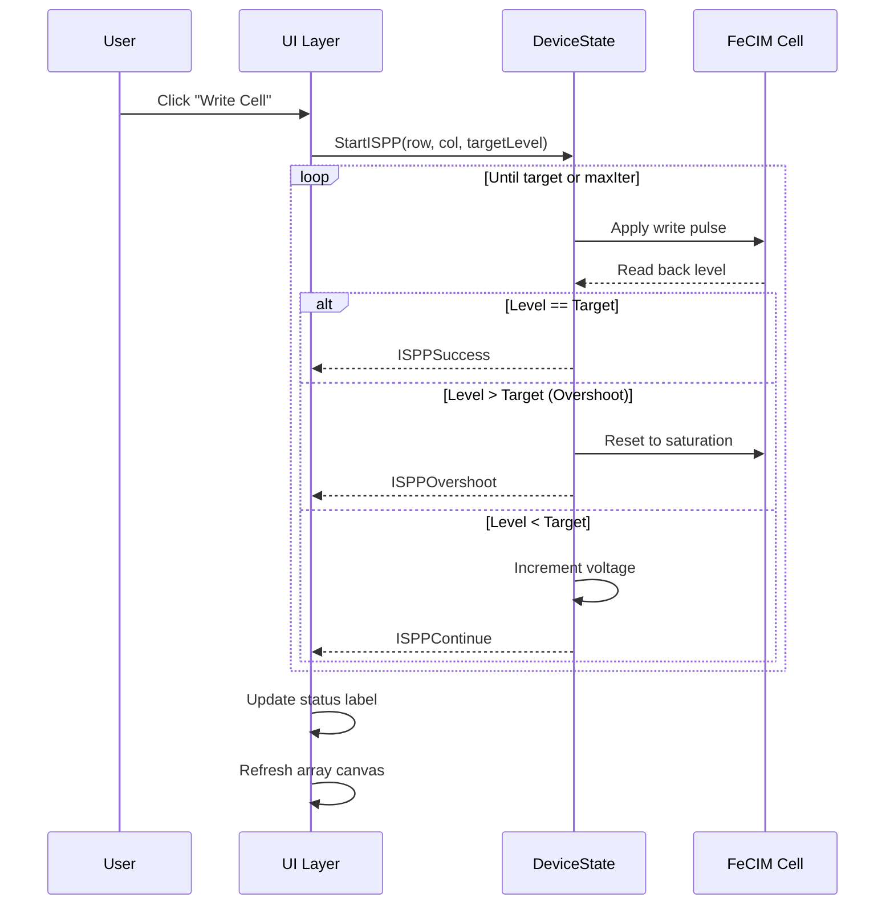

---

## 8. 4-Phase Write Timing

```mermaid
gantt
    title 4-Phase Write Sequence
    dateFormat X
    axisFormat %L

    section Phases
    RESET (opposite polarity)     :reset, 0, 10
    HOLD1 (stabilize)             :hold1, after reset, 5
    WRITE (target polarity)       :write, after hold1, 50
    HOLD2 (stabilize)             :hold2, after write, 5

    section Signals
    WL HIGH                       :wl, 0, 70
    BL Voltage                    :bl, 0, 70
```

---

## 9. Mode Panel Visibility

```mermaid
flowchart TD
    subgraph ModeChange["Mode Change Event"]
        SetMode["setOperationMode(mode)"]
    end

    subgraph PanelLogic["Panel Visibility Logic"]
        HideAll["Hide all panels"]
        CheckMode{"mode?"}
        ShowWrite["Show writeModePanel"]
        ShowCompute["Show computeModePanel"]
        NoPanel["No panel (clean view)"]
    end

    SetMode --> HideAll
    HideAll --> CheckMode
    CheckMode -->|"WRITE"| ShowWrite
    CheckMode -->|"COMPUTE"| ShowCompute
    CheckMode -->|"READ"| NoPanel

    subgraph WritePanelContent["Write Panel"]
        WriteSlider["Level Slider (0-29)"]
        WriteLabels["Level & Voltage Labels"]
        TargetLabel["Target: Row X, Col Y"]
    end

    subgraph ComputePanelContent["Compute Panel"]
        InputEntries["8 Input Entries (0-255)"]
        RandClearBtns["Random | Clear Buttons"]
    end

    ShowWrite --> WritePanelContent
    ShowCompute --> ComputePanelContent

    style ShowWrite fill:#5a4a2a,stroke:#a84
    style ShowCompute fill:#2a4a5a,stroke:#48a
```

---

## 10. File Structure After Refactor

```mermaid
graph TD
    subgraph Package["pkg/gui"]
        direction TB

        subgraph CoreFiles["Core Files"]
            App["app.go<br/>CircuitsApp struct"]
            DevState["device_state.go<br/>DeviceState"]
            Embedded["embedded.go<br/>Interface impl"]
        end

        subgraph UnifiedView["Unified View (Split)"]
            TabMain["tab_unified.go<br/>1146 lines<br/>View creation, events, panels"]
            TabCanvas["tab_unified_canvas.go<br/>114 lines<br/>TappableCanvas widget"]
            TabDrawing["tab_unified_drawing.go<br/>872 lines<br/>Array rendering"]
            TabActions["tab_unified_actions.go<br/>438 lines<br/>Action handlers"]
            TabVoltage["tab_unified_voltage.go<br/>537 lines<br/>ISPP, voltage rules"]
        end

        subgraph OtherViews["Other Views"]
            TabComp["tab_comparison.go"]
            TabRef["tab_reference.go"]
            TabRefTiming["tab_reference_timing.go"]
            TabRefSpecs["tab_reference_specs.go"]
        end

        subgraph Helpers["Helpers"]
            Drawing["drawing.go"]
            HelpersFile["helpers.go"]
            Font["font.go"]
        end
    end

    App --> DevState
    App --> TabMain
    TabMain --> TabCanvas
    TabMain --> TabDrawing
    TabMain --> TabActions
    TabMain --> TabVoltage
    TabMain --> HelpersFile
    TabDrawing --> Drawing

    style TabMain fill:#2a5a4a,stroke:#4a8
    style TabDrawing fill:#3a4a5a,stroke:#68a
    style TabVoltage fill:#4a3a5a,stroke:#84a
```

---

## 11. Signal Chain Visualization

```mermaid
flowchart LR
    subgraph Input["Input Stage"]
        Digital["Digital Input<br/>(0-255)"]
        DAC["DAC<br/>5-bit, 15fJ"]
    end

    subgraph Array["Crossbar Array"]
        BL["Bit Lines<br/>(voltage)"]
        Cells["FeCIM Cells<br/>30 levels"]
        WL["Word Lines<br/>(select)"]
        SL["Source Lines<br/>(current)"]
    end

    subgraph Output["Output Stage"]
        TIA["TIA<br/>10kΩ, 5fJ"]
        ADC["ADC<br/>5-bit SAR, 25fJ"]
        Result["Digital Output<br/>(0-29)"]
    end

    Digital -->|"Code"| DAC
    DAC -->|"Voltage<br/>±1.5V"| BL
    BL --> Cells
    WL -->|"Enable"| Cells
    Cells -->|"Current<br/>µA"| SL
    SL --> TIA
    TIA -->|"Voltage<br/>0-1V"| ADC
    ADC -->|"Level"| Result

    style DAC fill:#4a2a5a,stroke:#84a
    style Cells fill:#2a4a3a,stroke:#4a8
    style TIA fill:#5a4a2a,stroke:#a84
    style ADC fill:#2a4a4a,stroke:#4a8
```

---

## 12. Voltage Zone Colors

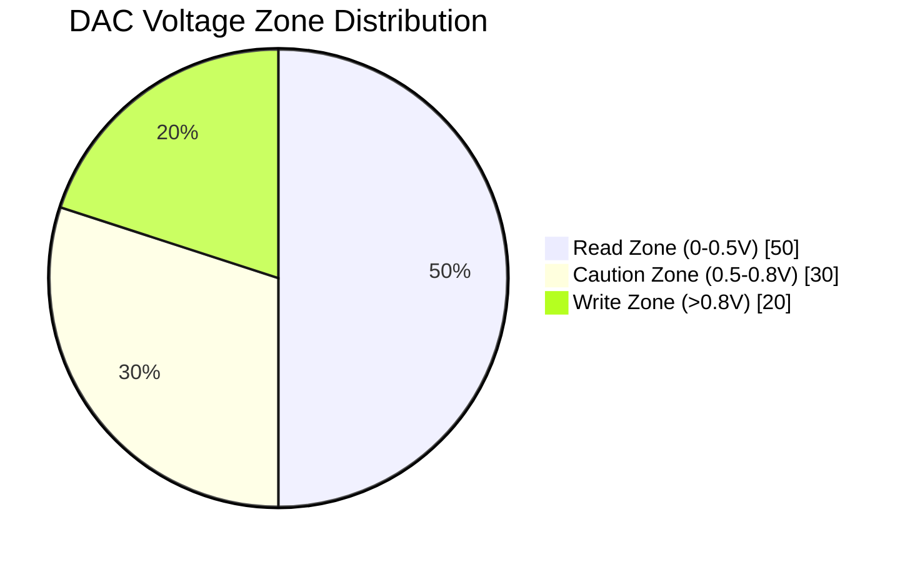

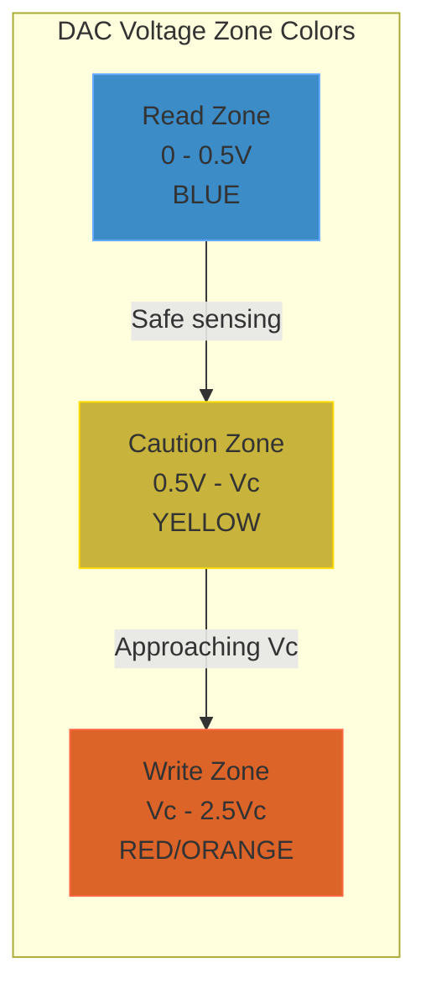

---

## 13. Cell State Color Mapping

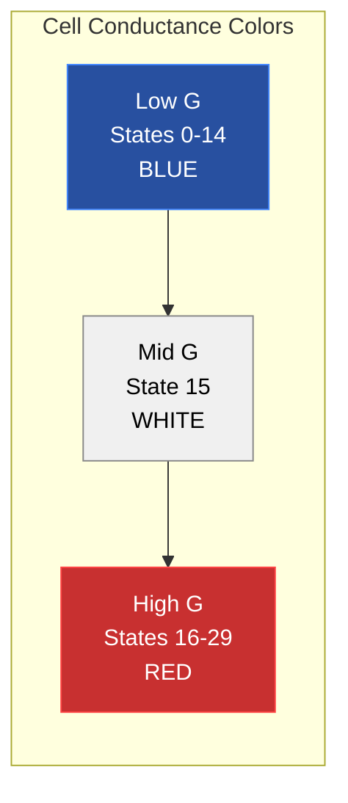

---

## Usage

These diagrams can be rendered in:
- GitHub/GitLab markdown preview
- VS Code with Mermaid extension
- Mermaid Live Editor (mermaid.live)
- Documentation generators (MkDocs, Docusaurus)

---

*Generated: 2026-01-29*
