# Module 6 EDA Design Suite - GUI Architecture

Comprehensive Mermaid diagrams documenting the FeCIM EDA GUI architecture, component hierarchy, data flow, and state machines.

Source: Codebase analysis - module6-eda/pkg/gui/ (embedded.go, app.go, tabs/builder_validation_tab.go, tabs/learn_tab.go)

## Diagram Index

| # | Diagram | Purpose | Key Elements |
|---|---------|---------|--------------|
| 1 | Component Hierarchy | Overall structure | EDAModule, EmbeddedEDAApp, MainWindow, AppTabs |
| 2 | BuilderValidationTab Detailed | Complete layout breakdown | TopSection, PreviewArea, ValidationSection |
| 3 | LearnTab Structure | Educational content | TopicSelector, ContentScroll, 3 topics |
| 4 | Data Flow Diagram | Config through pipelines | Generation → Validation → Export |
| 5 | State Machine | Button states | Idle → Generating/Validating/Exporting |
| 6 | Validation Result Flow | Detailed validation sequence | Yosys → DEF → Cross-check → Placement |
| 7 | Image Generation Pipelines | Three visualization tools | KLayout, Yosys, OpenROAD |
| 8 | Architecture-Based Cell Selection | Cell file routing | PASSIVE, 1T1R, 2T1R architectures |
| 9 | OpenLane Integration Points | Docker/tool integration | Status detection, validation, export |
| 10 | Widget Dependency Graph | Widget update relationships | Config → Stats → Previews → Results |
| 11 | Callback Connection Map | Event handling | Button callbacks, goroutine patterns |
| 12 | File Export Structure | Output directory hierarchy | Generated files organization |

---

## Diagram 1: Component Hierarchy

Shows the overall structure of the application and how components are organized.

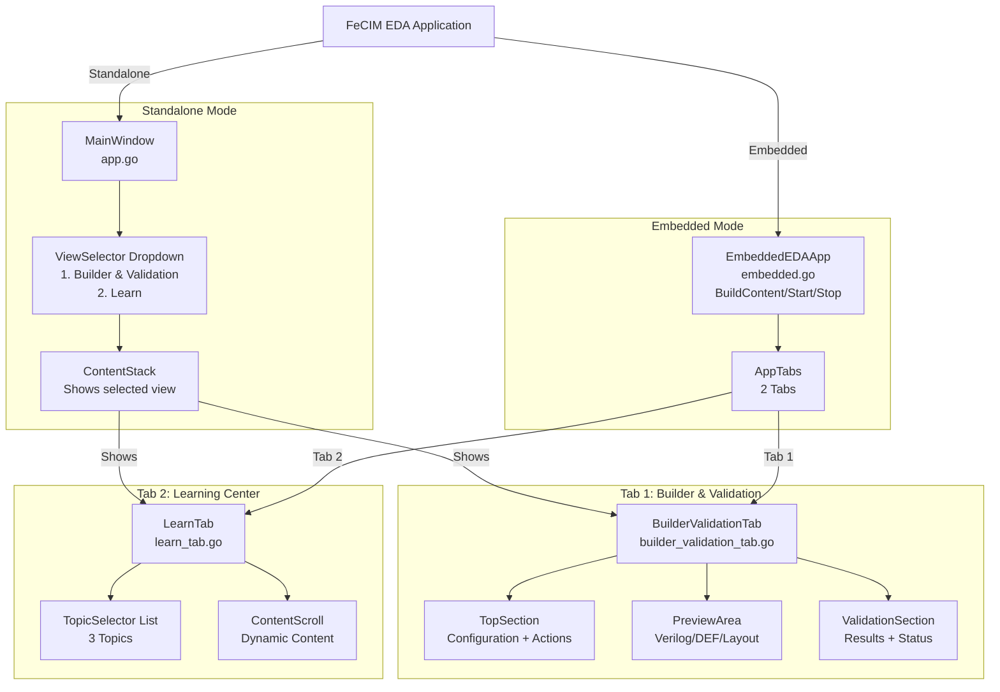

---

## Diagram 2: BuilderValidationTab Detailed Structure

Complete layout of the unified Builder & Validation tab with all subsections.

```mermaid
graph TD
    BVTab["BuilderValidationTab"]

    subgraph "Top Section: Configuration & Actions"
        ConfigSplit["ConfigSplit<br/>HSplit 45%|55%"]

        subgraph "Left: Cell Config 45%"
            CellPanel["CellPanel"]
            CellGrid["CellGrid 6 cols<br/>Name | Width | Height<br/>Rise | Fall | Cap"]
            CellGrid2["CellGrid2 4 cols<br/>Leakage | CellArea | empty"]
        end

        subgraph "Right: Array Config 55%"
            ArrayPanel["ArrayPanel"]
            ArrayGrid["ArrayGrid 6 cols<br/>Rows | Cols | Mode"]
            ArrayGrid2["Architecture Toggle<br/>3 buttons: PASSIVE | 1T1R | 2T1R"]
            ModeHelp["ModeHelpText<br/>Storage/Memory/Compute"]
            StatsRow["StatsRow HBox<br/>Total | Area | WL | BL | Density | Util"]
        end

        ActionRow["ActionRow HBox<br/>GenerateAll | ValidateAll | ExportPackage"]
        StatusBar["StatusBar HBox<br/>Status: label"]
    end

    subgraph "Middle Section: Preview Tabs"
        PreviewTabs["AppTabs<br/>Verilog | DEF | Layout"]

        subgraph "Verilog Tab"
            VerilogStats["VerilogStats<br/>Instances | Lines | Size"]
            VerilogPreview["VerilogPreview MultiLineEntry<br/>Scrollable code view"]
        end

        subgraph "DEF Tab"
            DefStats["DefStats<br/>Components | File"]
            DefPreview["DefPreview MultiLineEntry<br/>Scrollable placement"]
        end

        subgraph "Layout Tab"
            LayoutButtons["LayoutButtons HBox<br/>GenSchematic | GenOpenROAD"]
            LayoutHelp["LayoutHelp Label<br/>Tool availability info"]
            ImageGrid["ImageGrid<br/>GridWithColumns 3"]

            subgraph "ImageGrid Contents"
                KLayoutCard["KLayoutCard<br/>Image + Status"]
                OpenROADCard["OpenROADCard<br/>Image + Status"]
                YosysCard["YosysCard<br/>Image + Status"]
            end
        end
    end

    subgraph "Bottom Section: Validation & Status"
        ValidationRow["ValidationRow HBox<br/>Label | Summary |<br/>Yosys | DEF | Cross | Placement"]
        OpenLaneRow["OpenLaneRow HBox<br/>Docker Status | PDK Status | Pull Button"]
        LogSection["LogSection<br/>LogHeader + LogScroll"]

        subgraph "Log Output"
            ClearLogBtn["ClearLogBtn"]
            LogOutput["LogOutput MultiLineEntry<br/>Scrollable monospace"]
        end
    end

    BVTab --> TopSection
    BVTab --> PreviewArea["VSplit 75%|25%"]
    BVTab --> ValidationSection

    TopSection --> ConfigSplit
    ConfigSplit --> CellPanel
    ConfigSplit --> ArrayPanel
    CellPanel --> CellGrid
    CellPanel --> CellGrid2
    ArrayPanel --> ArrayGrid
    ArrayPanel --> ArrayGrid2
    ArrayPanel --> ModeHelp
    ArrayPanel --> StatsRow
    TopSection --> ActionRow
    TopSection --> StatusBar

    PreviewArea --> PreviewTabs
    PreviewTabs --> VerilogTab
    PreviewTabs --> DEFTab
    PreviewTabs --> LayoutTab

    VerilogTab --> VerilogStats
    VerilogTab --> VerilogPreview
    DEFTab --> DefStats
    DEFTab --> DefPreview
    LayoutTab --> LayoutButtons
    LayoutTab --> LayoutHelp
    LayoutTab --> ImageGrid
    ImageGrid --> KLayoutCard
    ImageGrid --> OpenROADCard
    ImageGrid --> YosysCard

    ValidationSection --> ValidationRow
    ValidationSection --> OpenLaneRow
    ValidationSection --> LogSection
    LogSection --> ClearLogBtn
    LogSection --> LogOutput
```

---

## Diagram 3: LearnTab Structure

Educational content with topic-based navigation and dynamic content loading.

```mermaid
graph TD
    LearnTab["LearnTab<br/>learn_tab.go"]

    subgraph "Layout: HSplit 25%|75%"
        Sidebar["Sidebar<br/>SidebarTitle + List"]
        ContentArea["ContentScroll<br/>750x500 minimum"]
    end

    subgraph "Topics List"
        Topic0["Topic 0<br/>What is FeCIM EDA?"]
        Topic1["Topic 1<br/>The Crossbar Architecture"]
        Topic2["Topic 2<br/>EDA Files We Generate"]
    end

    subgraph "Topic 0: Introduction"
        Intro["Intro Title + Description"]
        OperationModes["OperationModesVisual<br/>620x230"]
        OpenLaneFlow["OpenLaneFlowDiagram<br/>760x290"]
        StagesExplained["StagesExplained Section<br/>6 stages in detail"]
        WhatWeDo["What We Do Bullets<br/>LEF/LIB/V/DEF/Config"]
        WhatWeDont["What We Don't Do Bullets<br/>Models/GDSII/Timing"]
        Disclaimer["DisclaimerCard<br/>Not affiliated with Rice"]
    end

    subgraph "Topic 1: Crossbar Architecture"
        PassiveTitle["Passive Crossbar<br/>Description + specs"]
        PassiveDiagram["IsometricCrossbar<br/>3x3 visual<br/>450x400"]
        OneTitle["1T1R Architecture<br/>Description + specs"]
        OneDiagram["Isometric1T1RCrossbar<br/>3x3 visual<br/>450x400"]
        ComparisonTable["CellComparisonTable<br/>460x220"]
        SneakPath["Sneak Path Explanation<br/>Problem description"]
        Recommendation["RecommendationCard<br/>Size guidelines"]
    end

    subgraph "Topic 2: Files We Generate"
        FilesTitle["EDA Files We Generate"]
        FileCards["FileCardsGrid<br/>AdaptiveGrid 2 cols"]

        subgraph "File Cards"
            LEFCard["LEFPreviewCard"]
            DEFCard["DEFPreviewCard"]
            VerilogCard["VerilogPreviewCard"]
            LibertyCard["LibertyPreviewCard"]
        end

        GenSection["How We Generate Files<br/>Verilog/DEF/LEF logic"]
        ValSection["How We Validate<br/>Yosys/DEF/Cross/Placement"]
        ImgSection["Layout Visualization<br/>KLayout/Magic/OpenROAD"]
        FormatSection["File Format Summary<br/>Purpose of each file"]
        RefsSection["References<br/>OpenLane docs + links"]
    end

    Header["Header<br/>Title + Subtitle"]

    LearnTab --> Header
    LearnTab --> Layout["HSplit"]
    Layout --> Sidebar
    Layout --> ContentArea

    Sidebar --> Topic0
    Sidebar --> Topic1
    Sidebar --> Topic2

    Topic0 --> ContentArea
    Topic1 --> ContentArea
    Topic2 --> ContentArea

    ContentArea -->|Topic 0| Intro
    ContentArea -->|Topic 0| OperationModes
    ContentArea -->|Topic 0| OpenLaneFlow
    ContentArea -->|Topic 0| StagesExplained
    ContentArea -->|Topic 0| WhatWeDo
    ContentArea -->|Topic 0| WhatWeDont
    ContentArea -->|Topic 0| Disclaimer

    ContentArea -->|Topic 1| PassiveTitle
    ContentArea -->|Topic 1| PassiveDiagram
    ContentArea -->|Topic 1| OneTitle
    ContentArea -->|Topic 1| OneDiagram
    ContentArea -->|Topic 1| ComparisonTable
    ContentArea -->|Topic 1| SneakPath
    ContentArea -->|Topic 1| Recommendation

    ContentArea -->|Topic 2| FilesTitle
    ContentArea -->|Topic 2| FileCards
    ContentArea -->|Topic 2| GenSection
    ContentArea -->|Topic 2| ValSection
    ContentArea -->|Topic 2| ImgSection
    ContentArea -->|Topic 2| FormatSection
    ContentArea -->|Topic 2| RefsSection

    FileCards --> LEFCard
    FileCards --> DEFCard
    FileCards --> VerilogCard
    FileCards --> LibertyCard
```

---

## Diagram 4: Data Flow Diagram

Shows how array configuration flows through generation, validation, and export pipelines.

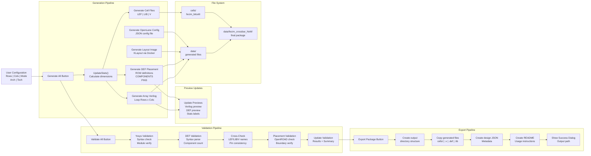

---

## Diagram 5: State Machine - Button States During Async Operations

Describes the lifecycle of button states during long-running operations.

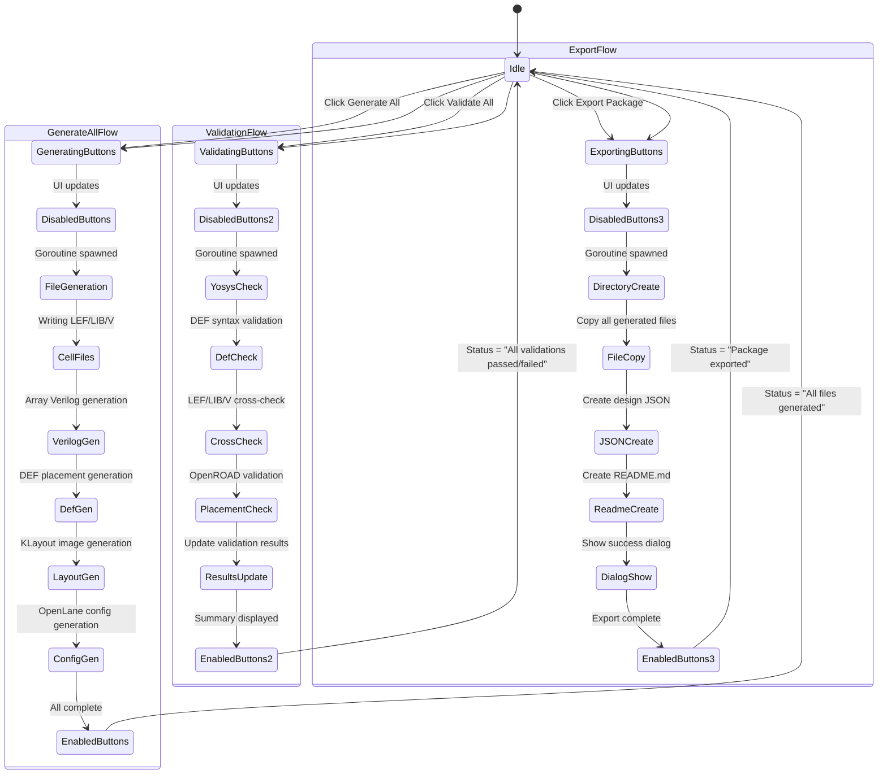

---

## Diagram 6: Validation Result Flow

Detailed sequence of validation checks and result updates.

```mermaid
graph TD
    Start["Validate All Started"]

    subgraph "Yosys Validation"
        YV1["Load Array: fecim_crossbar_NxM.v"]
        YV2["Load Cell: cell.v"]
        YV3["Run: yosys -p read_verilog"]
        YV4{Syntax OK?}
        YV5A["✓ PASS"]
        YV5B["✗ FAIL<br/>Log error"]
    end

    subgraph "DEF Validation"
        DV1["Load DEF: fecim_crossbar_NxM.def"]
        DV2["Parse structure"]
        DV3["Check COMPONENTS count"]
        DV4{Syntax OK?}
        DV5A["✓ PASS<br/>Extract stats"]
        DV5B["✗ FAIL<br/>Log error"]
    end

    subgraph "Cross-Check Validation"
        CV1["Compare cell names<br/>LEF ↔ LIB ↔ V"]
        CV2["Compare pin names"]
        CV3{All match?}
        CV4A["✓ PASS"]
        CV4B["✗ FAIL<br/>Log mismatch"]
    end

    subgraph "Placement Validation"
        PV1{OpenLane Available?}
        PV2A["SKIP<br/>Docker/tools missing"]
        PV2B["Load LEF + DEF"]
        PV3["Run OpenROAD<br/>check_placement"]
        PV4{Placement OK?}
        PV5A["✓ PASS<br/>Boundaries OK"]
        PV5B["✗ FAIL<br/>Violations found"]
    end

    subgraph "Summary Generation"
        SG1{All passed?}
        SG2A["✓ ALL PASSED<br/>Green summary"]
        SG2B["✗ SOME FAILED<br/>Red summary<br/>Details in log"]
    end

    subgraph "UI Update"
        UI1["Update labels:<br/>yosysResult<br/>defResult<br/>crossResult<br/>placementResult"]
        UI2["Update summary"]
        UI3["Enable buttons"]
        UI4["Update status"]
    end

    Start --> YV1
    YV1 --> YV2 --> YV3 --> YV4
    YV4 -->|Yes| YV5A
    YV4 -->|No| YV5B

    YV5A --> DV1
    YV5B --> DV1
    DV1 --> DV2 --> DV3 --> DV4
    DV4 -->|Yes| DV5A
    DV4 -->|No| DV5B

    DV5A --> CV1
    DV5B --> CV1
    CV1 --> CV2 --> CV3
    CV3 -->|Yes| CV4A
    CV3 -->|No| CV4B

    CV4A --> PV1
    CV4B --> PV1
    PV1 -->|No| PV2A
    PV1 -->|Yes| PV2B
    PV2B --> PV3 --> PV4
    PV4 -->|Yes| PV5A
    PV4 -->|No| PV5B

    PV2A --> SG1
    PV5A --> SG1
    PV5B --> SG1
    SG1 -->|Yes| SG2A
    SG1 -->|No| SG2B

    SG2A --> UI1
    SG2B --> UI1
    UI1 --> UI2 --> UI3 --> UI4
    UI4 --> End["Validation Complete"]
```

---

## Diagram 7: Image Generation Pipelines

Three different tools for generating layout visualizations.

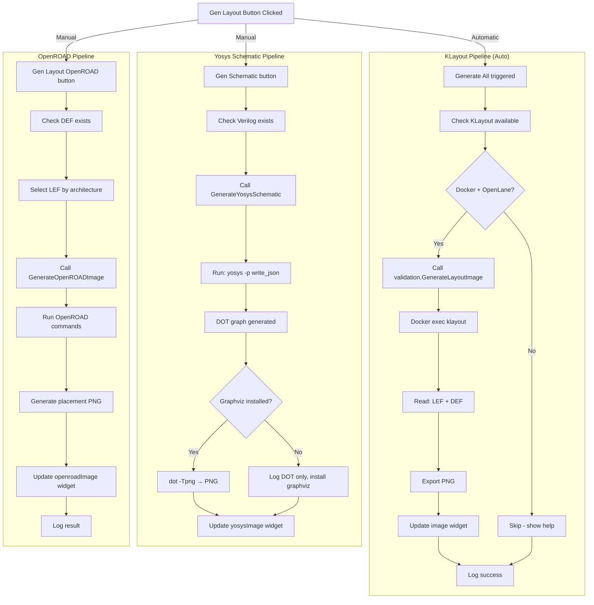

---

## Diagram 8: Architecture-Based Cell Selection

How the application routes to different cell files based on architecture choice.

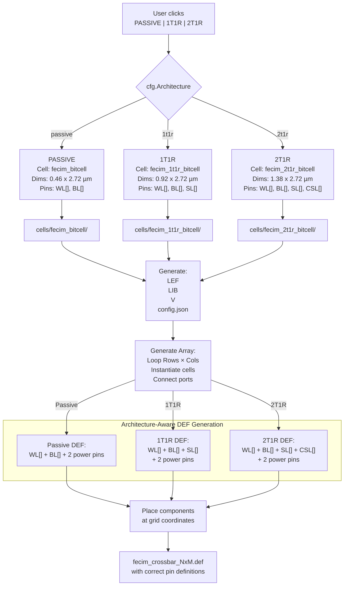

---

## Diagram 9: OpenLane Integration Points

Shows where the app integrates with OpenLane/Docker ecosystem.

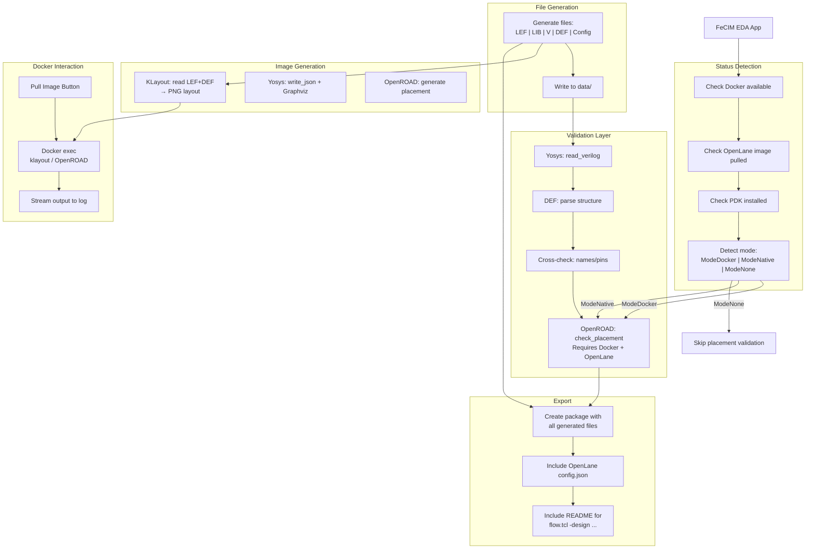

---

## Diagram 10: Widget Dependency Graph

Shows how widgets receive updates and interact with data flow.

```mermaid
graph TD
    Config["ArrayConfig struct<br/>Rows | Cols | Mode<br/>CellWidth | CellHeight<br/>Architecture | Technology"]

    subgraph "Input Widgets"
        RowsEntry["rowsEntry"]
        ColsEntry["colsEntry"]
        WidthEntry["widthEntry"]
        HeightEntry["heightEntry"]
        ModeSelect["modeSelect"]
        ArchButtons["archPassiveBtn<br/>arch1T1RBtn<br/>arch2T1RBtn"]
    end

    subgraph "Statistics Widgets"
        TotalLabel["totalLabel"]
        AreaLabel["areaLabel"]
        WLLength["wlLengthLabel"]
        BLLength["blLengthLabel"]
        DensityLabel["densityLabel"]
        UtilizationLabel["utilizationLabel"]
        CellAreaLabel["cellAreaLabel"]
    end

    subgraph "Preview Widgets"
        VerilogPreview["verilogPreview"]
        VerilogStats["verilogStatsLabel"]
        DefPreview["defPreview"]
        DefStats["defStatsLabel"]
    end

    subgraph "Validation Widgets"
        YosysResult["yosysResult"]
        DefResult["defResult"]
        CrossResult["crossResult"]
        PlacementResult["placementResult"]
        ValidationSummary["validationSummary"]
        LogOutput["logOutput"]
    end

    subgraph "Image Widgets"
        KLayoutImage["klayoutImage"]
        KLayoutStatus["klayoutStatus"]
        OpenROADImage["openroadImage"]
        OpenROADStatus["openroadStatus"]
        YosysImage["yosysImage"]
        YosysStatus["yosysStatus"]
    end

    subgraph "Status Widgets"
        StatusLabel["statusLabel"]
        DockerStatus["dockerStatus"]
        PDKStatus["pdkStatus"]
    end

    Config --> updateStats["updateStats()"]
    RowsEntry --> updateStats
    ColsEntry --> updateStats
    WidthEntry --> updateStats
    HeightEntry --> updateStats

    updateStats --> TotalLabel
    updateStats --> AreaLabel
    updateStats --> WLLength
    updateStats --> BLLength
    updateStats --> DensityLabel
    updateStats --> UtilizationLabel
    updateStats --> CellAreaLabel

    Config --> getCellConfig["getCellConfig()"]
    ArchButtons --> getCellConfig

    getCellConfig -->|Generation| VerilogPreview
    getCellConfig -->|Generation| DefPreview

    VerilogPreview --> VerilogStats
    DefPreview --> DefStats

    Config -->|Validation| YosysResult
    Config -->|Validation| DefResult
    Config -->|Validation| CrossResult
    Config -->|Validation| PlacementResult

    YosysResult --> ValidationSummary
    DefResult --> ValidationSummary
    CrossResult --> ValidationSummary
    PlacementResult --> ValidationSummary

    Config -->|Image Gen| KLayoutImage
    Config -->|Image Gen| OpenROADImage
    Config -->|Image Gen| YosysImage

    KLayoutImage --> KLayoutStatus
    OpenROADImage --> OpenROADStatus
    YosysImage --> YosysStatus

    LogOutput -.->|All operations| StatusLabel
```

---

## Diagram 11: Callback Connection Map

Shows how button callbacks and event handlers connect components.

```mermaid
graph TD
    subgraph "Configuration Callbacks"
        RowsEntry["rowsEntry.OnChanged<br/>→ updateStats()"]
        ColsEntry["colsEntry.OnChanged<br/>→ updateStats()"]
        WidthEntry["widthEntry.OnChanged<br/>→ updateStats()"]
        HeightEntry["heightEntry.OnChanged<br/>→ updateStats()"]
        ModeSelect["modeSelect.OnChanged<br/>→ updateModeHelp()"]
        ArchPassive["archPassiveBtn.OnTapped<br/>→ cfg.Architecture='passive'<br/>→ updateArchButtons()"]
    end

    subgraph "Action Callbacks"
        GenAll["generateAllBtn.OnTapped<br/>→ Goroutine spawns<br/>→ Generate pipeline"]
        ValidAll["validateAllBtn.OnTapped<br/>→ Goroutine spawns<br/>→ Validation pipeline"]
        ExportPkg["exportPackageBtn.OnTapped<br/>→ Goroutine spawns<br/>→ Export pipeline"]
        ClearLog["clearLogBtn.OnTapped<br/>→ logOutput.SetText('')"]
    end

    subgraph "Image Generation Callbacks"
        GenSchematic["genSchematicBtn.OnTapped<br/>→ Goroutine<br/>→ validation.GenerateYosysSchematic()"]
        GenOpenROAD["genOpenROADBtn.OnTapped<br/>→ Goroutine<br/>→ validation.GenerateOpenROADImage()"]
        PullImage["pullImageBtn.OnTapped<br/>→ Goroutine<br/>→ manager.PullDockerImage()"]
    end

    subgraph "Goroutine Patterns"
        GoGen["go func() {<br/>  updateStats()<br/>  getCellConfig()<br/>  export.GenerateLEF()<br/>  ...<br/>  fyne.Do(func() {<br/>    Update UI widgets<br/>  })<br/>}()"]
        GoVal["go func() {<br/>  validation.ValidateVerilog()<br/>  validation.ValidateDEF()<br/>  validation.CrossCheck()<br/>  validation.RunPlacementCheck()<br/>  fyne.Do(func() {<br/>    Update results<br/>  })<br/>}()"]
        GoExp["go func() {<br/>  os.MkdirAll()<br/>  os.WriteFile() × 6<br/>  fyne.Do(func() {<br/>    dialog.ShowInformation()<br/>  })<br/>}()"]
    end

    RowsEntry -.-> updateStats["updateStats()"]
    ColsEntry -.-> updateStats
    WidthEntry -.-> updateStats
    HeightEntry -.-> updateStats

    GenAll --> GoGen
    ValidAll --> GoVal
    ExportPkg --> GoExp

    GoGen -->|fyne.Do| UpdateUI["UI Update pattern<br/>- Labels<br/>- Previews<br/>- Status"]
    GoVal -->|fyne.Do| UpdateUI
    GoExp -->|fyne.Do| UpdateUI

    GenSchematic --> GoGen
    GenOpenROAD --> GoGen
    PullImage --> GoGen
```

---

## Diagram 12: File Export Structure

Hierarchy of generated files when "Export Package" is clicked.

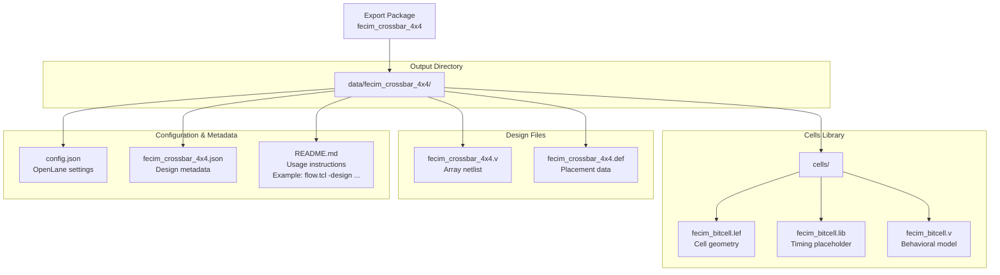

---

## Key Architectural Principles

### 1. Separation of Concerns
- **GUI Layer** (`gui/`): Only Fyne widgets and layouts
- **Logic Layer** (`pkg/export`, `pkg/validation`): File generation and validation
- **Config Layer** (`pkg/config`): Data structures
- **Integration Layer** (`pkg/openlane`): External tool management

### 2. Async/Goroutine Pattern
All heavy operations (generation, validation, export) run in goroutines:
```go
go func() {
    // Heavy work
    fyne.Do(func() {
        // UI updates - must be on main thread
    })
}()
```

### 3. Architecture-Aware Generation
The app supports three cell architectures (PASSIVE, 1T1R, 2T1R) and routes to appropriate files:
- Cell library path selection
- Pin definitions in DEF (SL, CSL for transistor variants)
- Verilog instantiation parameters

### 4. Docker Integration
Optional Docker support for advanced features:
- KLayout image generation (automatic on "Generate All")
- OpenROAD placement validation
- Yosys schematic generation
- Fallback modes when Docker unavailable

### 5. Progressive UI Updates
Generation/validation happen in background while UI remains responsive:
1. Button disabled (prevent double-click)
2. Status updated immediately
3. Goroutine processes files
4. Results streamed to log in real-time
5. Previews and validation results updated
6. Button re-enabled when complete

---

## File Locations

| Component | File |
|-----------|------|
| Embedded entry point | `pkg/gui/embedded.go` |
| Standalone entry point | `pkg/gui/app.go` |
| Builder & Validation tab | `pkg/gui/tabs/builder_validation_tab.go` |
| Learn Center tab | `pkg/gui/tabs/learn_tab.go` |
| Educational visuals | `pkg/gui/tabs/learn_visuals*.go` |
| Layout canvas | `pkg/gui/widgets/layout_canvas.go` |
| Command entry point | `cmd/eda-gui/main.go` |

---

## Related Documentation

- **Main Architecture**: `/docs/eda/GUI_ARCHITECTURE.md`
- **Source Code Analysis**: `/docs/development/GUI.module6.md`
- **Builder Tab**: 1286 lines of configuration, generation, and validation UI
- **Learn Tab**: Educational content with 3 topics and interactive visuals
