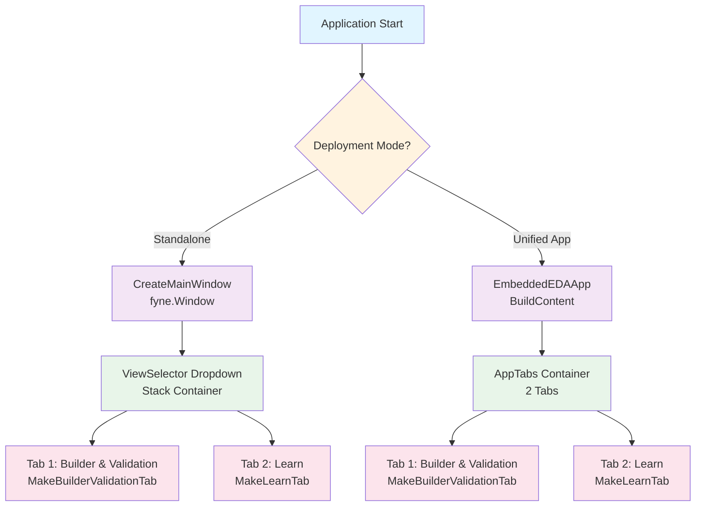
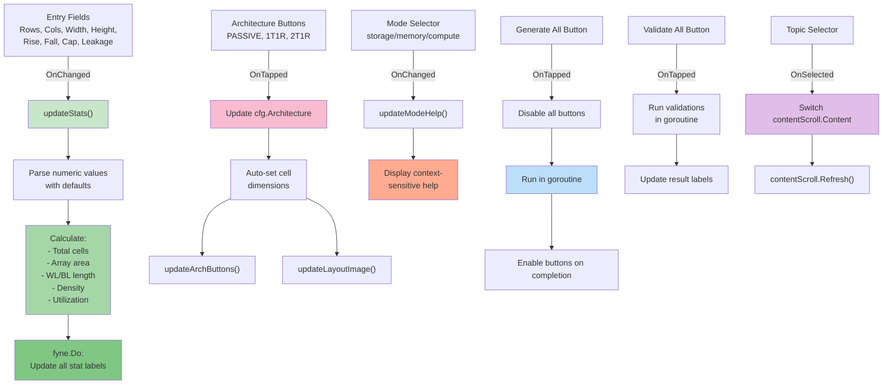
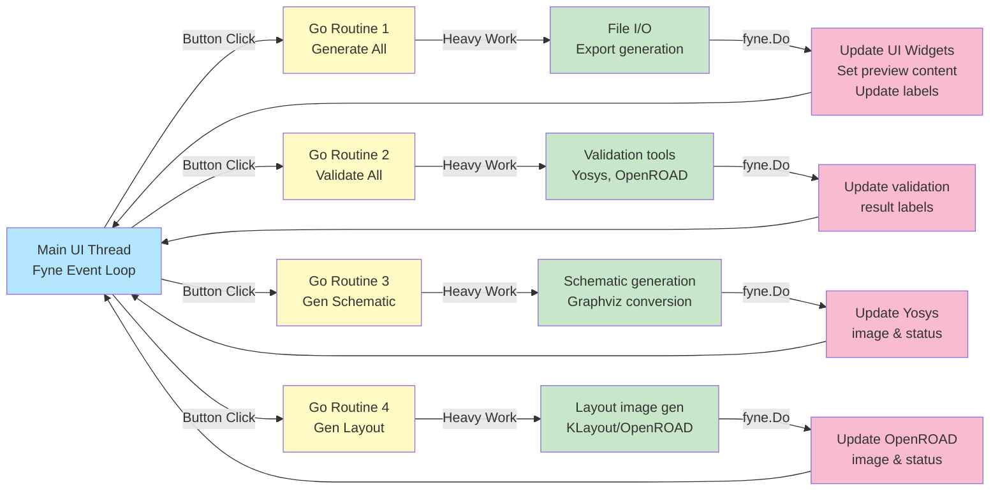
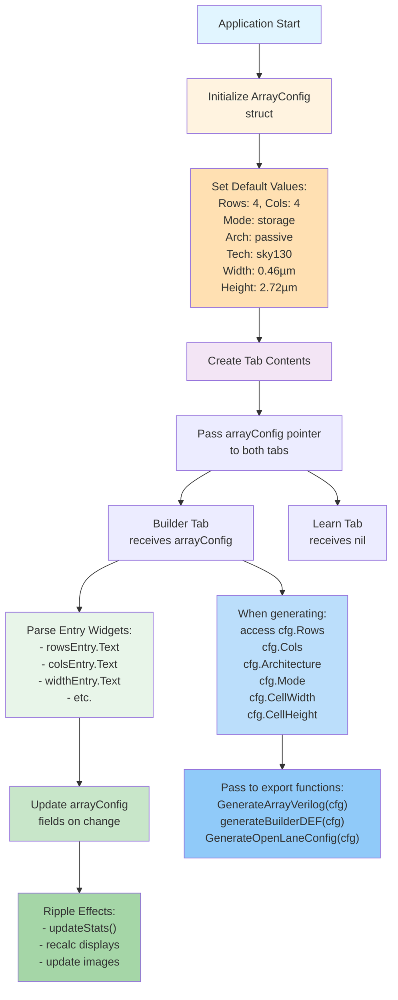
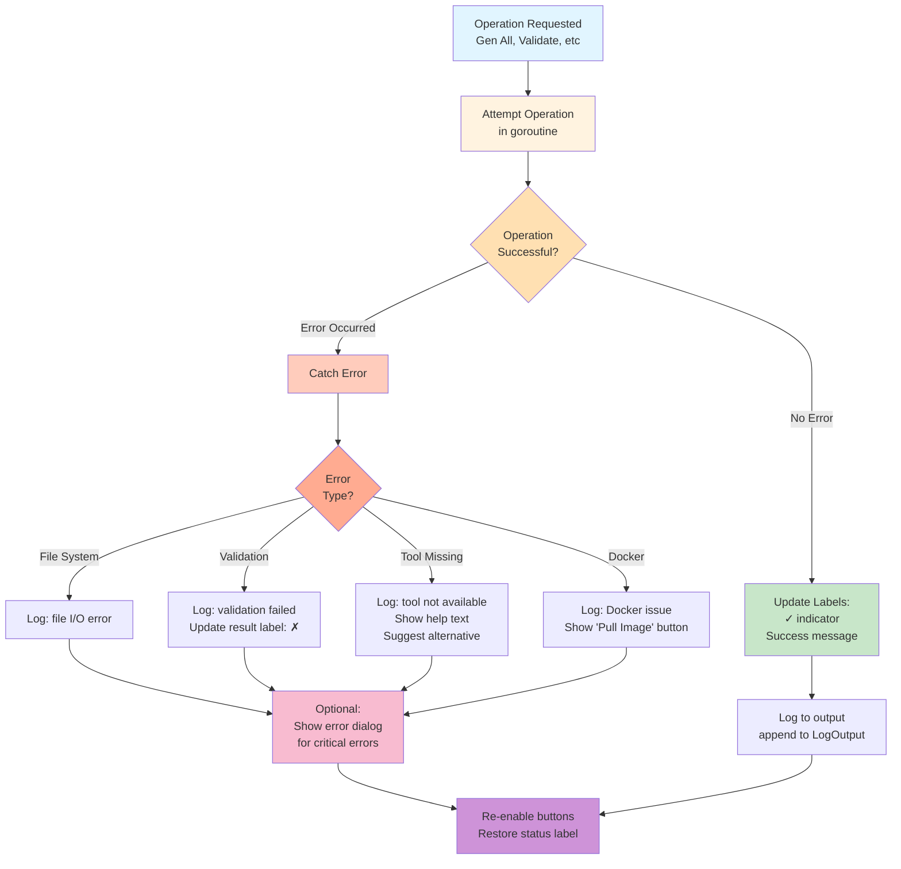

# Module 6 EDA GUI Architecture

> **Status (2026-02-03):** This document reflects the earlier multi-panel GUI design.  
> The current GUI exposes two views only: **Builder & Validation** and **Learn**.  
> Treat the rest as legacy reference; see `module6-eda/pkg/gui/app.go` for the live structure.

## Overview

Module 6 EDA provides two deployment modes with identical functionality:

1. **Standalone Mode** (`cmd/eda-gui/main.go`): Traditional windowed application using `CreateMainWindow()`
2. **Embedded Mode** (`cmd/fecim-lattice-tools/main.go`): AppTabs integration into unified visualizer using `EmbeddedEDAApp`

Both modes share identical tab implementations and data flow.

## GUI Component Hierarchy



## Builder & Validation Tab - Detailed Structure

```mermaid
graph TD
    BuilderTab["Builder & Validation Tab<br/>MakeBuilderValidationTab"]

    BuilderTab --> MainLayout["MainContent<br/>BorderContainer"]

    MainLayout --> TopSection["TopSection<br/>VBox"]
    MainLayout --> MainSplit["MainSplit<br/>VSplit 75/25"]

    %% Top Section Components
    TopSection --> ConfigSplit["ConfigSplit<br/>HSplit 45/55"]
    TopSection --> ActionRow["ActionRow<br/>HBox"]
    TopSection --> StatusBar["StatusBar<br/>HBox"]

    %% Config Split Panels
    ConfigSplit --> CellPanel["CellPanel<br/>VBox"]
    ConfigSplit --> ArrayPanel["ArrayPanel<br/>VBox"]

    %% Cell Panel Contents
    CellPanel --> CellTitle["CellTitle: 'Cell Config'"]
    CellPanel --> CellGrid["CellGrid<br/>GridWithColumns 6<br/>Name, Width, Height,<br/>Rise, Fall, Cap"]
    CellPanel --> CellGrid2["CellGrid2<br/>GridWithColumns 4<br/>Leakage, Area"]

    %% Array Panel Contents
    ArrayPanel --> ArrayTitle["ArrayTitle: 'Array Config'"]
    ArrayPanel --> ArrayGrid["ArrayGrid<br/>GridWithColumns 6<br/>Rows, Cols, Mode"]
    ArrayPanel --> ArchToggle["ArchToggle<br/>GridWithColumns 3<br/>PASSIVE, 1T1R, 2T1R"]
    ArrayPanel --> ModeHelp["ModeHelp<br/>TextLabel<br/>Context-sensitive text"]
    ArrayPanel --> StatsRow["StatsRow<br/>HBox<br/>Total, Area, WL, BL,<br/>Density, Utilization"]

    %% Action Row
    ActionRow --> GenAllBtn["Generate All"]
    ActionRow --> ValidateAllBtn["Validate All"]
    ActionRow --> ExportPkgBtn["Export Package"]

    %% Main Split - Preview vs Validation
    MainSplit --> PreviewTabs["PreviewTabs<br/>AppTabs"]
    MainSplit --> ValidationSection["ValidationSection<br/>VBox"]

    %% Preview Tabs
    PreviewTabs --> VerilogTab["Tab: Verilog<br/>BorderContainer"]
    PreviewTabs --> DEFTab["Tab: DEF<br/>BorderContainer"]
    PreviewTabs --> LayoutTab["Tab: Layout<br/>BorderContainer"]

    %% Verilog Tab
    VerilogTab --> VerilogStats["VerilogStatsLabel<br/>Stats: instances, lines, size"]
    VerilogTab --> VerilogPreview["VerilogPreview<br/>MultiLineEntry + Scroll"]

    %% DEF Tab
    DEFTab --> DEFStats["DEFStatsLabel<br/>Stats: components, file"]
    DEFTab --> DEFPreview["DEFPreview<br/>MultiLineEntry + Scroll"]

    %% Layout Tab
    LayoutTab --> LayoutButtons["LayoutButtons<br/>HBox"]
    LayoutTab --> ImageGrid["ImageGrid<br/>GridWithColumns 3"]

    LayoutButtons --> GenSchematicBtn["Gen Schematic<br/>Yosys"]
    LayoutButtons --> GenOpenROADBtn["Gen Layout<br/>OpenROAD"]
    LayoutButtons --> LayoutHelp["LayoutHelp<br/>Help text"]

    ImageGrid --> KLayoutCard["KLayoutCard<br/>Image + Status"]
    ImageGrid --> OpenROADCard["OpenROADCard<br/>Image + Status"]
    ImageGrid --> YosysCard["YosysCard<br/>Image + Status"]

    %% Validation Section
    ValidationSection --> Separator1["Separator"]
    ValidationSection --> ValidationRow["ValidationRow<br/>HBox"]
    ValidationSection --> OpenLaneRow["OpenLaneRow<br/>HBox"]
    ValidationSection --> LogHeader["LogHeader<br/>HBox"]
    ValidationSection --> LogScroll["LogScroll<br/>Scroll Container"]

    ValidationRow --> ValSummary["Summary<br/>Label"]
    ValidationRow --> YosysResult["Yosys<br/>Result"]
    ValidationRow --> DEFResult["DEF<br/>Result"]
    ValidationRow --> CrossResult["Cross<br/>Result"]
    ValidationRow --> PlacementResult["Placement<br/>Result"]

    OpenLaneRow --> DockerStatus["Docker:<br/>Status Label"]
    OpenLaneRow --> PDKStatus["PDK:<br/>Status Label"]
    OpenLaneRow --> PullImageBtn["Pull Image<br/>Button"]

    LogScroll --> LogOutput["LogOutput<br/>MultiLineEntry"]
    LogHeader --> ClearLogBtn["Clear Log<br/>Button"]

    style BuilderTab fill:#b3e5fc
    style MainLayout fill:#e0f2f1
    style TopSection fill:#fff9c4
    style MainSplit fill:#fff9c4
    style ConfigSplit fill:#ffe0b2
    style CellPanel fill:#f0f4c3
    style ArrayPanel fill:#f0f4c3
    style PreviewTabs fill:#e1bee7
    style LayoutTab fill:#c8e6c9
    style ValidationSection fill:#ffccbc
    style ImageGrid fill:#d1c4e9
    style LogScroll fill:#f5f5f5
```



## Learn Tab - Detailed Structure

```mermaid
graph TD
    LearnTab["Learn Tab<br/>MakeLearnTab"]

    LearnTab --> Header["Header<br/>VBox"]
    LearnTab --> Content["Content<br/>BorderContainer"]

    Header --> LearnTitle["Title: 'FeCIM Array Builder -<br/>Learning Center'"]
    Header --> LearnSubtitle["Subtitle"]
    Header --> Separator["Separator"]

    Content --> Split["Split<br/>HSplit 25/75"]

    Split --> Sidebar["Sidebar<br/>BorderContainer"]
    Split --> ContentScroll["ContentScroll<br/>Scroll Container"]

    Sidebar --> SidebarTitle["SidebarTitle:<br/>'Topics'"]
    Sidebar --> TopicSelector["TopicSelector<br/>List Widget<br/>3 Topics"]

    ContentScroll --> DynamicContent["Dynamic Content<br/>VBox"]

    TopicSelector --> Topic0["Topic 0<br/>What is FeCIM EDA?"]
    TopicSelector --> Topic1["Topic 1<br/>Crossbar Architecture"]
    TopicSelector --> Topic2["Topic 2<br/>EDA Files"]

    DynamicContent -->|Topic 0| IntroContent["Intro Content<br/>makeIntroContent"]
    DynamicContent -->|Topic 1| CrossbarContent["Crossbar Content<br/>makeCrossbarContent"]
    DynamicContent -->|Topic 2| FilesContent["Files Content<br/>makeFilesContent"]

    %% Intro Content Structure
    IntroContent --> IntroTitle["Title: 'What is FeCIM EDA?'"]
    IntroContent --> IntroText["Intro Text:<br/>Array builder explanation"]
    IntroContent --> OperationModes["OperationModesVisual<br/>Canvas drawing"]
    IntroContent --> OpenLaneFlow["OpenLaneFlowDiagram<br/>Canvas drawing"]
    IntroContent --> StagesExplained["Stages Explained:<br/>6-stage flow description"]
    IntroContent --> DoList["Do List<br/>Bullet points"]
    IntroContent --> DontList["Don't List<br/>Bullet points"]
    IntroContent --> DisclaimerCard["DisclaimerCard<br/>Widget Card"]

    %% Crossbar Content Structure
    CrossbarContent --> CrossbarTitle["Title: 'Crossbar Architecture'"]
    CrossbarContent --> PassiveSection["Passive Section"]
    CrossbarContent --> OneT1RSection["1T1R Section"]
    CrossbarContent --> ComparisonTable["Comparison Table<br/>CellComparisonTable"]
    CrossbarContent --> SneakPathExplained["Sneak Path Explained"]
    CrossbarContent --> RecommendationCard["Recommendation Card"]

    PassiveSection --> PassiveTitle["Passive Title"]
    PassiveSection --> PassiveDesc["Passive Description"]
    PassiveSection --> PassiveDiagram["IsometricCrossbar<br/>3x3 diagram"]

    OneT1RSection --> OneT1RTitle["1T1R Title"]
    OneT1RSection --> OneT1RDesc["1T1R Description"]
    OneT1RSection --> OneT1RDiagram["Isometric1T1RCrossbar<br/>3x3 diagram"]

    %% Files Content Structure
    FilesContent --> FilesTitle["Title: 'EDA Files We Generate'"]
    FilesContent --> FileCards["File Cards<br/>AdaptiveGrid 2<br/>LEF, DEF, Verilog, Liberty"]
    FilesContent --> GenSection["How We Generate Files"]
    FilesContent --> ValSection["How We Validate"]
    FilesContent --> ImgSection["Layout Visualization"]
    FilesContent --> PurposesSection["File Format Summary"]
    FilesContent --> ReferencesSection["References Card"]

    style LearnTab fill:#b3e5fc
    style Header fill:#fff9c4
    style Content fill:#e0f2f1
    style Split fill:#ffe0b2
    style Sidebar fill:#f0f4c3
    style TopicSelector fill:#c8e6c9
    style ContentScroll fill:#f0f4c3
    style IntroContent fill:#d1c4e9
    style CrossbarContent fill:#f8bbd0
    style FilesContent fill:#c8e6c9
    style PassiveSection fill:#bbdefb
    style OneT1RSection fill:#bbdefb
    style DynamicContent fill:#e1f5fe
```



## Data Flow: Generate All Operation

```mermaid
sequenceDiagram
    participant User
    participant UI["UI Layer<br/>builder_validation_tab.go"]
    participant Config["Config<br/>config/types.go"]
    participant Export["Export<br/>pkg/export/"]
    participant File["File System"]
    participant Validation["Validation<br/>pkg/validation/"]
    participant OpenLane["OpenLane<br/>pkg/openlane/"]

    User->>UI: Click "Generate All"
    activate UI
    UI->>UI: Disable buttons, show "Generating..."
    UI->>UI: Call updateStats()
    UI->>UI: Parse cell config from entries

    UI->>Config: Create CellConfig
    Config-->>UI: cellCfg

    UI->>Export: GenerateLEF(cellCfg)
    Export-->>UI: LEF content
    UI->>File: Write LEF to cells/

    UI->>Export: GenerateLiberty(cellCfg)
    Export-->>UI: LIB content
    UI->>File: Write LIB to cells/

    UI->>Export: GenerateCellVerilog(cellCfg)
    Export-->>UI: Cell V content
    UI->>File: Write cell V to cells/

    UI->>Export: GenerateArrayVerilog(cfg)
    Export-->>UI: Array V content
    UI->>UI: Update verilogPreview widget
    UI->>File: Write array V to data/

    UI->>UI: generateBuilderDEF(cfg)
    UI-->>UI: DEF content
    UI->>UI: Update defPreview widget
    UI->>File: Write DEF to data/

    UI->>OpenLane: NewManager()
    OpenLane-->>UI: manager
    UI->>Validation: GenerateLayoutImage()
    Validation->>File: KLayout via Docker
    File-->>Validation: PNG image
    UI->>UI: updateLayoutImage()

    UI->>Export: GenerateOpenLaneConfig(cfg)
    Export-->>UI: Config JSON
    UI->>File: Write config.json

    UI->>UI: Enable buttons, update status
    deactivate UI
```

## Data Flow: Validation Operation

```mermaid
sequenceDiagram
    participant User
    participant UI["UI Layer"]
    participant Validation["Validation<br/>pkg/validation/"]
    participant OpenLane["OpenLane<br/>Manager"]
    participant Tools["EDA Tools<br/>Yosys/OpenROAD"]

    User->>UI: Click "Validate All"
    activate UI
    UI->>UI: Disable buttons, clear log
    UI->>UI: Update validation status labels

    rect rgb(100, 150, 200)
    Note over UI,Tools: Yosys Verilog Validation
    UI->>Validation: ValidateVerilogWithCell(array.v, cell.v)
    Validation->>Tools: yosys -p "read_verilog ..."
    Tools-->>Validation: Result (pass/fail)
    Validation-->>UI: error or nil
    UI->>UI: Update yosysResult label
    end

    rect rgb(150, 100, 150)
    Note over UI,Tools: DEF Syntax Validation
    UI->>Validation: ValidateDEF(def.path)
    Validation->>Validation: Parse DEF structure
    Validation-->>UI: error or nil
    UI->>UI: Update defResult label
    end

    rect rgb(200, 150, 100)
    Note over UI,Tools: LEF/LIB/V Cross-Check
    UI->>Validation: CrossCheckFiles(lef, lib, v)
    Validation->>Validation: Compare pin names
    Validation-->>UI: error or nil
    UI->>UI: Update crossResult label
    end

    rect rgb(100, 200, 150)
    Note over UI,Tools: OpenLane Placement Validation
    UI->>OpenLane: DetectMode()
    OpenLane-->>UI: mode (Docker/Native/None)

    alt Docker Available
        UI->>Validation: RunPlacementCheckWithCell()
        Validation->>Tools: OpenROAD placement check
        Tools-->>Validation: PlacementResult
        Validation-->>UI: result
        UI->>UI: Update placementResult label
    else Docker Not Available
        UI->>UI: Set placementResult to "SKIP"
    end
    end

    UI->>UI: Calculate summary (all passed?)
    UI->>UI: Update validationSummary label
    UI->>UI: Enable buttons
    deactivate UI
```

## State Management & Callbacks



## Threading Model



## Configuration Flow



## Error Handling & User Feedback



## Key Configuration Types

### ArrayConfig Structure
```go
type ArrayConfig struct {
    Rows         int       // Number of rows (default: 4)
    Cols         int       // Number of columns (default: 4)
    Mode         string    // "storage", "memory", or "compute"
    Architecture string    // "passive", "1t1r", or "2t1r"
    Technology   string    // "sky130" (fixed)
    CellWidth    float64   // µm (0.46 passive, 0.92 1T1R, 1.38 2T1R)
    CellHeight   float64   // µm (2.72 passive/1T1R, 3.40 2T1R)
}
```

### CellConfig Structure
```go
type CellConfig struct {
    Name         string    // "fecim_bitcell"
    Width        float64   // µm from entry
    Height       float64   // µm from entry
    CellType     string    // Architecture type
    Technology   string    // "sky130"
    RiseTime     float64   // ns
    FallTime     float64   // ns
    InputCap     float64   // pF
    LeakagePower float64   // nW
}
```

## UI Widget Organization

| Section | Widget Type | Count | Purpose |
|---------|------------|-------|---------|
| Cell Config | Entry | 7 | Name, W, H, Rise, Fall, Cap, Leakage |
| Array Config | Entry | 2 | Rows, Cols |
| Mode Selection | Select | 1 | storage/memory/compute dropdown |
| Architecture | Button | 3 | PASSIVE, 1T1R, 2T1R toggle |
| Statistics | Label | 6 | Total, Area, WL, BL, Density, Util |
| Action Buttons | Button | 3 | Generate All, Validate All, Export |
| Preview | MultiLineEntry | 2 | Verilog, DEF source code |
| Layout Images | Canvas | 3 | KLayout, OpenROAD, Yosys |
| Validation Results | Label | 4 | Yosys, DEF, Cross, Placement |
| Log Output | MultiLineEntry | 1 | Event log with scroll |

## File Generation Pipeline

```
┌─────────────────────────────────────────────────────────────┐
│ Click "Generate All"                                         │
└────────────────┬────────────────────────────────────────────┘
                 │
     ┌───────────┴───────────┐
     │   Parse User Inputs   │
     │  - Cell dimensions    │
     │  - Array dimensions   │
     │  - Architecture type  │
     └───────────┬───────────┘
                 │
     ┌───────────┴───────────────────────┐
     │  Generate Cell Library (3 files)  │
     │  - LEF: cell geometry abstraction │
     │  - LIB: timing info (placeholder) │
     │  - V:   structural model          │
     └───────────┬───────────────────────┘
                 │
     ┌───────────┴────────────────┐
     │  Generate Array (2 files)  │
     │  - Verilog: cell instances │
     │  - DEF: cell placement     │
     └───────────┬────────────────┘
                 │
     ┌───────────┴─────────────────────────┐
     │  Generate Visualizations            │
     │  - KLayout PNG (from DEF + LEF)    │
     │  - OpenROAD PNG (placement view)   │
     │  - Yosys DOT -> PNG (schematic)    │
     └───────────┬─────────────────────────┘
                 │
     ┌───────────┴──────────────────┐
     │  Generate Config & Metadata  │
     │  - config.json: OpenLane cfg │
     │  - Design JSON: metadata     │
     └───────────┬──────────────────┘
                 │
     ┌───────────┴─────────────────────┐
     │  Update UI & Enable Validation  │
     │  - Show previews               │
     │  - Update status               │
     │  - Enable Validate button      │
     └───────────┬─────────────────────┘
                 │
                 ▼
         Generation Complete
```

## Design Patterns

### 1. **Shared Configuration Pattern**
- Single `ArrayConfig` pointer passed to both tabs
- Allows real-time synchronization between Builder & Learn
- Configuration persists across tab switches

### 2. **Goroutine + fyne.Do Pattern**
- Heavy operations (file I/O, tool execution) run in background goroutines
- UI updates marshalled back to main thread via `fyne.Do()`
- Prevents UI freezing during long operations

### 3. **Preview + Validation Pattern**
- Text previews update in real-time as config changes
- Full validation only on explicit "Validate All" button click
- Allows quick experimentation without full validation overhead

### 4. **Conditional UI Pattern**
- "Pull Image" button only shown when Docker available but image missing
- Status labels show ✓/✗/⊝ symbols for different states
- Help text dynamically updates based on selected mode

### 5. **Tab Content Switching Pattern**
- Learn tab dynamically renders content based on topic selection
- All content generators (makeIntroContent, etc.) create fresh VBox
- Prevents widget reuse issues in Fyne

## Performance Considerations

| Operation | Duration | Blocking | Notes |
|-----------|----------|----------|-------|
| Parse entries | <1ms | No | updateStats runs inline |
| Generate cell files | ~5ms | No | File I/O in goroutine |
| Generate array Verilog | ~50ms | No | Depends on array size |
| Generate DEF | ~50ms | No | Placement calculation |
| KLayout image gen | 1-5s | No | Requires Docker/OpenLane |
| Yosys validation | 1-3s | No | Depends on netlist size |
| OpenROAD placement check | 2-5s | No | Requires Docker/OpenLane |

All long operations use `fyne.Do()` for UI updates to maintain responsiveness.
