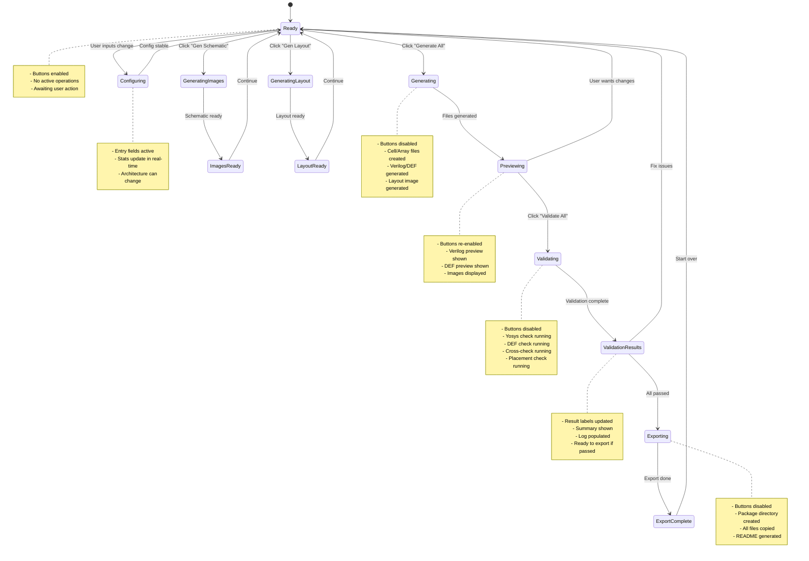
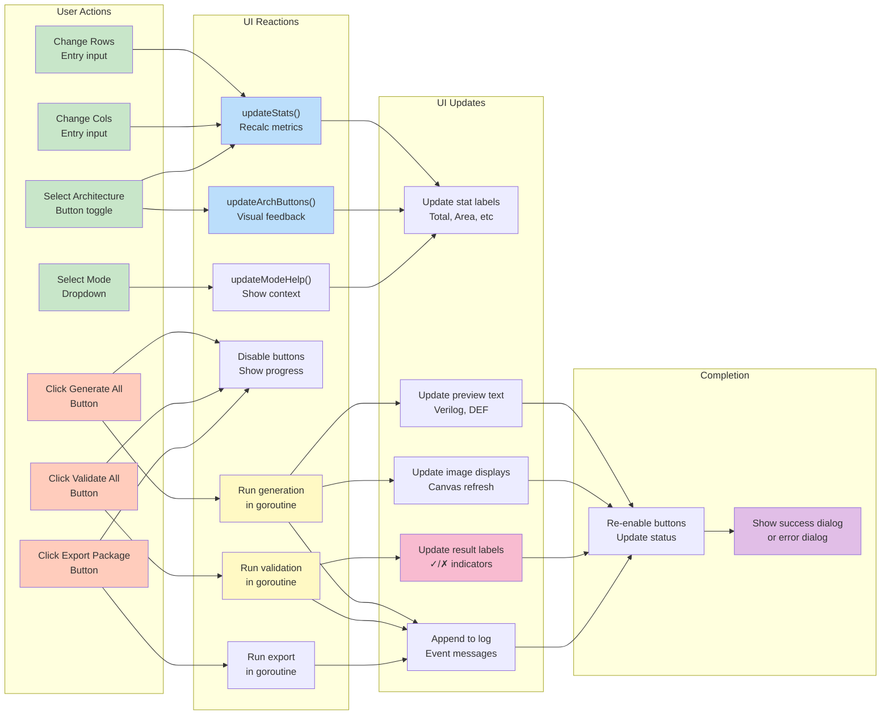

# Module 6 EDA GUI - Complete Mermaid Diagram

> **Status (2026-02-03):** This diagram reflects the earlier multi-panel GUI design.  
> The current GUI exposes two views only: **Builder & Validation** and **Learn**.  
> Treat the rest as legacy reference; see `module6-eda/pkg/gui/app.go` for the live structure.

## Complete GUI Architecture Flow

```mermaid
graph TD
    subgraph "Application Entry"
        Start["🚀 Application Start"]
    end

    subgraph "Deployment Modes"
        Mode{Deployment<br/>Mode?}
        Standalone["📌 Standalone Mode<br/>cmd/eda-gui/main.go<br/>CreateMainWindow"]
        Unified["📌 Unified Mode<br/>Embedded App<br/>BuildContent"]
    end

    subgraph "Main Layout Layer"
        StandaloneWindow["fyne.Window<br/>1400x900"]
        Header["Header Container<br/>ViewSelector Dropdown<br/>Banner"]
        Stack["Stack Container<br/>Manages View Visibility"]
    end

    subgraph "Tab Navigation"
        TabNav{Current View}
        Tab1Route["Tab 1<br/>Builder & Validation"]
        Tab2Route["Tab 2<br/>Learn"]
    end

    subgraph "Builder Tab - Top Section"
        TopSection["⬆️ TopSection<br/>VBox"]
        ConfigSplit["ConfigSplit<br/>HSplit 45/55"]

        subgraph "Left: Cell Configuration"
            CellPanel["Cell Panel<br/>VBox"]
            CellTitle["📋 Cell Config"]
            CellGrid["Grid: Name, W, H"]
            CellGrid2["Grid: Rise, Fall, Cap"]
            CellGrid3["Grid: Leakage, Area"]
            CellEntries["Entry Widgets<br/>7 text inputs<br/>📍 OnChanged → updateStats"]
        end

        subgraph "Right: Array Configuration"
            ArrayPanel["Array Panel<br/>VBox"]
            ArrayTitle["📋 Array Config"]
            ArrayGrid["Grid: Rows, Cols, Mode"]
            ArchToggle["🔘 Architecture Toggle<br/>PASSIVE | 1T1R | 2T1R<br/>📍 OnTapped → setArch"]
            ModeHelp["Help Text<br/>Context-sensitive<br/>storage/memory/compute"]
            StatsRow["📊 Statistics Row<br/>6 metrics: Total, Area,<br/>WL, BL, Density, Util"]
        end

        ActionBar["Action Buttons<br/>Generate All | Validate All<br/>Export Package"]
        StatusBar["Status Bar<br/>Status: Label"]
    end

    subgraph "Builder Tab - Middle Section"
        PreviewSection["⬇️ PreviewTabs<br/>AppTabs 75% height"]

        subgraph "Verilog Tab"
            VerilogStats["📈 Verilog Stats<br/>Instances, Lines, Size KB"]
            VerilogPreview["Code Preview<br/>MultiLineEntry + Scroll<br/>Shows generated Verilog"]
        end

        subgraph "DEF Tab"
            DEFStats["📈 DEF Stats<br/>Components, File path"]
            DEFPreview["Code Preview<br/>MultiLineEntry + Scroll<br/>Shows generated DEF"]
        end

        subgraph "Layout Tab"
            LayoutButtons["Layout Action Buttons"]
            GenSchematicBtn["📊 Gen Schematic Yosys<br/>📍 OnTapped → generateYosysSchematic"]
            GenOpenROADBtn["📊 Gen Layout OpenROAD<br/>📍 OnTapped → generateOpenROADImage"]
            LayoutHelp["Help Text<br/>Instructions for generation"]

            ImageGrid["Image Grid<br/>3-column layout"]

            subgraph "Image Cards"
                KLayoutCard["🖼️ KLayout Card<br/>Canvas + Status label<br/>Physical layout from DEF+LEF"]
                OpenROADCard["🖼️ OpenROAD Card<br/>Canvas + Status label<br/>Placement visualization"]
                YosysCard["🖼️ Yosys Card<br/>Canvas + Status label<br/>Circuit schematic"]
            end
        end
    end

    subgraph "Builder Tab - Validation Section"
        ValidationSection["⬇️ ValidationSection<br/>VBox 25% height"]

        subgraph "Validation Results Row"
            ValSummary["Summary Label<br/>✓ All passed | ✗ Failed"]
            ValidRow["Validation Row<br/>HBox"]
            YosysResult["🔹 Yosys<br/>✓/✗/⊝ status"]
            DEFResult["🔹 DEF<br/>✓/✗/⊝ status"]
            CrossResult["🔹 Cross<br/>✓/✗/⊝ status"]
            PlacementResult["🔹 Placement<br/>✓/✗/⊝ status"]
        end

        subgraph "OpenLane Status Row"
            OpenLaneRow["OpenLane Row<br/>HBox"]
            DockerStatus["🐳 Docker<br/>Status label<br/>✓ Ready | ○ Missing<br/>✗ Unavailable"]
            PDKStatus["📦 PDK<br/>Status label<br/>✓ Available | ○ Optional"]
            PullImageBtn["🔽 Pull Image Button<br/>📍 OnTapped → pullDockerImage<br/>Shows only when needed"]
        end

        subgraph "Log Output"
            LogHeader["Log Header<br/>HBox"]
            LogTitle["📝 Log Title"]
            ClearLogBtn["Clear Log<br/>Button"]
            LogScroll["Log Scroll<br/>Scroll Container<br/>Min height: 100px"]
            LogOutput["Log Output<br/>MultiLineEntry<br/>Monospace font<br/>Append mode"]
        end
    end

    subgraph "Learn Tab"
        LearnMain["Learn Tab Content"]

        subgraph "Learn Header"
            LearnTitle["📚 FeCIM Array Builder<br/>Learning Center"]
            LearnSubtitle["Understanding OpenLane flow"]
            LearnSep["Separator"]
        end

        subgraph "Learn Split Layout"
            LearnSplit["Split Layout<br/>HSplit 25/75"]

            subgraph "Learn Sidebar"
                SidebarTitle["Topics"]
                TopicList["Topic List Widget<br/>📍 OnSelected → switchContent"]
                Topic0["1. What is FeCIM EDA?"]
                Topic1["2. Crossbar Architecture"]
                Topic2["3. EDA Files We Generate"]
            end

            subgraph "Learn Content"
                ContentScroll["Content Scroll<br/>Dynamic content area"]

                subgraph "Content 0: Introduction"
                    IntroContent["🎓 Intro Content"]
                    IntroTitle["Title: What is FeCIM EDA?"]
                    IntroText["Array builder explanation<br/>NOT device modeling"]
                    IntroVisuals["📊 OperationModes Visual<br/>Canvas drawing"]
                    FlowDiagram["📊 OpenLane Flow Diagram<br/>Canvas drawing"]
                    StagesText["6-stage flow explanation"]
                    DoList["✅ What We Do<br/>5 bullet points"]
                    DontList["❌ What We Don't Do<br/>4 bullet points"]
                    DisclaimerCard["⚠️ Disclaimer Card"]
                end

                subgraph "Content 1: Crossbar"
                    CrossbarContent["🎓 Crossbar Content"]
                    PassiveSection["Passive Crossbar<br/>Description + Diagram<br/>3x3 isometric view"]
                    OneT1RSection["1T1R Architecture<br/>Description + Diagram<br/>3x3 isometric view"]
                    ComparisonTable["Comparison Table<br/>Passive vs 1T1R metrics"]
                    SneakPathExplained["Sneak Path Problem<br/>Explanation + visual"]
                    RecommendCard["Recommendation<br/>Array size guidelines"]
                end

                subgraph "Content 2: Files"
                    FilesContent["🎓 Files Content"]
                    FileCardsGrid["File Cards<br/>2-column adaptive grid"]
                    LEFCard["LEF Card<br/>Description + snippet"]
                    DEFCard["DEF Card<br/>Description + snippet"]
                    VerilogCard["Verilog Card<br/>Description + snippet"]
                    LibertyCard["Liberty Card<br/>Description + snippet"]
                    GenSection["How We Generate<br/>Step-by-step explanation"]
                    ValSection["How We Validate<br/>4 validation types"]
                    ImgSection["Layout Visualization<br/>KLayout/OpenROAD/Magic"]
                    PurposesSection["File Format Summary<br/>Quick reference"]
                    ReferencesCard["References<br/>External links"]
                end
            end
        end
    end

    subgraph "Data Layer - Shared Configuration"
        ArrayConfig["ArrayConfig struct<br/>Rows, Cols, Mode<br/>Architecture, Technology<br/>CellWidth, CellHeight"]
    end

    subgraph "Export Layer"
        ExportPkg["pkg/export/"]
        GenVerilog["GenerateArrayVerilog<br/>Verilog netlist"]
        GenDEF["generateBuilderDEF<br/>DEF placement"]
        GenLEF["GenerateLEF<br/>Cell geometry"]
        GenLib["GenerateLiberty<br/>Timing info"]
        GenCellV["GenerateCellVerilog<br/>Cell model"]
        GenConfig["GenerateOpenLaneConfig<br/>OpenLane settings"]
    end

    subgraph "Validation Layer"
        ValidationPkg["pkg/validation/"]
        ValidateYosys["ValidateVerilogWithCell<br/>Yosys syntax check"]
        ValidateDEF["ValidateDEF<br/>DEF structure check"]
        CrossCheck["CrossCheckFiles<br/>LEF/LIB/V consistency"]
        PlacementCheck["RunPlacementCheckWithCell<br/>OpenROAD check"]
        GenImages["GenerateLayoutImage<br/>KLayout PNG"]
        GenYosysSchematic["GenerateYosysSchematic<br/>Yosys DOT→PNG"]
        GenOpenROADImage["GenerateOpenROADImage<br/>Placement visualization"]
    end

    subgraph "OpenLane Layer"
        OpenLanePkg["pkg/openlane/"]
        Manager["Manager struct<br/>DetectMode, IsDockerAvailable<br/>IsPDKInstalled, etc"]
    end

    subgraph "File System"
        FileIO["File Output"]
        CellDir["cells/<br/>fecim_bitcell/<br/>fecim_1t1r_bitcell/<br/>fecim_2t1r_bitcell"]
        DataDir["data/<br/>generated files<br/>PNG images<br/>JSON configs"]
    end

    subgraph "Threading & UI Updates"
        MainThread["Main UI Thread<br/>Fyne Event Loop"]
        Goroutine1["Go Routine 1<br/>Generate All"]
        Goroutine2["Go Routine 2<br/>Validate All"]
        Goroutine3["Go Routine 3<br/>Gen Schematic"]
        Goroutine4["Go Routine 4<br/>Gen Layout"]
        FyneDo["fyne.Do<br/>Marshal UI updates<br/>to main thread"]
    end

    Start --> Mode
    Mode -->|Standalone| Standalone
    Mode -->|Unified| Unified
    Standalone --> StandaloneWindow
    Unified --> AppTabs["AppTabs<br/>2 tab items"]

    StandaloneWindow --> Header
    AppTabs --> Header
    Header --> Stack
    Stack --> TabNav

    TabNav -->|Select Tab 1| Tab1Route
    TabNav -->|Select Tab 2| Tab2Route

    Tab1Route --> TopSection
    TopSection --> ConfigSplit
    ConfigSplit --> CellPanel
    ConfigSplit --> ArrayPanel

    CellPanel --> CellTitle
    CellPanel --> CellGrid
    CellPanel --> CellGrid2
    CellPanel --> CellGrid3
    CellPanel --> CellEntries

    ArrayPanel --> ArrayTitle
    ArrayPanel --> ArrayGrid
    ArrayPanel --> ArchToggle
    ArrayPanel --> ModeHelp
    ArrayPanel --> StatsRow

    TopSection --> ActionBar
    TopSection --> StatusBar

    ActionBar -->|Click Generate All| Goroutine1
    ActionBar -->|Click Validate All| Goroutine2

    TopSection --> PreviewSection
    PreviewSection --> VerilogStats
    PreviewSection --> VerilogPreview
    PreviewSection --> DEFStats
    PreviewSection --> DEFPreview
    PreviewSection --> LayoutButtons

    LayoutButtons --> GenSchematicBtn
    LayoutButtons --> GenOpenROADBtn
    GenSchematicBtn -->|Click| Goroutine3
    GenOpenROADBtn -->|Click| Goroutine4

    LayoutButtons --> ImageGrid
    ImageGrid --> KLayoutCard
    ImageGrid --> OpenROADCard
    ImageGrid --> YosysCard

    PreviewSection --> ValidationSection
    ValidationSection --> ValSummary
    ValidationSection --> ValidRow
    ValidRow --> YosysResult
    ValidRow --> DEFResult
    ValidRow --> CrossResult
    ValidRow --> PlacementResult

    ValidationSection --> OpenLaneRow
    OpenLaneRow --> DockerStatus
    OpenLaneRow --> PDKStatus
    OpenLaneRow --> PullImageBtn

    ValidationSection --> LogHeader
    LogHeader --> LogTitle
    LogHeader --> ClearLogBtn
    ValidationSection --> LogScroll
    LogScroll --> LogOutput

    Tab2Route --> LearnMain
    LearnMain --> LearnTitle
    LearnMain --> LearnSubtitle
    LearnMain --> LearnSep
    LearnMain --> LearnSplit

    LearnSplit --> SidebarTitle
    LearnSplit --> TopicList
    TopicList --> Topic0
    TopicList --> Topic1
    TopicList --> Topic2

    LearnSplit --> ContentScroll

    Topic0 -->|Selected| IntroContent
    Topic1 -->|Selected| CrossbarContent
    Topic2 -->|Selected| FilesContent

    IntroContent --> IntroTitle
    IntroContent --> IntroText
    IntroContent --> IntroVisuals
    IntroContent --> FlowDiagram
    IntroContent --> StagesText
    IntroContent --> DoList
    IntroContent --> DontList
    IntroContent --> DisclaimerCard

    CrossbarContent --> PassiveSection
    CrossbarContent --> OneT1RSection
    CrossbarContent --> ComparisonTable
    CrossbarContent --> SneakPathExplained
    CrossbarContent --> RecommendCard

    FilesContent --> FileCardsGrid
    FileCardsGrid --> LEFCard
    FileCardsGrid --> DEFCard
    FileCardsGrid --> VerilogCard
    FileCardsGrid --> LibertyCard
    FilesContent --> GenSection
    FilesContent --> ValSection
    FilesContent --> ImgSection
    FilesContent --> PurposesSection
    FilesContent --> ReferencesCard

    CellEntries --> ArrayConfig
    ArrayGrid --> ArrayConfig
    ArchToggle --> ArrayConfig

    Goroutine1 --> ExportPkg
    ExportPkg --> GenVerilog
    ExportPkg --> GenDEF
    ExportPkg --> GenLEF
    ExportPkg --> GenLib
    ExportPkg --> GenCellV
    ExportPkg --> GenConfig

    GenVerilog --> FileIO
    GenDEF --> FileIO
    GenLEF --> FileIO
    GenLib --> FileIO
    GenCellV --> FileIO
    GenConfig --> FileIO

    FileIO --> CellDir
    FileIO --> DataDir

    GenVerilog --> VerilogPreview
    GenDEF --> DEFPreview
    GenLEF --> KLayoutCard

    Goroutine2 --> ValidationPkg
    ValidationPkg --> ValidateYosys
    ValidationPkg --> ValidateDEF
    ValidationPkg --> CrossCheck
    ValidationPkg --> PlacementCheck

    ValidateYosys --> YosysResult
    ValidateDEF --> DEFResult
    CrossCheck --> CrossResult
    PlacementCheck --> PlacementResult

    Goroutine3 --> GenYosysSchematic
    GenYosysSchematic --> YosysCard

    Goroutine4 --> GenOpenROADImage
    GenOpenROADImage --> OpenROADCard

    GenImages --> KLayoutCard

    Goroutine1 --> FyneDo
    Goroutine2 --> FyneDo
    Goroutine3 --> FyneDo
    Goroutine4 --> FyneDo

    FyneDo --> MainThread

    MainThread --> CellEntries
    MainThread --> ArchToggle
    MainThread --> ActionBar

    style Start fill:#e1f5ff,stroke:#01579b,stroke-width:2px
    style Mode fill:#fff3e0,stroke:#e65100,stroke-width:2px
    style Standalone fill:#f3e5f5,stroke:#4a148c,stroke-width:2px
    style Unified fill:#f3e5f5,stroke:#4a148c,stroke-width:2px
    style TopSection fill:#fff9c4,stroke:#f57f17,stroke-width:2px
    style CellPanel fill:#e8f5e9,stroke:#1b5e20,stroke-width:1px
    style ArrayPanel fill:#e8f5e9,stroke:#1b5e20,stroke-width:1px
    style PreviewSection fill:#e1bee7,stroke:#4a148c,stroke-width:2px
    style ValidationSection fill:#ffccbc,stroke:#bf360c,stroke-width:2px
    style LearnMain fill:#b3e5fc,stroke:#01579b,stroke-width:2px
    style IntroContent fill:#d1c4e9,stroke:#311b92,stroke-width:1px
    style CrossbarContent fill:#f8bbd0,stroke:#880e4f,stroke-width:1px
    style FilesContent fill:#c8e6c9,stroke:#1b5e20,stroke-width:1px
    style ExportPkg fill:#bbdefb,stroke:#0d47a1,stroke-width:2px
    style ValidationPkg fill:#ffccbc,stroke:#bf360c,stroke-width:2px
    style OpenLanePkg fill:#dcedc8,stroke:#558b2f,stroke-width:2px
    style FileIO fill:#f5f5f5,stroke:#424242,stroke-width:2px
```

## Component State Diagram

## User Interaction Flow Diagram

## Component Relationship Matrix

| Component | Depends On | Updates | Listens To |
|-----------|-----------|---------|-----------|
| CellEntries | ArrayConfig | updateStats | OnChanged |
| ArrayGrid | ArrayConfig | updateStats | OnChanged |
| ArchToggle | ArrayConfig | updateArchButtons | OnTapped |
| ModeSelect | ArrayConfig | updateModeHelp | OnChanged |
| StatsRow | updateStats | Labels | rowsEntry, colsEntry |
| VerilogPreview | GenerateArrayVerilog | Text | Generate button |
| DEFPreview | generateBuilderDEF | Text | Generate button |
| KLayoutCard | GenerateLayoutImage | Canvas + status | Gen Schematic button |
| YosysCard | GenerateYosysSchematic | Canvas + status | Gen Layout button |
| YosysResult | ValidateVerilogWithCell | Label | Validate button |
| DEFResult | ValidateDEF | Label | Validate button |
| CrossResult | CrossCheckFiles | Label | Validate button |
| PlacementResult | RunPlacementCheckWithCell | Label | Validate button |
| DockerStatus | Manager.DetectMode | Label | App startup |
| LogOutput | addLog | Text append | All operations |
| TopicSelector | Learn state | Content | OnSelected |
