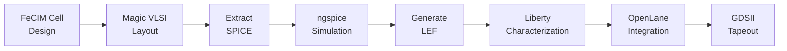

# SKY130 PDK Reference Guide

> **For:** FeCIM EDA Design Suite (Module 6)  
> **Process:** SkyWater SKY130 (130nm Open Source CMOS)  
> **Last Updated:** 2026-01-24

## Overview

This document provides guidance on accessing and using **SkyWater SKY130 PDK** documentation for the FeCIM (Ferroelectric Compute-in-Memory) project. The SKY130 is a mature 130nm process with full open-source documentation, making it ideal for academic research and custom cell design.

---

## Quick Start: What You Need

For FeCIM custom cell design and OpenLane integration, you need:

### ✅ **Essential References** (Already Downloaded)

Located in [`docs/sky130-reference/`](../references/):

1. **📄 SKY130_QUICK_REFERENCE.md** - Comprehensive technical reference
   - Standard cell specifications (cell height, site width)
   - Metal layer stack (widths, spacings, GDS layers)
   - Design rules and constraints
   - FeCIM-specific integration guidelines
   - OpenLane configuration examples

2. **🌐 sky130_specs.html** - Design rules (periphery)
3. **🌐 sky130_layers.html** - Layer definitions

### 📦 **Full PDK Installation** (Optional, for Advanced Work)

Only needed if you're doing:
- Full SPICE simulations with transistor models
- Physical verification (DRC/LVS) with Magic VLSI
- Custom Liberty timing characterization

```bash
# Clone full PDK (WARNING: ~10GB+)
git clone https://github.com/google/skywater-pdk.git
export PDK_ROOT=$(pwd)/skywater-pdk
export PDK=sky130A
```

**For most EDA work, the quick reference is sufficient.**

---

## Key Specifications at a Glance

### Standard Cell Library (sky130_fd_sc_hd)

| Parameter | Value | Purpose |
|-----------|-------|---------|
| **Cell Height** | 2.72 μm | Standardizes placement grid |
| **Site Width** | 0.46 μm | Minimum cell width increment |
| **Site Name** | `unithd` | LEF SITE identifier |
| **Power Rails** | VPWR/VGND on met1 | 0.48 μm width each |

### Metal Stack (Relevant Layers)

| Layer | Min Width | Min Space | Typical Use |
|-------|-----------|-----------|-------------|
| **li1** (local) | 0.17 μm | 0.17 μm | Cell-internal routing |
| **met1** | 0.14 μm | 0.14 μm | Cell pins, power rails |
| **met2** | 0.14 μm | 0.14 μm | Horizontal signal routing |
| **met3** | 0.30 μm | 0.30 μm | Vertical signal routing |
| **met4-5** | 0.30-1.60 μm | 0.30-1.60 μm | Power distribution |

### Operating Conditions

| Parameter | Nominal | Min | Max |
|-----------|---------|-----|-----|
| **Supply (VDD)** | 1.8 V | 1.65 V | 1.95 V |
| **Temperature** | 25°C | -40°C | 85°C |

---

## FeCIM Custom Cell Design Guidelines

### Recommended Cell Dimensions

```
Width:  Multiple of 0.46 μm (e.g., 1.84 μm = 4 sites)
Height: 2.72 μm (match standard cell height)
```

### Pin Assignment Strategy

| Signal | Layer | Edge | Notes |
|--------|-------|------|-------|
| **Word Line (WL)** | met1 | Left/Right | Horizontal routing |
| **Bit Line (BL)** | met2 | Top/Bottom | Vertical routing |
| **VPWR** | met1 | Top | 0.48 μm width |
| **VGND** | met1 | Bottom | 0.48 μm width |

### Critical Design Rules

- **Minimum poly width:** 0.15 μm
- **Minimum poly spacing:** 0.21 μm
- **Minimum metal1 area:** 0.083 μm²
- **Via1 exact size:** 0.15×0.15 μm

> 📖 **Full design rules:** See [SKY130_QUICK_REFERENCE.md](../references/cli-reference.md) section on "Critical Design Rules"

---

## OpenLane Integration

### Required Files for Custom FeCIM Cells

1. **LEF file** (`.lef`) - Physical abstract view
2. **Liberty file** (`.lib`) - Timing characterization
3. **GDS file** (`.gds`) - Full layout for tapeout
4. **Verilog model** (`.v`) - Behavioral model

### Configuration Snippet

```tcl
# config.tcl for FeCIM design
set ::env(PDK) "sky130A"
set ::env(STD_CELL_LIBRARY) "sky130_fd_sc_hd"
set ::env(DESIGN_NAME) "fecim_array_4x4"

# Include custom FeCIM cells
set ::env(EXTRA_LEFS) [glob $::env(DESIGN_DIR)/lef/*.lef]
set ::env(EXTRA_LIBS) [glob $::env(DESIGN_DIR)/lib/*.lib]

# Critical: Use DEF template for floorplanning
set ::env(FP_DEF_TEMPLATE) "$::env(DESIGN_DIR)/def/fecim_floorplan.def"
```

> ⚠️ **Important:** The `FP_DEF_TEMPLATE` setting is critical for custom cell placement (see Module 6 PRD Section 3.2.4).

---

## Tools and Workflow

### Recommended Design Flow



### Tool Setup

```bash
# Set PDK environment variables
export PDK=sky130A
export PDK_ROOT=/path/to/skywater-pdk

# For Magic VLSI layout tool
magic -T $PDK_ROOT/sky130A/libs.tech/magic/sky130A.tech

# For ngspice simulation
ngspice -b fecim_cell.spice
```

---

## Online Resources

### Official Documentation

| Resource | URL | Purpose |
|----------|-----|---------|
| **SKY130 Docs** | [skywater-pdk.readthedocs.io](https://skywater-pdk.readthedocs.io/) | Complete process specs |
| **PDK Repository** | [github.com/google/skywater-pdk](https://github.com/google/skywater-pdk) | Full PDK files |
| **Standard Cells** | [github.com/google/skywater-pdk-libs-sky130_fd_sc_hd](https://github.com/google/skywater-pdk-libs-sky130_fd_sc_hd) | LEF/Liberty/GDS |
| **OpenLane** | [openlane.readthedocs.io](https://openlane.readthedocs.io/) | Automated RTL-to-GDS flow |

### Academic Citation

For papers using SKY130 in FeCIM/memristor research:

```bibtex
@misc{skywater130pdk,
  author = {{Google} and {SkyWater Technology Foundry}},
  title = {{SKY130 Process Design Kit}},
  year = {2020},
  howpublished = {\url{https://github.com/google/skywater-pdk}},
  note = {Open source 130nm CMOS, Apache 2.0 license}
}
```

---

## FeCIM-Specific Considerations

### ⚠️ **Material Integration Challenges**

1. **Ferroelectric Materials Not Included**
   - SKY130 baseline is standard CMOS (SiO₂ gate oxide)
   - FeFET integration requires custom process steps (e.g., HfO₂ deposition)
   - Consult foundry for post-fab compatibility

2. **Characterization Gaps**
   - Standard Liberty models don't capture:
     - Polarization-dependent states
     - Retention time degradation
     - Write endurance effects
   - → Custom Verilog-A or behavioral models needed

3. **Verification Limitations**
   - OpenLane focuses on digital logic
   - Use **Xschem + ngspice** for analog/mixed-signal FeCIM cells
   - Use **Magic** for DRC/LVS checking

### 📋 **Integration Checklist**

- [ ] Design FeCIM cell layout in Magic VLSI
- [ ] Extract and simulate with ngspice
- [ ] Generate LEF abstract (with correct pin placements)
- [ ] Create Liberty timing model (or use placeholder values with disclaimers)
- [ ] Write Verilog behavioral model
- [ ] Integrate with OpenLane using `EXTRA_LEFS` and `EXTRA_LIBS`
- [ ] Verify floorplan with `FP_DEF_TEMPLATE`
- [ ] Run full synthesis → PnR → signoff flow

---

## Local Reference Files

All essential SKY130 documentation is available in:

```
docs/sky130-reference/
├── SKY130_QUICK_REFERENCE.md    ← 📘 Comprehensive technical guide
├── sky130_specs.html            ← 🌐 Design rules (cached)
├── sky130_layers.html           ← 🌐 Layer definitions (cached)
└── LICENSE.txt                  ← Apache 2.0 license (TODO)
```

### Quick Access

- **Metal stack specs:** [SKY130_QUICK_REFERENCE.md#metal-layer-stack](../references/cli-reference.md#metal-layer-stack)
- **Pin placement:** [SKY130_QUICK_REFERENCE.md#fecim-custom-cell-design-guidelines](../references/cli-reference.md#fecim-custom-cell-design-guidelines)
- **OpenLane config:** [SKY130_QUICK_REFERENCE.md#openlane-integration](../references/cli-reference.md#openlane-integration)

---

## Next Steps

1. ✅ **Review** [`SKY130_QUICK_REFERENCE.md`](../references/cli-reference.md) for detailed specs
2. 📐 **Design** FeCIM custom cell layouts following pin placement guidelines
3. 🔧 **Configure** OpenLane with custom LEF/Liberty files
4. ✅ **Verify** DRC/LVS compliance before tapeout

---

## License

**SkyWater SKY130 PDK** is licensed under **Apache License 2.0**  
Copyright 2020 SkyWater PDK Authors

This documentation is derived from official SKY130 sources and maintains the same license.

**Document Maintained By:** XelHaku  
**Project:** [Multilayer Ferroelectric CIM Visualizer](https://github.com/your-org/fecim-lattice-tools)  
**Module:** Module 6 - FeCIM EDA Design Suite