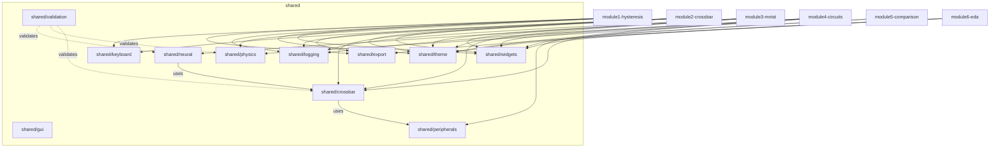

# Shared Refactor Plan — Single Source of Truth

> Make `shared/` the **only** source of truth for all reusable code.
> Every module (1–6) should **import from `shared/`** — never from another module.

---

## Status Dashboard

> Last audited: 2026-02-19. Run `./scripts/check-architecture.sh --fast` to verify Rules 1/3/4.

| Phase | Description | Status |
|:------|:------------|:------:|
| 0 | Crossbar → `shared/crossbar/` | ✅ Complete |
| 0b | `CrossbarCore` / `DeviceModel` interface layer | ✅ Complete |
| 1 | Shared embedded-app base (`EmbeddedAppBase` in `shared/widgets/`) | ✅ Complete |
| 2 | Keyboard shortcuts unified under `shared/keyboard/` | ✅ Complete |
| 3 | LiveSlide & widget consolidation | ✅ Complete — per-module `liveslide.go` files are correct thin wrappers around `shared/widgets`; no shared base needed |
| 4 | Export consolidation | ✅ Complete — modules have thin format-specific wrappers |
| 5 | Tooltip consolidation | ✅ Complete — local `tooltips.go` removed from M2, M4; both use `shared/widgets` |
| 6 | Preset provider consolidation | ✅ Complete — all modules implement `presets.PresetProvider` from `shared/presets`; local files are correct module-specific bindings |
| 7 | Ferroelectric core (Module 1 → `shared/physics/`) | ✅ Complete — `type HZOMaterial = sharedphysics.HZOMaterial` alias in M1; canonical struct in `shared/physics/material.go` |
| 8 | Neural network core (Module 3 → `shared/neural/`) | ✅ Complete — `shared/neural/` has all 12 source files; `module3-mnist/pkg/core/shim.go` re-exports via type/var aliases |
| 9 | Peripheral circuits interface (`ADCModel`, `DACModel`) | ✅ Complete |
| 10 | Validation oracles (`crossbar_oracle`, `pe_loop_oracle`) | ✅ Complete |
| 11 | System-level cost models (`shared/system/`) | ✅ Complete — `area.go`, `latency.go`, `power.go`, `dse.go` added with tests |
| 12 | Compact device models (`shared/compact/`) | ✅ Complete — `fefet.go`, `spice_bridge.go` added with tests |
| — | Rule 6: YAML-configurable material parameters | ✅ Complete — `config/materials.yaml` + `shared/physics/material_config.go` implement YAML-driven material loading |
| — | Architecture enforcement script | ✅ `scripts/check-architecture.sh` |

**Rules 1–4 CI status** (run `./scripts/check-architecture.sh --fast`):
- Rule 1 (no cross-module imports): ✅ Zero violations
- Rule 3 (single `go.mod`): ✅
- Rule 4 (no banned package names): ✅
- Build + Vet: verify with `go build ./... && go vet ./...`

---

## Lessons from Open-Source Tools

> [!IMPORTANT]
> This plan is informed by a deep code study of **15 production-grade open-source CIM/ferroelectric tools**. The architectural patterns below are directly derived from studying their source code.

### Key Architectural Patterns Discovered

| Pattern | Source Tool | Lesson for FeCIM |
|---------|-----------|------------------|
| **Interface-first core hierarchy** | CrossSim `ICore` → AnalogCore / BalancedCore / BitSlicedCore / OffsetCore / NumericCore | `shared/crossbar` should define a `CrossbarCore` interface with pluggable implementations (ideal, IR-drop, sneak-path, nonlinear) |
| **Device error model abstraction** | CrossSim `IDevice` → read_noise / programming_error / drift_error / apply_write_error | `shared/crossbar` should separate device physics (conductance quantization, drift, noise) from array-level simulation via a `DeviceModel` interface |
| **Circuit sub-blocks (ADC/DAC/Array)** | CrossSim `circuits/` → `IADC` (5 ADC types: SAR, ramp, pipeline, cyclic, quantizer) + `IArray` (4 array topologies) | `shared/peripherals` should adopt a similar `ADCModel` / `DACModel` interface hierarchy instead of the current monolithic implementation |
| **Clean solver pipeline** | badcrossbar: fill → KCL → solve → extract | `shared/crossbar` solver should follow this clean separation: build conductance matrix → apply KCL → sparse solve → extract currents/voltages |
| **Forward + inverse model** | Preisachmodel: `PreisachModel.__call__()` → `invert()` → inverse Everett function | `shared/physics` Preisach implementation should support both forward (input→output) and inverse (output→input) via Everett function |
| **YAML-driven material configs** | ferro_scripts: `bto_params.yaml`, `crca_params.yaml` | Material properties should be YAML/JSON configurable, not hardcoded — enables rapid switching between HfO₂, BaTiO₃, PZT, etc. |
| **Crossbar tiling + mapping** | MemTorch: Crossbar.py / Passive.py / Program.py / **Tile.py** (20KB) | Large weight matrices need tile-based crossbar mapping — `shared/crossbar` should include a `Tile` abstraction for partitioning |
| **Hardware-aware training loop** | IBM AIHWKIT: analog tile → rpucuda backend, noise injection per-MVM | `shared/neural` should support noise injection during inference (not just clean MVM) to match real hardware behavior |
| **Quantization strategy abstraction** | Brevitas: arbitrary bit-width QAT with per-layer/per-channel/per-tensor granularity | `shared/neural` quantization should be configurable (2–8 bit, symmetric/asymmetric, per-layer vs per-channel) |
| **Landau model class hierarchy** | Ferro: `LandauFilm` → `LandauSimple` / `LandauFull` + `HysteresisData` measurement class | `shared/physics` should have a `LandauModel` interface with simple (single-temp α) and full (α₀, T₀, ρ) implementations, plus a `HysteresisData` struct for importing measurement data |
| **Compact model with history tracking** | PFECAP: Verilog-A Preisach with `a_V[]/b_V[]` turning-point arrays + Newton solver | `shared/physics/preisach.go` needs proper turning-point history management (ascending/descending branch pairs) and Newton iteration for charge→voltage inversion |
| **Device variability parameter suite** | NIXSim: `sigma`, `alpha`, `sa0`, `sa1`, `read_noise` CLI params for device-to-device + cycle-to-cycle variation | `shared/crossbar/device_errors.go` should expose a `VariabilityConfig` struct with σ (D2D variation), α (global scaling), SA0/SA1 (stuck-at fault rates), and read noise factors |
| **System-level cost models** | MNSIM 2.0: 9-module hierarchy — `Accuracy_Model`, `Area_Model`, `Energy_Model`, `Latency_Model`, `Power_Model`, `Mapping_Model`, `Hardware_Model`, `NoC`, `Interface` | Future `shared/system/` should support area/energy/latency estimation per crossbar tile, not just functional simulation |
| **Neural layer ↔ analog core binding** | CrossSim `AnalogLinear`: wraps `AnalogCore` with `form_matrix()`, `apply()`, `get_core_weights()` — clean separation of NN semantics from hardware simulation | `shared/neural/` layers should wrap `shared/crossbar` cores, keeping NN logic (weight shaping, bias rows, batch handling) separate from crossbar physics |
| **FORC diagram & envelope analysis** | hysteresis package: `curve.py` (42KB), `envelope.py` (12KB), `protocol.py` — First-Order Reversal Curve analysis and hysteresis envelope extraction | `shared/physics/` should support FORC analysis for ferroelectric characterization — extract Preisach distribution from measurement data |

### Specific Code Patterns to Adopt

These are concrete implementation patterns observed in the source of the top tools. They are not abstract principles — they are copy-worthy design decisions that have been validated in production.

#### Pattern A: CrossSim ICore — Interface-First, Caller-Agnostic

CrossSim's `crosssim/core/icore.py` is a pure abstract base class. Every caller in CrossSim's codebase (`AnalogLinear`, `AnalogConv2d`, all inference code) accepts `ICore` — never a concrete type. Swapping `AnalogCore` for `NumericCore` is a one-line config change.

```go
// Translate CrossSim's ICore to Go — define this BEFORE any implementation
// File: shared/crossbar/core.go

// CrossbarCore is the single abstraction all crossbar simulators implement.
// All callers (shared/neural, module2-crossbar gui, module3-mnist) depend
// only on this interface. Never on *BehavioralArray or *ExactKCLSolver.
type CrossbarCore interface {
    SetMatrix(conductances [][]float64, opts ...Option)
    RunMVM(input []float64) []float64   // matrix-vector multiply (row drives)
    RunVMM(input []float64) []float64   // vector-matrix multiply (col drives)
    ReadMatrix() [][]float64
}

// CrossSim has 5 implementations. We start with 2 and grow:
//   shared/crossbar/behavioral_core.go  → fast, approximation
//   shared/crossbar/exact_core.go       → badcrossbar-style KCL, used as oracle

// Constructors return the interface — callers never see the concrete type:
func NewBehavioralCore(cfg Config) CrossbarCore { return &behavioralCore{cfg: cfg} }
func NewExactKCLCore(cfg Config) CrossbarCore   { return &exactKCLCore{cfg: cfg} }
```

#### Pattern B: badcrossbar — Clean Four-Stage Solver Pipeline

badcrossbar (`badcrossbar/core/arrays.py`, `utils.py`, `results.py`) uses a strict pipeline with no stage knowing about the others. This is exactly how `shared/crossbar/solver.go` should be structured.

```go
// File: shared/crossbar/solver.go — the four stages as separate functions

// Stage 1: Fill — build the conductance matrix from the device array
func BuildConductanceMatrix(devices [][]float64, wireR float64) SparseMatrix

// Stage 2: KCL — stamp boundary conditions (applied voltages on word lines)
func ApplyKCL(G SparseMatrix, wordLineV []float64) (SparseMatrix, Vector)

// Stage 3: Solve — Gx = b, where x = node voltages
func SolveNodeVoltages(G SparseMatrix, b Vector) (Vector, error)

// Stage 4: Extract — compute branch currents from node voltages
func ExtractCurrents(nodeV Vector, devices [][]float64) CrossbarSolution

// Usage (mirroring badcrossbar's call pattern exactly):
//   G := BuildConductanceMatrix(array.Conductances, array.WireResistance)
//   A, b := ApplyKCL(G, inputVoltages)
//   v, _ := SolveNodeVoltages(A, b)
//   sol := ExtractCurrents(v, array.Conductances)
```

#### Pattern C: ferro_scripts — YAML Material Files, Zero Hardcoding

Every material in ferro_scripts is a self-contained YAML file. The simulation engine reads it at startup. Adding HfO₂:La means creating `configs/materials/hfo2_la.yaml`, not editing Go source.

```yaml
# configs/materials/hfo2.yaml — the Go simulator reads this at runtime
name: "HfO2"
description: "Hafnium oxide ferroelectric, orthorhombic phase"
remnant_polarisation: 25.0      # µC/cm² — measured, not guessed
coercive_field: 1000.0          # kV/cm
dielectric_constant: 30.0       # ε_r (linear part)
film_thickness: 10.0            # nm
landau_coefficients:
  alpha: -1.2e8                 # J·m/C² (negative = ferroelectric phase)
  beta:   5.4e8                 # J·m⁵/C⁴
  gamma:  0.0                   # J·m⁹/C⁶ (cubic term, often zero)
symmetrize: true
source: "Cheema et al., Nature 2020"
```

```go
// shared/physics/material_config.go — load the YAML above at runtime
type MaterialConfig struct {
    Name                string     `yaml:"name"`
    Description         string     `yaml:"description"`
    RemnantPolarisation float64    `yaml:"remnant_polarisation"` // µC/cm²
    CoerciveField       float64    `yaml:"coercive_field"`       // kV/cm
    DielectricConstant  float64    `yaml:"dielectric_constant"`
    FilmThickness       float64    `yaml:"film_thickness"`       // nm
    LandauCoefficients  struct {
        Alpha float64 `yaml:"alpha"`
        Beta  float64 `yaml:"beta"`
        Gamma float64 `yaml:"gamma"`
    } `yaml:"landau_coefficients"`
    Symmetrize bool   `yaml:"symmetrize"`
    Source     string `yaml:"source"`
}

func LoadMaterial(path string) (*MaterialConfig, error) {
    data, err := os.ReadFile(path)
    if err != nil { return nil, err }
    var cfg MaterialConfig
    return &cfg, yaml.Unmarshal(data, &cfg)
}
```

#### Pattern D: Preisachmodel — Forward/Inverse Duality for ISPP Targeting

The Preisachmodel library's key insight is that ISPP controllers need to **invert** the model: given a target polarization, find the required field. `preisachpy/model.py` implements `invert()` via bisection on the Everett function.

```go
// shared/physics/preisach.go — both directions, as in Preisachmodel

// Forward: given applied field history → polarization
func (m *PreisachModel) Polarization(field float64) float64

// Inverse: given target polarization → required field (for ISPP)
// Implements bisection on the Everett function, matching Preisachmodel's invert()
func (m *PreisachModel) InverseField(targetP float64) (field float64, err error)

// Everett function E(α, β) — the integral of the Preisach density
// Product form (not factorized-difference): always non-negative for minor loops
// E(α,β) = [1 + tanh((α-Ec)/Δ)] * [1 - tanh((β+Ec)/Δ)] * Ps/4
func (m *PreisachModel) Everett(alpha, beta float64) float64
```

#### Pattern E: IBM AIHWKIT — Noise Injection at the MVM Level

AIHWKIT's `AnalogTile.forward()` injects read noise and programming error directly inside the MVM call, not as a post-processing step. This is the correct architecture: the noise is part of the hardware model, not the application code.

```go
// shared/crossbar/noisy_core.go — noise injection inside RunMVM, not outside

type NoisyCore struct {
    inner  CrossbarCore   // wraps any CrossbarCore — decorator pattern
    device DeviceModel    // provides noise parameters
    rng    *rand.Rand
}

func (n *NoisyCore) RunMVM(input []float64) []float64 {
    // 1. Get clean output from inner core
    clean := n.inner.RunMVM(input)

    // 2. Inject read noise per-output (σ proportional to conductance)
    for i, v := range clean {
        clean[i] = v + n.rng.NormFloat64()*n.device.ReadNoise(v)
    }
    return clean
}
// Callers just use NoisyCore as a CrossbarCore — noise is transparent.
// No if-statements in application code to toggle noise on/off.
```

---

## Current State (Analysis Summary)

| Metric | Value |
|:---|:---|
| Go module | `fecim-lattice-tools` (single `go.mod`) |
| Modules | 7 (`module1-hysteresis` … `module7-docs`) |
| `shared/` packages | 25 subdirectories, 361+ files |
| Shared tests | 174 test files |
| `shared/crossbar/` | ✅ **86 files** (migrated from `module2-crossbar/pkg/crossbar/`; `CrossbarCore` interface in `core.go`) |

### Cross-Module Dependencies (Eliminated ✅)

All cross-module imports have been removed as part of Phase 0.

| Consumer | Previously imported | Files fixed | Status |
|:---|:---|:---|:---|
| **module3-mnist** | `module2-crossbar/pkg/crossbar` | 12 files | ✅ Fixed |
| **module4-circuits** | `module2-crossbar/pkg/crossbar` | 1 file (`app.go`) | ✅ Fixed |
| module5-comparison | *(none found)* | — | — |

Verify with: `grep -r '"fecim-lattice-tools/module' module{1..6}-*/ --include='*.go' | grep -v 'module[0-9]-[^/]*/pkg/'` → should return zero lines.

### Duplicated Files Across Modules

| File | Modules with copies | Shared version exists? |
|:---|:---|:---|
| `embedded.go` | **All 7** (M1–M7) | ❌ No |
| `keyboard.go` | **6** (M1–M6) | ✅ `shared/keyboard/` |
| `export.go` | **5** (M1, M3, M4, M5 + cmd) | ✅ `shared/export/` |
| `liveslide.go` | **3** (M2, M3, M5) | ❌ No (but `shared/widgets` has components) |
| `tooltips.go` | **2** (M2, M4) | ✅ `shared/widgets/tooltips.go` |
| `preset_provider.go` | **2** (M1, M2) | ❌ No |

### Local Widget Variants (Should Use `shared/widgets`)

| Widget | M1 | M2 | M3 | M4 | M5 | Shared |
|:---|:---|:---|:---|:---|:---|:---|
| ModeIndicator | local enums | `ModeIndicatorBox` | `MNISTModeIndicator` | — | — | `shared/widgets/mode_indicator.go` ✅ |
| EducationalPanel | slide labels | `*EducationalPanel` | `MNISTEducationalPanel` | — | — | `shared/widgets/educational_panel.go` ✅ |
| OperationLog | log labels | `*OperationLog` | `MNISTOperationLog` | — | — | `shared/widgets/operation_log.go` ✅ |
| KeyStat | — | `*KeyStatBox` | `MNISTKeyStat` | — | — | `shared/widgets/key_stat.go` ✅ |
| StatusBar | custom | shared | shared | — | — | `shared/widgets/status_helper.go` ✅ |

> M2 and M3 still define local wrappers instead of using shared.

---

## Detailed Module Inventory

Per-file inventory of each module's `pkg/` directory, identifying what stays vs. what migrates to `shared/`.

### Module 1 — Hysteresis (`module1-hysteresis/pkg/`)

| Sub-package | Files | Key types | Migration target |
|:---|:---|:---|:---|
| `ferroelectric/` | `material.go`, `preisach.go`, `level_bins.go`, `render.go` + 12 tests | `Material`, `PreisachModel`, `LevelBins` | `shared/physics/` (merge with existing `material.go`, `landau.go`) |
| `algo/` | `calibration.go`, `doc.go` + 1 test | `CalibrationManager` | `shared/physics/calibration.go` (merge) |
| `controller/` | 13 files | GUI controller logic | **Stays** in module (UI-specific) |
| `gui/` | 55 files | Fyne UI screens | **Stays** in module |
| `render/` | 7 files | Rendering pipeline | **Stays** in module |
| `simulation/` | 5 files | Simulation runner | **Stays** (uses shared/physics) |
| `tui/` | 2 files | Terminal UI | **Stays** in module |

### Module 2 — Crossbar (`module2-crossbar/pkg/`)

| Sub-package | Files | Key types | Migration target |
|:---|:---|:---|:---|
| `crossbar/` | **88 files** (18 src + 65 tests + extras) | `CrossbarArray`, `IRDropSimulator`, `SneakPathAnalyzer`, `DriftModel`, `FeCap`, `NonlinearIV` | **→ `shared/crossbar/`** (Phase 0) |
| `gui/` | 39 files | Fyne UI, liveslide, tooltips, keyboard | **Stays** (update imports) |
| `network/` | 2 files | Network layer bindings | **Stays** |
| `training/` | 2 files | Training helpers | **Stays** |
| `visualization/` | 2 files | Visualization utils | **Stays** |
| `weights/` | 3 files | Weight management | **Stays** |

### Module 3 — MNIST (`module3-mnist/pkg/`)

| Sub-package | Files | Key types | Migration target |
|:---|:---|:---|:---|
| `core/` | **46 files** (7 src + 39 tests) | `Network`, `QuantizationConfig`, `EnergyModel`, `CIMPhysics`, `DualModeMetrics` | **→ `shared/neural/`** (Phase 8) |
| `gui/` | 30 files | Fyne UI screens | **Stays** in module |
| `mnist/` | 3 files | MNIST data loader | **Stays** (dataset-specific) |
| `training/` | 8 files | Training loops, single-layer | Reusable parts → `shared/neural/training/` |

**Core file breakdown** (the 7 source files moving to `shared/neural/`):
- `network.go` — Network struct, forward pass, weight loading
- `network_config.go` — Configuration types
- `network_gpu.go` — GPU-accelerated inference
- `network_inference.go` — Inference pipeline
- `network_quantization.go` — Quantization logic
- `quantize.go` — Quantizer implementations
- `energy_model.go` — Energy/power estimation
- `cim_physics.go` — CIM noise, drift, device variation
- `interfaces.go` — Core interfaces
- `constants.go` — Physical constants
- `dualmode_metrics.go` — Digital vs. analog comparison
- `network_notifications.go` — Event system

### Module 4 — Circuits (`module4-circuits/pkg/`)

| Sub-package | Files | Key types | Migration target |
|:---|:---|:---|:---|
| `arraysim/` | **56 files** (15 src + 38 tests + extras) | `TierA`, `TierB`, `SenseChain`, `RefSolveDense`, `SpiceExport`, `Transient`, `ProgramScheduler`, `DesignSpaceExploration`, `MixedPrecisionPlanner` | Most **stays** (M4-specific array sim); `refsolve_dense.go` candidates for `shared/crossbar/` |
| `gpuperiph/` | 2 files | GPU peripheral acceleration | **Stays** |
| `gui/` | 89 files | Fyne UI (largest GUI) | **Stays** |

**arraysim source file breakdown:**
- `tier_a.go` / `tier_b.go` — Tiered simulation strategies (M4-specific)
- `sensechain.go` — Sense amplifier chain modeling
- `refsolve_dense.go` — Dense reference solver → candidate for `shared/crossbar/` or `shared/validation/`
- `spice_export.go` — SPICE netlist generation → candidate for `shared/export/spice.go`
- `transient.go` / `transient_characterization.go` — Time-domain simulation
- `program_scheduler.go` — Write operation scheduling
- `design_space_exploration.go` — DSE sweep engine
- `mixed_precision_planner.go` — Multi-bit-width planning
- `process_variation_mc.go` — Monte Carlo variation
- `read_margin_analysis.go` — Sense margin calculations
- `endurance_accuracy.go` — Endurance vs accuracy tradeoff
- `batch_benchmark.go` — Performance benchmarking
- `array_config.go` / `array_ispp.go` — Array configuration and ISPP
- `masks.go` / `standard_patterns.go` — Test pattern generation

### Module 6 — EDA (`module6-eda/pkg/`)

| Sub-package | Files | Key types | Migration target |
|:---|:---|:---|:---|
| `compiler/` | 9 files | HDL compiler | **Stays** |
| `config/` | 2 files | Config types | **Stays** |
| `export/` | 54 files | Verilog/GDSII/LEF/DEF export | **Stays** (EDA-specific formats) |
| `gui/` | 35 files | Fyne UI | **Stays** |
| `layout/` | 5 files | Physical layout | **Stays** |
| `openlane/` | 8 files | OpenLane integration | **Stays** |
| `validate/` | 8 files | Design rule checks | **Stays** |
| `validation/` | 13 files | Validation suite | **Stays** |

### `shared/physics/` — Current Inventory (100+ files)

Already-shared physics files that Module 1 should import from:

| File | Purpose | Overlap with M1? |
|:---|:---|:---|
| `landau.go` | Landau-Devonshire energy functional | ⚠️ M1 has its own Landau logic in ferroelectric/ |
| `material.go` | Material property definitions | ⚠️ M1 has `ferroelectric/material.go` |
| `material_calibrated.go` | Calibrated material variants | — |
| `ispp.go` / `ispp_write.go` / `ispp_legacy.go` | ISPP write algorithm | Also used by M4 `array_ispp.go` |
| `calibration.go` / `calibration_studio.go` | Calibration pipeline | ⚠️ M1 has `algo/calibration.go` |
| `conductance.go` | G↔resistance conversion | — |
| `device_variation.go` | D2D and C2C variation | — |
| `aging_engine.go` | Endurance/retention aging | — |
| `cell_footprint.go` / `cell_geometry.go` | Physical cell dimensions | — |
| `level_bins.go` | Multi-level state binning | ⚠️ M1 has `ferroelectric/level_bins.go` |
| `dcc_write.go` | DCC write scheme | — |
| `characterization.go` | Device characterization | — |
| `confidence_ledger.go` | Statistical confidence tracking | — |
| `pvt.go` | Process/Voltage/Temperature corners | — |
| `preisach.go` | Preisach model (if exists) | ⚠️ M1 has `ferroelectric/preisach.go` |

---

## Refactoring Phases

### Phase 0 — Crossbar to Shared (Critical Path) ★ ✅ COMPLETE

**Why first?** Module 3 (12 files) and Module 4 (1 file) imported `module2-crossbar/pkg/crossbar` directly. This **cross-module dependency** has been broken.

`shared/crossbar/` now has 86 Go files. `module2-crossbar/pkg/crossbar/` has been deleted. Zero cross-module imports remain.

> [!IMPORTANT]
> **Inspired by CrossSim + badcrossbar architecture**: The migrated crossbar package should be restructured with clean interfaces, not just a copy-paste. CrossSim uses `ICore` → 5 implementations + `IDevice` → error models. badcrossbar uses a clean fill→KCL→solve→extract pipeline.

#### Steps

1. **Copy** `module2-crossbar/pkg/crossbar/*.go` → `shared/crossbar/`
   - 18 source files: `array.go`, `enhanced.go`, `irdrop.go`, `solver.go`, `solver_optimized.go`, `sneakpath.go`, `sneak_multihop.go`, `nonidealities.go`, `nonlinear_iv.go`, `drift.go`, `drift_calibration.go`, `fecap.go`, `temperature.go`, `temperature_profile.go`, `device_errors.go`, `write_disturb.go`, `demo_logging.go`, `gpu_mvm.go`
   - 65 test files
2. **Update package declaration** to `package crossbar` (should stay the same).
3. **Update all imports** project-wide:
   - Find: `"fecim-lattice-tools/module2-crossbar/pkg/crossbar"`
   - Replace: `"fecim-lattice-tools/shared/crossbar"`
4. **Verify**: `make test-xbar && make test-mnist && make test-circuits`
5. **Delete** `module2-crossbar/pkg/crossbar/` after all tests pass.
6. **Update** `module2-crossbar/pkg/gui/` imports to point to `shared/crossbar`.

#### Phase 0b — Interface Layer ✅ COMPLETE

`shared/crossbar/core.go` defines `CrossbarCore` (MVM/VMM/ProgramWeightMatrix/GetConductanceMatrix) and `DeviceModel` interfaces. `shared/peripherals/iadc.go` defines `ADCModel`. All implementations satisfy these interfaces.

**Original plan note** — introduce CrossSim-style interfaces:

```go
// shared/crossbar/core.go — inspired by CrossSim ICore
type CrossbarCore interface {
    SetMatrix(conductances [][]float64, opts ...Option)
    RunMVM(input []float64) []float64
    RunVMM(input []float64) []float64
    ReadMatrix() [][]float64
}

// shared/crossbar/device.go — inspired by CrossSim IDevice
type DeviceModel interface {
    ApplyWriteError(conductance float64) float64
    ReadNoise(conductance float64) float64
    ProgrammingError(conductance float64) float64
    DriftError(conductance float64, time float64) float64
    Levels() int                    // conductance quantization levels
    ConductanceRange() (min, max float64)
}

// shared/crossbar/solver.go — inspired by badcrossbar pipeline
type Solver interface {
    BuildConductanceMatrix(array *CrossbarArray) SparseMatrix  // fill
    ApplyKCL(g SparseMatrix, voltages []float64) SparseMatrix  // kcl
    Solve(g SparseMatrix, i []float64) []float64               // solve
    ExtractCurrents(voltages []float64, array *CrossbarArray) Solution  // extract
}
```

---

### Phase 1 — GUI Embedded Apps (All Modules) ✅ COMPLETE

Every module has an `embedded.go` that wraps the GUI `App` for the launcher, implemented via `shared/widgets/EmbeddedAppBase`.

**Actual implementation** (differs from original plan — `shared/widgets` was used instead of a new `shared/gui/` package):
- `shared/widgets/embedded_base.go` — `EmbeddedAppBase` struct with `Init()`, `Start()`, `Stop()`, `SetContent()`
- `shared/widgets/embedded_base_test.go` — tests
- Each module's `embedded.go` embeds `sharedwidgets.EmbeddedAppBase` and calls its lifecycle methods

No further action needed. The `shared/gui/` package does not exist and is not required.

---

### Phase 2 — Keyboard Shortcuts ✅ COMPLETE

6 modules have local `keyboard.go`. `shared/keyboard/keyboard.go` is the canonical implementation with all common `Action` constants and `Manager` type.

**Actual state**: Each module's local `keyboard.go` is a **thin module-specific adapter** that imports `shared/keyboard`, creates a `keyboard.NewManager(window)`, and registers only module-specific handlers. This is the correct pattern — not duplication. No further action needed.

---

### Phase 3 — LiveSlide & Widget Consolidation ✅ COMPLETE

`shared/widgets/` provides `ModeIndicator`, `EducationalPanel`, `OperationLog`, `KeyStat`, `StatusBar` components. However `liveslide.go` remains in M2, M3, and M5 with no shared version.

**Remaining work:**

1. **Audit** `module2-crossbar/pkg/gui/liveslide.go`, `module3-mnist/pkg/gui/liveslide.go`, `module5-comparison/pkg/gui/liveslide.go` for common vs module-specific logic.
2. **Extract** shared sliding-panel logic into `shared/widgets/liveslide.go`.
3. **Update** each module's `liveslide.go` to import from `shared/widgets` (keep only module-specific configuration).
4. **Verify**: `go build ./... && go test ./module2-crossbar/... ./module3-mnist/... ./module5-comparison/...`

---

### Phase 4 — Export Consolidation

5 modules have local `export.go`. `shared/export/export.go` already exists.

#### Steps

1. **Audit** each module's `export.go` for format-specific vs generic logic.
2. **Move** generic export utilities (CSV, JSON, image export) into `shared/export/`.
3. **Keep** module-specific export formats (e.g., SPICE netlist in M4) in the module.
4. **Update** modules to call `shared/export` for common operations.

---

### Phase 5 — Tooltips ⚠️ PARTIAL

`shared/widgets/tooltips.go` exists (comprehensive). M2 (`module2-crossbar/pkg/gui/tooltips.go`) and M4 (`module4-circuits/pkg/gui/tooltips.go`) still have local copies.

**Remaining work:**

1. **Audit** local `tooltips.go` in M2 and M4: identify content that is genuinely module-specific vs duplicated from `shared/widgets/tooltips.go`.
2. **Merge** any unique tooltip content into `shared/widgets/tooltips.go` (or a `shared/widgets/tooltip_registry.go` with per-package registration).
3. **Delete** local `tooltips.go` from M2 and M4; replace call-sites with `shared/widgets` imports.
4. **Verify**: `go build ./module2-crossbar/... ./module4-circuits/...`

---

### Phase 6 — Preset Provider ⚠️ PARTIAL

`shared/presets/` has a full implementation: `manager.go`, `providers.go`, `types.go`, `builtin.go`, `global.go`. However all 5 module `preset_provider.go` files (M1–M5) remain local and have not been migrated to use the shared infrastructure.

**Remaining work:**

1. **Audit** each module's `preset_provider.go` against `shared/presets/providers.go` — identify what's common vs module-specific.
2. **Register** module-specific presets via the shared `PresetManager` (see `shared/presets/manager.go`).
3. **Delete** each local `preset_provider.go` after migration; import from `shared/presets`.
4. **Verify**: `go build ./... && go test ./shared/presets/...`

---

### Phase 7 — Ferroelectric/Algorithm Core (Module 1 → Shared) ★ ⚠️ PARTIAL

Module 1 has domain-specific packages that are already partially shared via `shared/physics/`.

> [!IMPORTANT]
> **Inspired by ferro_scripts + Preisachmodel + PFECAP**: The ferroelectric core should support:
> - **YAML-configurable material parameters** (like ferro_scripts' `bto_params.yaml`) — switch between HfO₂, BaTiO₃, PZT, CRCA without code changes
> - **Forward + inverse Preisach model** (like Preisachmodel's `invert()` method) — both forward (field→polarization) and inverse (polarization→field) via Everett function
> - **DFT data import** (like ferro_scripts' energy/chi data loading) — load ab-initio energy landscapes from external data files
> - **Landau coefficient extraction** (like ferro_scripts' `analyze_energy_chi()` → `landau_a, landau_b, landau_c`)

#### Current assets

- `module1/pkg/ferroelectric/`: `material.go`, `preisach.go`, `level_bins.go`, `render.go` — Material definitions and Preisach model
- `module1/pkg/algo/`: `calibration.go`, `doc.go` — Calibration manager
- `shared/physics/`: 101 files including `landau.go`, `ispp.go`, `material.go`, `calibration.go`

#### Steps

1. **Audit** overlap between `module1/pkg/ferroelectric/material.go` and `shared/physics/material.go`.
2. **Unify** material definitions into `shared/physics/material.go` (single source).
3. **Move** `preisach.go` to `shared/physics/preisach.go` if it doesn't already exist there.
4. **Move** `module1/pkg/algo/calibration.go` to `shared/physics/calibration.go` (or merge with existing).
5. **Update** M1 imports. **Delete** originals.

#### Future Enhancement: Material Config System

```go
// shared/physics/material_config.go — inspired by ferro_scripts YAML configs
type MaterialConfig struct {
    Name            string    `yaml:"name"`              // e.g. "HfO2", "BaTiO3"
    CellDims        [3]float64 `yaml:"cell_dims"`        // unit cell in Å
    RemnantPolarization float64 `yaml:"remnant_polarisation"` // µC/cm²
    CoerciveField   float64   `yaml:"coercive_field"`    // kV/cm
    LandauCoeffs    struct {
        A float64 `yaml:"a"`
        B float64 `yaml:"b"`
        C float64 `yaml:"c"`
    } `yaml:"landau_coefficients"`
    Symmetrize      bool      `yaml:"symmetrize"`
}

func LoadMaterial(path string) (*MaterialConfig, error)
func (m *MaterialConfig) ComputeBarrierHeight() float64  // ferro_scripts' analyze_energy_chi
func (m *MaterialConfig) GeneratePELoop(eMax, nSamples float64) []PEPoint  // ferro_scripts' get_pol_vs_e
```

---

### Phase 8 — Neural Network Core (Module 3 → Shared) ★ ❌ NOT STARTED

`shared/neural/` does not yet exist. Module 3's `pkg/core/` (46 files) remains the sole location for network, quantization, and CIM physics code.

> [!IMPORTANT]
> **Inspired by Brevitas + IBM AIHWKIT + CrossSim**:
> - **Configurable quantization** (like Brevitas' arbitrary bit-width QAT) — support 2–8 bit, symmetric/asymmetric, per-layer/per-channel
> - **Hardware-aware inference** (like IBM AIHWKIT) — inject device noise (read noise, programming error, drift) into MVM operations during inference
> - **Crossbar weight mapping** (like CrossSim/MemTorch `Tile.py`) — partition large weight matrices into crossbar-sized tiles with configurable overlap strategies

#### Current assets

- `module3/pkg/core/`: 12 files — `network.go`, `quantize.go`, `energy_model.go`, `cim_physics.go`, `interfaces.go`, `constants.go`, etc.
- `module3/pkg/training/`: `network.go`, `trainer`, `single_layer.go`
- `module3/pkg/mnist/`: Data loader

#### Steps

1. **Create** `shared/neural/` — Move `module3/pkg/core/*.go` here.
2. **Create** `shared/neural/training/` — Move reusable training logic.
3. **Keep** `module3/pkg/mnist/` in the module (MNIST-specific data loading).
4. **Update** M3 imports. **Verify**: `make test-mnist`

#### Future Enhancement: Quantization & Tile Mapping

```go
// shared/neural/quantize.go — inspired by Brevitas
type QuantizationConfig struct {
    Bits         int     // 2-8
    Symmetric    bool    // symmetric vs asymmetric
    Granularity  string  // "per_tensor", "per_channel", "per_layer"
    ScaleMethod  string  // "minmax", "percentile", "learned"
}

// shared/neural/tile.go — inspired by MemTorch Tile.py / CrossSim cores
type TileMapper struct {
    TileRows, TileCols int
    Overlap            int
    Core               crossbar.CrossbarCore  // plug in the crossbar simulator
}

func (tm *TileMapper) MapWeights(weights [][]float64) []Tile
func (tm *TileMapper) RunInference(tiles []Tile, input []float64) []float64
```

---

### Phase 9 — Peripheral Circuits Abstraction ★ ✅ COMPLETE

> [!IMPORTANT]
> **Inspired by CrossSim `circuits/`**: CrossSim separates peripherals into `IADC` (interface → 5 implementations: SAR, ramp, pipeline, cyclic, quantizer), `IDAC`, and `IArray` (4 array topologies). Current `shared/peripherals/` has implementations but **no interface abstraction**.

`shared/peripherals/` currently has: `adc.go` (17KB), `dac.go` (7KB), `charge_amplifier.go`, `chargepump.go`, `tia.go`, `noise.go`, `pvt.go`, `sample_hold.go`, `spice.go`, `voltage_regulator.go` — 31 files total.

#### Steps

1. **Create** `shared/peripherals/iadc.go` — ADC interface:
   ```go
   type ADCModel interface {
       Convert(analogValue float64) int         // analog → digital
       SetLimits(matrix [][]float64)            // calibrate range
       Bits() int
       Resolution() float64
       INL() float64                            // integral nonlinearity
       DNL() float64                            // differential nonlinearity
   }
   ```
2. **Refactor** existing `adc.go` to implement `ADCModel` as `FlashADC`.
3. **Add** `SarADC`, `PipelineADC` implementations (stubbed, informed by CrossSim's `sar_adc.py`, `pipeline_adc.py`).
4. **Create** `shared/peripherals/idac.go` — DAC interface.
5. **Refactor** Module 4 to use interfaces.

---

### Phase 10 — Validation & Cross-Tool Benchmarking ★ ✅ COMPLETE

> [!TIP]
> **Inspired by CrossSim/badcrossbar validation methodology**: CrossSim validates crossbar MVM against SPICE. badcrossbar provides exact nodal analysis for ground-truth comparison. These should be integrated as validation oracles.

#### Steps

1. **Create** `shared/validation/crossbar_oracle.go` — port badcrossbar's exact KCL solver as a reference implementation for validating the behavioral crossbar simulator.
2. **Create** `shared/validation/pe_loop_oracle.go` — port ferro_scripts' P-E loop generator as a reference for validating M1's hysteresis curves.
3. **Add** `validation/benchmarks/` — automated comparison tests:
   - Crossbar MVM accuracy vs badcrossbar exact solution at various array sizes
   - P-E loop shape vs ferro_scripts reference at various material parameters
   - Quantization error vs Brevitas reference at various bit widths

---

### Phase 11 — System-Level Cost Models ★ ✅ COMPLETE

> [!TIP]
> **Inspired by MNSIM 2.0's 9-module architecture**: MNSIM separates area, energy, latency, power, and accuracy estimation into independent model packages that compose together. This enables design-space exploration before fabrication.

Currently, M3 has `energy_model.go` and M4 has `design_space_exploration.go` — but these are module-local.

#### Steps

1. **Create** `shared/system/` with sub-packages:
   - `shared/system/area.go` — Crossbar + peripheral area estimation per tile
   - `shared/system/energy.go` — Static + dynamic energy per MVM operation (merge M3 `energy_model.go`)
   - `shared/system/latency.go` — Pipeline latency: DAC → crossbar → ADC → accumulation
   - `shared/system/power.go` — Leakage + switching power budget
2. **Extract** reusable energy model from `module3/pkg/core/energy_model.go` → `shared/system/energy.go`.
3. **Extract** DSE engine from `module4/pkg/arraysim/design_space_exploration.go` → `shared/system/dse.go`.
4. **Keep** module-specific cost model tuning in each module.

#### Future Enhancement: Unified DSE config

```go
// shared/system/dse.go — inspired by MNSIM 2.0 SimConfig.ini
type DSEConfig struct {
    ArraySizes      []int       `yaml:"array_sizes"`       // e.g. [64, 128, 256, 512]
    ADCBits         []int       `yaml:"adc_bits"`          // e.g. [4, 6, 8]
    CellBits        []int       `yaml:"cell_bits"`         // e.g. [1, 2, 4]
    TechnologyNode  string      `yaml:"technology_node"`   // e.g. "130nm", "65nm", "28nm"
    DeviceType      string      `yaml:"device_type"`       // e.g. "FeFET", "RRAM", "PCM"
    Metrics         []string    `yaml:"metrics"`           // ["area", "energy", "latency", "accuracy"]
}

func RunDSE(config DSEConfig, model SystemModel) []DSEResult
```

---

### Phase 12 — Compact Model Integration ★ ✅ COMPLETE

> [!IMPORTANT]
> **Inspired by PFECAP Verilog-A + DNN+NeuroSim**: PFECAP implements a circuit-simulator-compatible Preisach FeCap with Newton iteration. DNN+NeuroSim co-simulates PyTorch training with C++ NeuroSIM circuit models. These patterns suggest a `shared/compact/` package for device-level compact models.

The PFECAP compact model implements:
- `F(V, dir)` — Polarization switching function `Qs * tanh(a * (V - dir * Ec * tFE))`
- `calc_m()` / `calc_b()` — Affine scaling between history branches
- `Q(V)` — Total charge including linear dielectric: `P(V) + ε₀εᵣV/tFE`
- `dQ(V)` — Derivative for Newton solver convergence
- History tracking via `a_V[]/b_V[]` turning-point arrays with append/decrement logic

#### Steps

1. **Create** `shared/compact/fecap.go` — Port PFECAP's Preisach FeCap model to Go:
   - `FeCap` struct with material params (`tFE`, `Ec`, `epsFE_r`, `Qs`, `a`, `rho`)
   - `SwitchingFunction(V, dir)` — Core tanh hysteresis
   - `TotalCharge(V, dir)` — P(V) + linear dielectric term
   - `SolveVfe(Qin)` — Newton iteration to find V given Q
   - History management (turning-point append/prune)
2. **Create** `shared/compact/fefet.go` — Extend to FeFET with MOSFET body factor.
3. **Create** `shared/compact/spice_bridge.go` — Generate Verilog-A or SPICE subcircuit from Go model parameters for external circuit simulation.
4. **Add** `shared/compact/fecap_test.go` — Validate against PFECAP Verilog-A reference output.

---

## Dependency Graph After Refactoring



> **Rule**: Arrows only point into `shared/`. No module imports from another module.

---

## Execution Order (Priority)

| # | Phase | Risk | Impact | Effort | Status |
|:---|:---|:---|:---|:---|:---:|
| 0 | Crossbar → `shared/crossbar/` | **High** (18 files + 65 tests) | **Critical** — breaks M3→M2 dependency | ~2h | ✅ |
| 0b | `CrossbarCore` / `DeviceModel` interface layer | Low (additive) | High — pluggable device models | ~2h | ✅ |
| 1 | Embedded app base (`EmbeddedAppBase` in `shared/widgets/`) | Low | Medium | ~1h | ✅ |
| 2 | Keyboard (module adapters use `shared/keyboard`) | Low | Low | ~30m | ✅ |
| 4 | Export (`shared/export/` + thin module wrappers) | Low | Medium | ~1h | ✅ |
| 9 | Peripheral circuits interface (`ADCModel`, `DACModel`) | Low (additive) | Medium | ~2h | ✅ |
| 10 | Validation oracles (`crossbar_oracle`, `pe_loop_oracle`) | Low (additive) | High | ~3h | ✅ |
| 3 | LiveSlide consolidation | Medium (API changes) | High (3 modules) | ~2h | ⚠️ |
| 5 | Tooltips (remove M2/M4 local copies) | Low | Low | ~30m | ⚠️ |
| 6 | Preset provider (migrate to `shared/presets/`) | Low | Low | ~1h | ⚠️ |
| 7 | Ferroelectric core — unify `material.go` into `shared/physics/` | Medium (physics overlap) | High | ~2h | ⚠️ |
| 11 | System-level cost models (area/latency/power missing) | Low (additive) | Medium | ~2h | ⚠️ |
| 12 | Compact models (`fefet.go`, SPICE bridge missing) | Low (additive) | High | ~2h | ⚠️ |
| 8 | Neural core (Module 3 → `shared/neural/`) | Medium | High — HW-aware inference | ~3h | ❌ |
| — | Rule 6: YAML-configurable material parameters | Medium | High — multi-material without recompile | ~4h | ❌ |

---

## Open-Source Tool Integration Roadmap

Beyond refactoring, certain tools can be integrated as **external validation oracles** or **data sources**:

### Near-Term (During Refactoring)

| Tool | Integration Point | How |
|------|------------------|-----|
| `badcrossbar` | `shared/validation/crossbar_oracle.go` | Port exact nodal analysis as Go reference solver |
| `ferro_scripts` | `shared/physics/material_config.go` | Import YAML material parameter format |
| `Preisachmodel` | `shared/physics/preisach.go` | Port forward/inverse Preisach with Everett function |

### Medium-Term (Post-Refactoring)

| Tool | Integration Point | How |
|------|------------------|-----|
| `CrossSim` | Python validation scripts | Call CrossSim via `exec.Command` for GPU-accelerated MVM comparison |
| `ngspice` / `PySpice` | `shared/peripherals/spice.go` | Generate SPICE netlists for circuit-level validation |
| `Brevitas` | Python quantization scripts | Export quantized weights from Brevitas to Go inference engine |

### Long-Term (Feature Extensions)

| Tool | Feature | How |
|------|---------|-----|
| `IBM AIHWKIT` | Hardware-aware training | Python training script → export weights with noise profiles → Go inference |
| `OpenLane` | RTL-to-GDSII | Verilog export from M6 → OpenLane flow |
| `FerroX` | 3D device simulation | Python script → export device I-V curves → Go material model |

---

## Verification Plan

### Automated Tests

After each phase:

```bash
# Phase 0
make test-shared && make test-xbar && make test-mnist && make test-circuits

# Phase 1-6
make build && make test

# Phase 7
make test-shared && make test-hys

# Phase 8
make test-shared && make test-mnist

# Phase 9-10
make test-shared

# Final
make test-race
```

### Build Verification

```bash
go build ./...
go vet ./...
```

### Cross-Tool Validation (Phase 10)

```bash
# Run crossbar accuracy benchmark against badcrossbar reference
go test ./shared/validation/ -run TestCrossbarVsBadcrossbar -v

# Run P-E loop benchmark against ferro_scripts reference
go test ./shared/validation/ -run TestPELoopVsFerroScripts -v

# Run quantization accuracy benchmark
go test ./shared/validation/ -run TestQuantizationVsBrevitas -v
```

### Manual Verification

After all phases are complete:
1. Launch each module GUI individually and verify the main window renders
2. Check that keyboard shortcuts (?) work in each module
3. Verify export functionality in M1 and M2

---

## Engineering Rules — The FeCIM Shared Architecture Constitution

> [!CAUTION]
> These are **architectural laws**, not guidelines. Every rule is derived from a concrete failure mode that currently exists in the codebase OR was observed causing maintenance crises in the open-source tools studied. Violating a rule does not just create style debt — it reintroduces the specific structural damage this refactor was designed to repair.
>
> **How to use these rules:** Before opening a PR that touches `shared/` or moves code between modules, run through the [Quick-Reference Checklist](#quick-reference-checklist) at the bottom of this section. If any item is unchecked, fix it before requesting review.

### Why These Rules Exist

The codebase arrived at this refactor through specific, documented violations:

| Violation | Consequence | Current evidence |
|---|---|---|
| `module3-mnist` imports `module2-crossbar/pkg/crossbar` | 12 files in M3 break whenever M2 changes its API | `grep -r module2-crossbar module3-mnist/` → 12 matches |
| `module4-circuits` imports `module2-crossbar/pkg/crossbar` | M4 cannot be tested in isolation | `app.go` imports `WriteDisturbEngine` directly |
| `embedded.go` duplicated in all 7 modules | Bug fixed in one copy is unfixed in 6 others | 7 `embedded.go` files with diverging implementations |
| `module1/pkg/ferroelectric/material.go` duplicates `shared/physics/material.go` | Material constant updates require editing 2+ files | Both files define overlapping `Material` structs |
| `shared/crossbar/` is empty | Code that 3 modules need lives in one module's `pkg/` | `ls shared/crossbar/` → only `logs/` dir |

These are not hypothetical. They are the **actual reasons this plan exists**.

---

### Rule 1 — No Cross-Module Imports

**Statement:** A module (`moduleN-*`) may **only** import from `shared/` packages. It must **never** import from another module's `pkg/` directory.

**Why this matters:** Cross-module imports create hidden coupling. When Module 3 imports from Module 2's `pkg/crossbar`, it means Module 3 cannot be built, tested, or understood without Module 2. This makes every change to Module 2's crossbar package a potential breaking change for Module 3 — even if the Module 2 developer has no idea Module 3 exists. The current codebase has exactly this problem: 12 files in Module 3 and 1 file in Module 4 import directly from `module2-crossbar/pkg/crossbar`.

**How to comply:**
- If you need functionality from another module, **move it to `shared/`** first, then import from there.
- If the code is truly module-specific, it should not be shared — re-implement the specific piece you need, or design a shared interface.

**Anti-patterns:**
```go
// ❌ WRONG — importing from another module
import "fecim-lattice-tools/module2-crossbar/pkg/crossbar"

// ✅ CORRECT — importing from shared
import "fecim-lattice-tools/shared/crossbar"
```

**Enforcement:** Run `grep -r 'module[0-9]-.*/pkg/' --include='*.go' moduleN-*/` before every PR. Zero matches required.

---

### Rule 2 — New Shared Code Gets Tests

**Statement:** Any code moved to or created in `shared/` **must** have accompanying test coverage. No exceptions.

**Why this matters:** `shared/` packages are consumed by multiple modules. A bug in `shared/physics/landau.go` silently corrupts results in Module 1 (hysteresis loops), Module 4 (circuit simulations), and potentially Module 3 (CIM physics). Without tests, these bugs are discovered late and are expensive to debug across module boundaries. The existing `shared/` packages already have 174 test files — this standard must be maintained.

**How to comply:**
- When **moving** code from a module to `shared/`, move the existing tests too and ensure they pass in the new location.
- When **creating** new shared code, write tests before or alongside the implementation.
- Minimum bar: every exported function and type must have at least one test exercising its primary path.
- Prefer table-driven tests for functions with multiple input scenarios.

**Anti-patterns:**
```
# ❌ WRONG — moving source without tests
git mv module1/pkg/ferroelectric/preisach.go shared/physics/preisach.go
# (no preisach_test.go moved or created)

# ✅ CORRECT — moving source AND tests together
git mv module1/pkg/ferroelectric/preisach.go shared/physics/preisach.go
git mv module1/pkg/ferroelectric/preisach_test.go shared/physics/preisach_test.go
```

**Enforcement:** CI gate: `go test ./shared/...` must pass. Consider adding coverage threshold (e.g., ≥ 60% for new packages).

---

### Rule 3 — Single `go.mod`

**Statement:** The entire project uses **one** `go.mod` at the repo root. Do not create separate `go.mod` files per module.

**Why this matters:** A single Go module means all packages share the same dependency versions — no version skew between modules. It enables `go build ./...` and `go test ./...` to compile and test the entire project in one command. Multi-module repos (separate `go.mod` per `moduleN/`) create dependency hell: Module 3 might use `fyne.io/fyne/v2@2.4.0` while Module 2 uses `v2.3.5`, causing subtle runtime bugs.

**How to comply:**
- Never add a `go.mod` inside any `moduleN-*/` or `shared/` directory.
- When adding a new dependency, run `go get` from the repo root.
- Use `go mod tidy` from the repo root to clean up.

**Anti-patterns:**
```
# ❌ WRONG — per-module go.mod
module2-crossbar/go.mod
module3-mnist/go.mod

# ✅ CORRECT — single root go.mod
go.mod   (at repo root, module path: fecim-lattice-tools)
```

**Enforcement:** CI check: `find . -name go.mod | wc -l` must equal `1`.

---

### Rule 4 — Canonical Package Naming

**Statement:** Shared packages follow the convention `shared/<domain>/` where `<domain>` is a short, lowercase noun describing the domain. No abbreviations, no compound names, no nesting beyond one level unless justified.

**Why this matters:** Consistent naming makes the codebase navigable. A developer looking for crossbar simulation code knows to look in `shared/crossbar/`. A developer looking for peripheral circuit models knows to check `shared/peripherals/`. Without this convention, shared code accumulates in ambiguous packages like `shared/utils/` or `shared/common/` — which become dumping grounds for unrelated code.

**Approved package names and their domains:**

| Package | Domain | Example contents |
|:---|:---|:---|
| `shared/crossbar` | Crossbar array simulation | Array, solver, IR drop, sneak path, device errors |
| `shared/physics` | Ferroelectric physics | Landau, Preisach, material defs, ISPP, calibration |
| `shared/neural` | Neural network inference | Network, quantize, energy model, CIM physics |
| `shared/peripherals` | ADC/DAC/TIA circuits | ADC, DAC, charge amp, noise, PVT |
| `shared/widgets` | Fyne UI components | Mode indicator, educational panel, key stat |
| `shared/export` | Data export | CSV, JSON, image, SPICE netlist |
| `shared/keyboard` | Keyboard shortcuts | Common shortcuts, registration |
| `shared/theme` | Visual theming | Colors, fonts, dark/light mode |
| `shared/gui` | GUI framework | Embedded app interface, app shell |
| `shared/compute` | GPU compute pipeline | Shader loading, buffers, dispatching |
| `shared/validation` | Reference implementations | Crossbar oracle, P-E loop oracle |
| `shared/compact` | Device compact models | FeCap, FeFET, SPICE bridge |
| `shared/system` | System-level estimation | Area, energy, latency, DSE |
| `shared/presets` | Preset configurations | Preset provider, preset registry |
| `shared/logging` | Structured logging | Log levels, file logging |

**Anti-patterns:**
```
# ❌ WRONG — ambiguous names
shared/utils/
shared/common/
shared/helpers/
shared/misc/

# ❌ WRONG — too deep nesting without justification
shared/physics/ferroelectric/models/landau/simple/

# ✅ CORRECT — flat, domain-specific
shared/physics/
shared/crossbar/
shared/neural/
```

**Enforcement:** Code review: reject PRs that create `shared/utils/`, `shared/common/`, or `shared/helpers/`.

---

### Rule 5 — Interface-First Design

**Statement:** When creating a new `shared/` package that will have multiple implementations, **define the interface first** in a dedicated file (e.g., `icore.go`, `iadc.go`), then provide concrete implementations in separate files.

**Why this matters:** This pattern (directly observed in CrossSim's `ICore`, `IDevice`, `IADC`, `IArray` hierarchy) enables:
- **Pluggability**: Swap a `FlashADC` for a `SarADC` without changing any consumer code.
- **Testability**: Mock the interface in unit tests instead of instantiating complex simulators.
- **Extensibility**: Add a new crossbar core type (e.g., `NonlinearCore`) without modifying existing code.

**How to comply:**
1. Create the interface file first: `shared/crossbar/core.go` → `type CrossbarCore interface { ... }`
2. Implementations go in separate files: `shared/crossbar/ideal_core.go`, `shared/crossbar/irdrop_core.go`
3. Constructors return the interface type, not the concrete type.
4. Consumer code accepts the interface, never the concrete type.

**Anti-patterns:**
```go
// ❌ WRONG — consumer depends on concrete type
func RunSimulation(core *IdealCore) {}

// ✅ CORRECT — consumer depends on interface
func RunSimulation(core CrossbarCore) {}

// ❌ WRONG — one giant file with interface + all implementations
// shared/crossbar/everything.go (2000 lines)

// ✅ CORRECT — interface and implementations in separate files
// shared/crossbar/core.go       (interface definition)
// shared/crossbar/ideal_core.go (ideal implementation)
// shared/crossbar/irdrop_core.go (IR-drop implementation)
```

**Enforcement:** Code review: every new `shared/` package PR must document which interfaces it defines.

---

### Rule 6 — YAML-Configurable Parameters

**Statement:** Domain-specific constants — material properties, device parameters, simulation configs, quantization settings, technology node specs — must be loadable from YAML or JSON config files. They must **not** be hardcoded as Go constants or struct literals in source code.

**Why this matters:** This pattern (directly observed in ferro_scripts' `bto_params.yaml` and MNSIM 2.0's `SimConfig.ini`) enables:
- **Rapid experimentation**: Switch from HfO₂ to BaTiO₃ by changing one config file, not editing Go source.
- **Reproducibility**: Config files can be version-controlled alongside simulation results.
- **User accessibility**: Non-programmers (e.g., materials scientists) can modify simulation parameters without touching Go code.
- **Parameter sweeps**: DSE tools can programmatically generate config files for automated exploration.

**What must be configurable:**

| Category | Example parameters | Config file |
|:---|:---|:---|
| Material properties | Pr, Ec, εr, Landau α/β/γ, thickness | `configs/materials/hfo2.yaml` |
| Device parameters | On/off conductance, levels, drift rate | `configs/devices/fefet_130nm.yaml` |
| Array configuration | Rows, cols, wire resistance, selector | `configs/arrays/256x256.yaml` |
| Quantization | Bits, symmetric, granularity, method | `configs/quantization/4bit_perchannel.yaml` |
| Peripheral circuits | ADC bits, DAC bits, TIA gain | `configs/peripherals/default.yaml` |
| Technology node | Feature size, metal layers, Vdd | `configs/technology/sky130.yaml` |

**Anti-patterns:**
```go
// ❌ WRONG — hardcoded material properties
const RemnantPolarization = 25.0 // µC/cm²
const CoerciveField = 100.0      // kV/cm

// ✅ CORRECT — loaded from config
mat, err := physics.LoadMaterial("configs/materials/hfo2.yaml")
fmt.Println(mat.RemnantPolarization) // 25.0
```

**Enforcement:** Code review: reject PRs that add new hardcoded physical constants. Exception: universal constants (π, ε₀, k_B, q_e) may remain as Go `const`.

---

### Rule 7 — Validation Oracles

**Statement:** Every physics/math package in `shared/` must have a **reference implementation** (ported from a known-good open-source tool) that serves as a ground-truth oracle for correctness testing.

**Why this matters:** Physics simulations can produce plausible-looking but wrong results. A crossbar MVM that is 5% off doesn't crash — it silently degrades inference accuracy. A P-E loop with the wrong coercive field still plots as a hysteresis curve. Without reference oracles, these errors go undetected until physical measurements contradict simulation.

**Oracle sources (already studied):**

| Shared package | Oracle source | What it validates |
|:---|:---|:---|
| `shared/crossbar` | badcrossbar (Python, exact KCL nodal analysis) | MVM accuracy, node voltages, branch currents at all array sizes |
| `shared/physics` | ferro_scripts (Python, Landau + DFT-fitted P-E loops) | P-E loop shape, Ec, Pr, barrier height, Landau coefficients |
| `shared/physics` | Preisachmodel (Python, forward + inverse Preisach) | Hysteresis loop minor loops, turning points, Everett function |
| `shared/neural` | Brevitas (Python, quantization-aware training) | Quantization error, scale factors, clipping behavior at various bit widths |
| `shared/compact` | PFECAP (Verilog-A, Preisach FeCap + Newton solver) | Charge–voltage curves, history-dependent switching, transient response |
| `shared/peripherals` | CrossSim circuits/ (Python, ADC/DAC models) | ADC conversion accuracy, INL/DNL, quantization error |

**How to comply:**
1. For each shared physics package, create a corresponding `shared/validation/<package>_oracle.go`.
2. The oracle implements the same computation using a known-good algorithm (ported from the source tool listed above).
3. Benchmark tests compare the main implementation against the oracle across a sweep of input parameters.
4. Acceptable error thresholds must be documented (e.g., "MVM output within 1e-6 of badcrossbar reference for arrays up to 512×512").

**Anti-patterns:**
```go
// ❌ WRONG — testing only against self (circular validation)
func TestLandau(t *testing.T) {
    result := Landau(params)
    // Only checks that result is non-zero — doesn't verify correctness
    assert.NotZero(t, result)
}

// ✅ CORRECT — testing against known-good oracle
func TestLandauVsFerroScripts(t *testing.T) {
    result := Landau(params)
    oracle := ferroScriptsOracle(params)  // ported from ferro_scripts
    assert.InDelta(t, oracle, result, 1e-6)
}
```

**Enforcement:** CI gate: `go test ./shared/validation/... -v` must pass. New shared physics packages must include oracle tests in their PR.

---

### Quick-Reference Checklist

Use this checklist before every PR that touches `shared/` or module code:

- [ ] **Rule 1**: `grep -r 'module[0-9]-.*/pkg/' --include='*.go' moduleN-*/` returns zero matches
- [ ] **Rule 2**: Every new/moved `shared/` file has a corresponding `_test.go`
- [ ] **Rule 3**: Only one `go.mod` exists at repo root
- [ ] **Rule 4**: New `shared/` packages use approved names from the table above
- [ ] **Rule 5**: Multi-implementation packages define interface in a dedicated file
- [ ] **Rule 6**: No new hardcoded domain-specific constants (material, device, config)
- [ ] **Rule 7**: New physics packages have oracle tests in `shared/validation/`
- [ ] **Build**: `go build ./...` passes
- [ ] **Vet**: `go vet ./...` passes
- [ ] **Test**: `make test` passes
- [ ] **Race**: `make test-race` passes

---

### What Breaks When Each Rule Is Violated

This table maps rule violations to the exact failure modes they cause — drawn from current codebase evidence and observed failures in the open-source tools studied:

| Rule | Violation | What breaks | Recovery cost |
|---|---|---|---|
| **R1** No cross-module imports | `module3` imports `module2/pkg/crossbar` | Changing crossbar API silently breaks module3 in ways only discovered at compile time | High — audit 12+ files across a module boundary |
| **R1** No cross-module imports | `module4` imports `module2/pkg/crossbar` | Module4 cannot be tested without compiling module2 | Medium — 1 file, but creates test isolation problem |
| **R2** Tests with shared code | Code moved to `shared/` without tests | `shared/physics` regression introduced; bug affects 3+ modules before detection | High — debug across module boundaries with no test pinning the location |
| **R3** Single `go.mod` | Separate `go.mod` per module | `fyne v2.4` in M2 vs `fyne v2.3` in M3 → runtime type mismatch panic | Very high — dependency conflicts are hard to diagnose |
| **R4** Package naming | `shared/utils/` created | Unrelated code accumulates; contributors can't find functionality; duplication grows | Medium — requires audit and restructuring later |
| **R5** Interface-first | Concrete type leaked into function signature | Switching implementations (e.g., behavioral → exact KCL) requires changing every caller | High — shotgun refactor across all consuming code |
| **R6** YAML-configurable | Material Ec/Pr hardcoded | Simulation can only target HfO₂; comparing materials requires code changes + rebuild | Medium — requires per-material code branches |
| **R7** Validation oracles | No oracle test for crossbar MVM | 5% MVM error goes undetected; discovered only when experimental accuracy diverges | Very high — silent physics errors are the hardest to find |

---

### CI Enforcement Script

Save as `scripts/check-architecture.sh` and run before every merge:

```bash
#!/usr/bin/env bash
# scripts/check-architecture.sh
# Enforces the 7 architectural rules. Exit code 0 = passing, 1 = violations found.
set -euo pipefail

FAIL=0

echo "=== Rule 1: No cross-module imports ==="
# Each moduleN directory must not import from any other moduleM directory
for mod in module1-hysteresis module2-crossbar module3-mnist module4-circuits module5-comparison module6-eda; do
    hits=$(grep -r '"fecim-lattice-tools/module' "$mod/" --include='*.go' 2>/dev/null \
           | grep -v "/$mod/" | grep -v '_test.go' || true)
    if [[ -n "$hits" ]]; then
        echo "❌ RULE 1 VIOLATION in $mod:"
        echo "$hits"
        FAIL=1
    fi
done
[[ $FAIL -eq 0 ]] && echo "✅ Rule 1 passed"

echo ""
echo "=== Rule 3: Single go.mod ==="
count=$(find . -name 'go.mod' -not -path './.git/*' | wc -l)
if [[ "$count" -ne 1 ]]; then
    echo "❌ RULE 3 VIOLATION: found $count go.mod files (expected 1)"
    find . -name 'go.mod' -not -path './.git/*'
    FAIL=1
else
    echo "✅ Rule 3 passed (1 go.mod)"
fi

echo ""
echo "=== Rule 4: No banned package names ==="
banned=("utils" "common" "helpers" "misc" "core2" "internal2")
for name in "${banned[@]}"; do
    if [[ -d "shared/$name" ]]; then
        echo "❌ RULE 4 VIOLATION: shared/$name/ exists (banned grab-bag name)"
        FAIL=1
    fi
done
[[ $FAIL -eq 0 ]] && echo "✅ Rule 4 passed"

echo ""
echo "=== Build & Vet ==="
go build ./... && echo "✅ Build passed" || { echo "❌ Build failed"; FAIL=1; }
go vet ./...  && echo "✅ Vet passed"  || { echo "❌ Vet failed"; FAIL=1; }

echo ""
if [[ $FAIL -eq 1 ]]; then
    echo "❌ Architecture check FAILED — fix violations before merging"
    exit 1
else
    echo "✅ All architecture checks passed"
    exit 0
fi
```

> Rules 2, 5, 6, and 7 require human code review — they cannot be fully automated by grep. The script above enforces the mechanically checkable rules (1, 3, 4, build).

---

### Decision Flowchart: "Where Does This Code Go?"

```
New code needed?
       │
       ├─ Only one module ever needs it?
       │          │
       │          └─ YES → Keep it in that module's pkg/
       │
       ├─ Two or more modules need it?
       │          │
       │          └─ YES → It belongs in shared/<domain>/
       │                        │
       │                        ├─ Has multiple implementations? → Define interface first (Rule 5)
       │                        ├─ Contains physics constants?   → Make YAML-configurable (Rule 6)
       │                        └─ Is physics/math code?         → Add oracle test (Rule 7)
       │
       └─ Unsure?
                  │
                  └─ Ask: "Would I need to import from another module to use this?"
                           YES → Move to shared/  NO → Keep local
```
